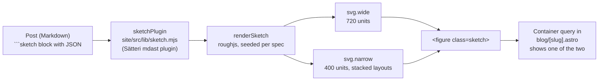

# Blog diagrams

Blog posts can carry hand-drawn diagrams, in the same rough-sketch style as Excalidraw (both use [roughjs](https://roughjs.com)). A post describes the diagram as a small JSON spec in a fenced code block; the build turns it into inline SVG. No image files and no script ship to the reader.



- **Two drawings per figure.** A wide one for laptop columns and a narrow one with stacked layouts and larger relative text for phones. A container query on the figure shows the one that fits (narrow below 560 px).
- **Theme colours.** Strokes and text use the site's CSS variables, so a diagram matches the page.
- **Font.** Labels use Caveat (`@fontsource/caveat`), loaded only on pages that draw a diagram.
- **Labels fit.** Text wraps by Caveat's measured character widths, and labels that would touch (markers, notes, band names, ticks) are pushed apart or stacked.
- **Stable output.** The roughness is seeded from the spec, so the same spec draws the same lines on every build.
- **Errors fail the build.** Invalid JSON, an unknown `kind` or `tone`, or a missing `alt` stops the build with the file and line.

## Writing one

````md
```sketch
{"kind": "bands", "alt": "Garmin's Load Ratio bands from 0 to 2.5", "min": 0, "max": 2.5,
 "bands": [{"to": 0.8, "label": "Low", "tone": "blue"}, {"to": 1.4, "label": "Optimal", "tone": "green"}],
 "caption": "Load Ratio bands as Garmin's owner's manuals give them."}
```
````

Every spec has:

| Field | Required | Meaning |
|---|---|---|
| `kind` | yes | One of the six kinds below |
| `alt` | yes | One sentence for screen readers: what the diagram shows |
| `caption` | no | Shown under the figure. Name the source, or say "Illustration, not real data" |

Tones: `green`, `yellow`, `red`, `blue`, `sleep`, `teal`, `orange`, `grey`. Leave `tone` out for the default ink.

## Kinds

### `bands`: a scale split into ranges

`{min, max, unit?, bands: [{to, label, tone}], markers?: [{at, label}]}`. Bands run from `min` to each `to` in order. A marker draws an arrow at a value with a label above it. Use for score bands (Body Battery, Load Ratio, Recovery colours).

### `bars`: horizontal bars

`{unit?, max?, legend?: [..], tones?: [..], bars: [{label, value} | {label, values: [..]}]}`. Several `values` per row draw grouped bars, coloured in `tones` order and named in `legend`. Use for real numbers from a cited source (HRV by age, prices).

### `flow`: inputs feeding one result

`{inputs: [string | {label, note?, tone?}], output, tone?, note?}`. `note` on an input sits at its right edge (a weight, for example). Use for "what goes into this score".

### `steps`: a numbered sequence

`{steps: [{title, text?}]}`. Rows of up to three on wide screens (two by two for four steps), one column on phones. Use for how-tos and troubleshooting orders.

### `line`: a trend

`{series: [{label?, points: [..], tone?}], band?: {from, to, label?}, yLabel?, xLabels?: [..], notes?: [{at, text, series?}], min?, max?}`. `band` shades a normal range; `notes` point at a value by index. Made-up points must be captioned "Illustration, not real data".

### `compare`: side-by-side columns

`{columns: [{title, items: [..], tone?}]}`. Two or three columns, stacked on phones. Use for "X vs Y" summaries.

## Rules

- Numbers in a diagram come from the post's own cited sources or from Pulse's code. Anything invented to show a shape is captioned as an illustration.
- No logos, product images or screenshots of other companies' apps. Product names as text are fine.
- No app screenshots in posts (see the WHOOP rule in `AGENTS.md`).
- One to three diagrams per post, where a picture explains something faster than the paragraph next to it. Not as decoration.

## Changing the renderer

Astro caches rendered Markdown by the post's content, not by the plugin, so a change to `sketch.mjs` does not show until the cache is cleared:

```sh
cd site
rm -rf node_modules/.astro .astro/data-store.json
pnpm build
```
