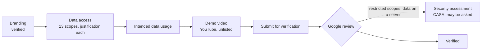

# Google OAuth verification

What Pulse submits for Google's OAuth app verification (Google Auth Platform › Verification center), and how. The
hosted instance is <https://pulsefit.portlabs.in>; the home page, privacy policy and terms live on the landing site.

| Field | Value |
|---|---|
| App home page | https://pulse.portlabs.in |
| Privacy policy | https://pulse.portlabs.in/privacy/ |
| Terms of service | https://pulse.portlabs.in/terms/ |
| Authorized domain | portlabs.in (verified in Search Console with the meta tag from `PUBLIC_GOOGLE_SITE_VERIFICATION`) |
| Branding | verified 2026-10-04 |

## Before submitting: verify or stay unverified?

The Google Health scopes are restricted. Pulse keeps the data on its own server, so Google may require an annual
third-party security assessment (CASA) on top of the review. Without verification the app still works "In
production": people see an "unverified app" warning and pass it with Advanced › Go to Pulse, and an unverified app
is capped at about 100 users. For a family instance that is enough; submit only when Pulse needs more users.

## Scopes (13)

Pulse asks only for what it uses (`SCOPES` in `src/server/sources/google/oauth.ts`), plus `openid`, `email` and
`profile` for the connected account's name, email and photo in Settings.

| Scope | Used for | Where in Pulse |
|---|---|---|
| `googlehealth.activity_and_fitness.readonly` | Steps, workouts, active minutes, calories, distance, floors | Strain, Activities, Activity detail, Home |
| `googlehealth.health_metrics_and_measurements.readonly` | Heart rate, HRV, resting heart rate, SpO2, breathing rate, skin temperature, weight, body fat, height, VO2 max | Recovery, Strain, Sleep, Health › Monitor, Pulse Age, Trends |
| `googlehealth.sleep.readonly` | Sleep sessions and stages | Sleep, Recovery, Sleep Planner |
| `googlehealth.ecg.readonly` | ECG classification and average heart rate (never the waveform) | Health › Monitor › Heart rhythm |
| `googlehealth.irn.readonly` | Irregular rhythm notifications | Health › Monitor › Heart rhythm |
| `googlehealth.nutrition.readonly` | Food and water logs | Journal › Log, Home metrics |
| `googlehealth.profile.readonly` | The age on the Google Health profile | Onboarding (opens the birth date picker on the right year) |
| `googlehealth.settings.readonly` | Paired devices (`users.pairedDevices.list`) | The "No Fitbit device" check in Settings and on Home |
| `googlehealth.nutrition.writeonly` | Saving water and food the user logs | Journal › Log |
| `googlehealth.health_metrics_and_measurements.writeonly` | Saving weight and body fat the user logs | Journal › Log |
| `googlehealth.mindfulness.writeonly` | Saving moods the user logs | Journal › Log |
| `googlehealth.logged_symptoms.writeonly` | Saving symptoms the user logs | Journal › Log |
| `googlehealth.reproductive_health.writeonly` | Saving menstrual periods and ovulation tests the user logs (female profiles only) | Journal › Log |

## Scope justifications (paste into Data access › each scope)

**activity_and_fitness.readonly.** Pulse turns the user's own Fitbit activity into a daily Strain score and an
activity journal. It reads steps, workouts, active minutes, calories, distance and floors to compute Strain, list
each workout with its heart-rate zones, and show daily activity totals. The data is shown only to the signed-in
user who connected the account.

**health_metrics_and_measurements.readonly.** Pulse's core scores need the user's heart data: Recovery uses heart
rate variability and resting heart rate, Strain uses minute-level heart rate, Sleep and the Health monitor use
SpO2, breathing rate and skin temperature, and Pulse Age uses VO2 max, weight and body fat. Pulse reads these to
compute and display the scores to the user who connected the account.

**sleep.readonly.** Pulse shows each night's sleep (duration, stages, consistency) and uses it in the Recovery
score and in the Sleep Planner that suggests a bedtime. It reads sleep sessions and stages for that purpose only.

**ecg.readonly.** The Health monitor shows the user their ECG results from their Fitbit: the classification and the
average heart rate of each reading, with the date. Pulse never reads or stores the waveform.

**irn.readonly.** The Health monitor's heart rhythm section shows the user when their Fitbit raised an irregular
rhythm notification, next to their ECG readings, so they have one place to review heart rhythm events.

**nutrition.readonly.** Pulse shows the food and water the user logged (in Pulse or in the Google Health app) on the
day's journal and daily metrics, so their totals match what Google Health shows.

**profile.readonly.** During setup Pulse reads the age on the user's Google Health profile only to open the birth
date picker on the right year. The user still enters their birth date and sex themselves.

**settings.readonly.** Pulse calls users.pairedDevices.list to check that a Fitbit device is paired with the
account. Without one there is no data to import, and Pulse tells the user how to fix it instead of showing empty
screens.

**nutrition.writeonly.** When the user logs water or food in Pulse's Journal › Log, Pulse saves that entry to their
Google Health account so it appears in the Google Health app too, and deletes it there if they delete it in Pulse.
Pulse never writes anything the user did not log.

**health_metrics_and_measurements.writeonly.** When the user logs their weight or body fat in Pulse, Pulse saves
that entry to their Google Health account (and deletes it if they delete it in Pulse). Nothing else is written.

**mindfulness.writeonly.** When the user logs their mood in Pulse's journal, Pulse saves it to Google Health as a
mood entry so it is kept with the rest of their health record. Moods are write-only in the Google Health API.

**logged_symptoms.writeonly.** When the user logs symptoms (for example headache or fatigue) in Pulse, Pulse saves
them to Google Health. Symptoms are write-only in the Google Health API.

**reproductive_health.writeonly.** On female profiles only, the user can log menstrual periods and ovulation tests
in Pulse; Pulse saves those entries to Google Health. These types are write-only in the Google Health API, and the
feature is hidden on male profiles.

## Intended data usage (paste into the usage field)

Pulse is an open-source recovery, strain and sleep app for Fitbit users. Each user signs in to their own Pulse
account and connects their own Google account. Pulse reads that user's Google Health data to compute daily scores
(Recovery, Strain, Sleep, stress and Pulse Age) and shows them only to that user. Data is stored in the Pulse
server's database solely to compute and display these scores and the user's history. Pulse writes to Google Health
only the entries the user logs in Pulse. Pulse does not sell data, show ads, share data with third parties, use it
to train AI models, or use it for credit or insurance decisions. Users can disconnect Google at any time (which
revokes Pulse's access) and delete their Pulse account, which deletes all of their data. Pulse's use and transfer
of information received from Google APIs adheres to the Google API Services User Data Policy, including the Limited
Use requirements.

## Demo video

Requirements: English, the OAuth consent screen with the app name and the browser's address bar showing the
`client_id`, and every scope's data shown in use. Upload to YouTube as **unlisted** and paste the link.

Recording setup: the whole screen with macOS screen recording (so the address bar is visible), Brave at a laptop
width, a Google account with Fitbit data, captions added in the edit (no voice needed).

Script (about 3–4 minutes):

1. **Home page** (5 s): open https://pulse.portlabs.in, then the app at https://pulsefit.portlabs.in.
2. **Sign up and onboarding** (20 s): create an account (name, username, email, password); birth date, sex, time zone.
3. **Connect Google** (30 s): Home › Connect Google. On Google's consent screen, pause on the app name and zoom the
   address bar to show `client_id=...`. Check every permission and continue.
4. **Read scopes in use** (90 s), a caption per screen naming its scope:
   - Recovery and Strain (activity, health metrics), Activities and one workout's heart-rate zones.
   - Sleep (sleep).
   - Health › Monitor › Heart rhythm: ECG readings and irregular rhythm notifications (ecg, irn).
   - Journal › Log: food and water totals (nutrition read).
   - Settings › Data source showing the connected account and device status (settings).
   - Onboarding's birth year preselected from the Google profile age (profile), shown in step 2.
5. **Write scopes in use** (45 s): Journal › Log water, food, weight, mood and a symptom; on a female profile a
   period and an ovulation test. Then show the same entries in the Google Health app or Google's data viewer.
   Delete one entry in Pulse to show it is removed at Google too.
6. **User control** (20 s): Settings › Disconnect Google (access revoked), then Settings › Account › Delete account.

## Cloud Console steps

1. Google Auth Platform › Data access: remove the scopes Pulse no longer asks for (location, the read side of
   mindfulness, logged symptoms and reproductive health, the write side of activity and fitness and of sleep), so
   the list matches the 13 above.
2. For each remaining scope: Fix the issue › paste its justification, the intended usage and the video link.
3. Verification center › Prepare for verification › submit. Answer follow-up emails from the review team from the
   project owner's account.
