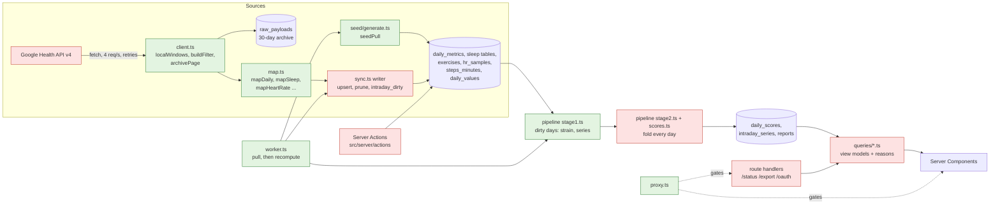
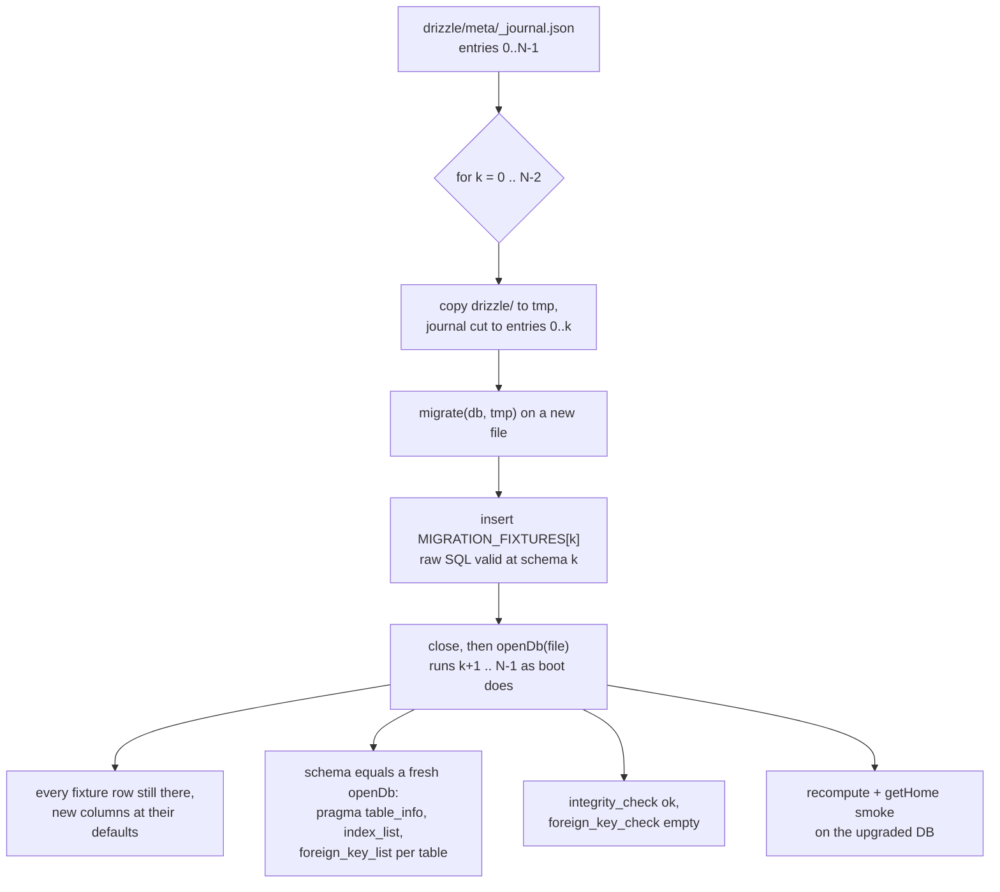
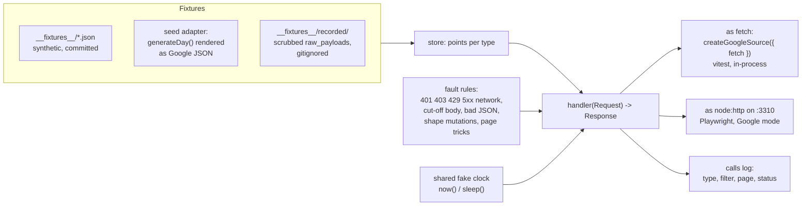
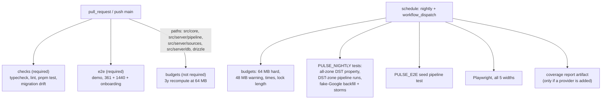
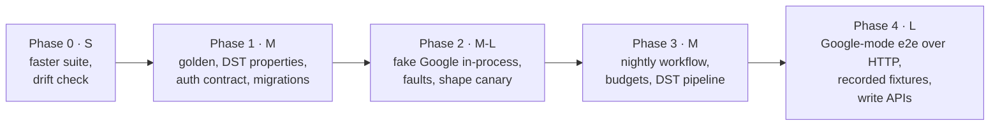

# Backend testing plan

This plan covers the server side of Pulse: the Google client and sync, the seed, the two-stage pipeline and its scorers, `src/core`, the queries, Server Actions, route handlers, auth, migrations and the worker. It lists what is tested today, ranks the failure modes by impact, and gives each risk a test, its fixtures and a file to live in. It ends with a phased order.

All paths are relative to the repo root. Measurements were taken on 2026-10-03 at `a7282a5`, on an Apple-silicon laptop with Node 26. CI runs Node 24 on 2-core runners, so expect CI times about 2–3× higher.

## Summary

The backend is already well tested where it matters most: core scorers (337 tests), the Google client and OAuth (60), sync deletions and resume, and the determinism and causality of the pipeline. The gaps are the parts the tests never reach:

1. **No pinned score outputs.** Every pipeline test checks invariants (deterministic, causal, NaN-free, correct scale). None checks the values. A scorer change that moves every Recovery by 5 points passes CI unless a core unit test happens to cover it.
2. **Timezones are only tested in `Asia/Kolkata`, which has no DST.** Two DST bugs came up while writing this plan (F1, F2 below).
3. **Migrations are only tested on an empty database.** No test upgrades a database that has data in it from an earlier schema.
4. **Auth checks are per file, not exhaustive.** 3 of 11 Server Actions and 5 of 10 route handlers have no signed-out test, and `/avatar` relies on the proxy alone.
5. **Google mode never runs end to end.** The sync tests use a fake `fetch` built from 15 small hand-written fixtures. Nothing injects 429 storms, shape changes or a revocation partway through a sync.
6. **The 64 MB recompute budget (commit `1570da9`) is measured by hand only.** No test stops a change that brings back the growth.

**Phase 1** (about 2–3 days) adds golden digests for the pipeline output, DST property tests for `src/server/time.ts`, an auth contract test that finds every action and handler on its own, and migration tests from every earlier schema. All of it runs on PRs and adds under 5 s.

---

## How the backend fits together, and where tests sit



Green: well covered. Red: covered for the happy path, with the gaps listed below. Google itself is red because only a `fetch` stub stands in for it.

---

## 1. Inventory

### How it was measured

- `vitest run --project node` gave 679 tests: 678 passed, and 1 was skipped (the manual `PULSE_E2E` seed run). Wall time was **25.4 s** on 10 cores.
- Four files take most of that time, and each one seeds and recomputes its own 180-day database:

  | File | Time |
  |---|---|
  | `src/server/pipeline/pipeline.test.ts` | 18.5 s |
  | `src/server/sources/seed/generate.test.ts` | 10.8 s |
  | `src/server/queries/sleep.test.ts` | 10.4 s |
  | `src/server/profile.test.ts` | 5.2 s |

  The 25 `src/core` files run 337 tests in 0.35 s in total.
- **No coverage provider is installed.** `package.json` lists no `@vitest/coverage-v8` or `-istanbul`, so `vitest --coverage` cannot run, and this plan adds no dependency for it. Adding `@vitest/coverage-v8` (pinned to vitest 5.0.3) would give per-file line and branch numbers. The most useful ones would be for:
  - the untested branches of the `sync.ts` writer (the `records`, `height` and `extra` kinds);
  - the 519 lines of `pipeline/scores.ts`, which only the whole-pipeline tests reach;
  - the queries the screen sweep only touches.

  Use it as a nightly report artifact, not as a PR gate: coverage instrumentation slows the seed-heavy files.

### Per area

Counts come from the vitest JSON report. "Gap" lists what no test exercises.

| Area | Files under test | Tests | What is covered | Gap |
|---|---|---|---|---|
| Google OAuth | `sources/google/oauth.ts` | 24 | Consent URL and scopes, single-use 10-minute state, code exchange (owner check, missing refresh token, no Health profile, unverified email, wrong audience), refresh, rotation, `invalid_grant` leads to revoked, 503 is not a revocation, revoke at Google, no token or body in errors | Granular consent (a subset of scopes granted), concurrent refreshes, write scopes on an old grant |
| Google client | `client.ts`, `catalogue.ts` | 36 | Local-day windows (including one 23 h day), filters per member, pagination and page cap, bad envelope, raw archive dedupe and retention, 429 Retry-After (seconds and HTTP-date), 5xx and network backoff, give-up after 5 tries, 401 then refresh then `auth_revoked`, the 250 ms limiter, `dailyRollUp` ranges, `parsePairedDevices` | A hanging request (the 30 s timeout cannot be injected), a body cut off mid-read, a page token that repeats a page, a 5,000-point page cap |
| Google mappers | `map.ts` | 17 | Each daily type, int64 casts, sample types on their local day, HR band-only, steps max across sources, sleep main/nap rules, unknown stage drops the hypnogram, exercises, extras and units, ECG without the waveform | A renamed field or a number where a string was expected (the result is silently empty), tombstones, a new `platform` value, recorded real payloads |
| Google sync | `sync.ts` | 11 | Not connected, a 180-day backfill oldest first with progress, an unchanged re-import is a no-op, HR overlap of `synced_through` minus 1 h, one failing type does not stop the others, paired-device states, raw prune, Fitbit deletions (sleep, workouts, HR) and their guards, backfill resume | Revocation partway through a run, quota and 429 storms (run length), request budget, shape-change detection, extras/records/height through the writer, a DST zone (the stub assumes a fixed +05:30), `syncErrorText` for 403/429 |
| Probe | `probe.ts` | 2 | `fieldPaths` (no values), `medianGapSeconds` | Fine as is. It is a manual tool |
| Seed | `seed/generate.ts`, `scenario.ts` | 27 | Range, 15 s HR grid, reason coverage, scenario effects, plausibility, determinism, incremental pulls | DST zones (checked by hand below: deterministic and NaN-free in London and Santiago) |
| Pipeline | `pipeline/{index,data,stage1,stage2,scores}.ts` | 21 (+1 manual) | One score per day, byte-identical rerun, same as a from-scratch run, today-only stage 1, version bump, causality, crash between the stages, journal dirty marks, scale contracts, recovery gating, incremental equals full on 220 days | **Score values** (no golden), each scorer in `scores.ts` alone, DST and timezone change (F1, F2), memory and time budgets, write-lock duration |
| Core scoring | `src/core/scoring/*` | 239 | Golden and property tests per scorer (baselines, recovery, sleep, strain, illness, readiness, forecast, ...) | Cross-scorer ranges as properties over random inputs (each file tests its own range) |
| Core algorithms | `src/core/algorithms/*` | 98 | Per-algorithm golden and property tests | Same as above |
| Queries | `queries/*.ts` | 39 | home (14), sleep (8), more/trends/behaviours (8), settings (4), calendar (3), common (2). One sweep runs every screen query on 14 days and checks for no NaN and for reasons | Value-level tests for `strain`, `recovery`, `health` (monitor, healthspan, stress, fitness), `activity`, `journal`, `reports`. Only Kolkata, and no DST day |
| Server Actions | `actions/*.ts`, `settings/actions.ts` | 22 | journal (13, signed-out included), dashboard (4), avatar (2), disconnect (3, owner only) | **`saveProfileAction`, `syncNow`, `loadCalendarMonth` have no test at all**. `removeAvatar` has no signed-out case. Nothing makes sure a new action gets one |
| Route handlers | `src/app/**/route.ts` | 22 | `/oauth/start` (4), `/oauth/callback` (11), `/export/{daily,journal,backup}` (7) | **`/status`, `/avatar`, `/logout`, `/login/demo`, `/healthz` have no test**. `/avatar` does not check the session itself |
| Auth, session, proxy, config | `session.ts`, `auth.ts`, `proxy.ts`, `config.ts`, `profile.ts` | 7 + 4 + 8 + 4 | Forged, expired and stale sessions, demo vs owner, claim race (conditional update), redirects, a hand-written matcher list | The matcher is checked against a fixed list, not against the routes on disk. No `alg: none` or wrong-secret case. The claim race is not run on two connections |
| DB and migrations | `db/index.ts`, `drizzle/` | 7 | Fresh DB has every table and column, pragmas, WITHOUT ROWID, reboot is a no-op, raw dedupe, single token row, cascade | **No upgrade from 0000–0005 with data**, no schema-drift check, no guard against destructive SQL |
| Worker | `worker.ts` | 10 + 1 | No overlap, errors keep the loop going, 5-minute gate, `force`, queued rerun, `syncAndWait` | A run that never finishes (the Settings ring spins until restart) |
| Time helpers | `time.ts` | 3 | Age arithmetic | **`localMidnight`/`localDay` have no properties across zones** (F1) |
| e2e | `e2e/*.spec.ts` | 16 | Demo mode only: auth redirects, 10 journeys, onboarding, a sweep at 5 widths | Google mode never runs. TZ is always `Asia/Kolkata` |

### Findings while writing this plan

These came from running code against the `a7282a5` tree with throwaway scripts (in the scratchpad, not committed). Each one becomes a test in Phase 1 or 2, and that test fails until the code is fixed.

- **F1. `localMidnight` is wrong in zones where DST changes at midnight.** A property check ran over all 418 IANA zones for every day from 2020 to 2030 (1.68 M days).
  - Spring-forward at 00:00: `localDay(localMidnight(d)) !== d` on the DST day in `America/Santiago`, `America/Havana`, `America/Asuncion`, `Atlantic/Azores`, `America/Scoresbysund` and `America/Coyhaique`. The returned instant is 23:00 of the day before.
  - Fall-back to 00:00 (`Asia/Amman`, `Asia/Gaza`, `Asia/Hebron` in 2020–21): it returns the second midnight, so the first hour of the day lies before its own start.
  - The effect in the pipeline: a 180-day seed in `America/Santiago` scores 2026-09-05 as a 23 h day (5,520 HR samples, 1,380-minute series) and 2026-09-06 as 24 h. The clocks actually jump on 2026-09-06. So the last hour of the 5th counts toward the 6th's strain, stress and Energy Bank, while the sync writer's `dayOf` (built on `localDay`) marks it dirty under the 5th.
  - `Europe/London` is correct: 2026-10-25 has 6,000 samples over 1,500 minutes and 2027-03-28 has 5,520 over 1,380.
- **F2. Stage 1's cache key ignores the timezone.**
  - `stage1Key` (`pipeline/stage1.ts`) hashes `SCORING_VERSION`, max HR, RHR, sessions and exercises. It does not hash `opts.timeZone`, yet the day bounds come from it.
  - A seed scored in `Asia/Kolkata` and then rescored with `TZ=UTC` reruns stage 1 for **44 of 180 days**. The other 136 keep strain computed over Kolkata midnights.
  - A one-line fix adds `opts.timeZone` to the key; that changes every key, so stage 1 reruns in full once. The rows that sync stored under the old zone (`sleep_sessions.day`, `exercises.day`) stay stale either way, so changing `TZ` also needs a documented "resync" path.
- **F3. A quota 429 can stall a sync run for about 10 hours** (worked out from `client.ts`, not run):
  - Each request makes 5 attempts and waits `min(Retry-After, 5 min)` between them, so a job that gets `429 Retry-After: 3600` on every call waits 4 × 5 min = 20 min and then fails.
  - There are 31 jobs plus the paired-device check, so the run takes about 10.7 h.
  - All that time the worker shows `running` and blocks every `requestSync`, and "Sync now" gives up after 60 s.
- **F4. `/avatar` is the only signed-in route handler that does not call `requestSession` itself.** `/status` and `/export/*` do. It is low risk (a profile photo), but it breaks the "check again in the handler" rule.
- **F5. Memory and time budgets for a 3-year history (1,095 days, 6.29 M HR rows; seeding took 4.1 s):**

  | Run | Heap | Result |
  |---|---|---|
  | Full recompute | 64 MB | OK in 12.1 s (stage 1: 1.9 s, stage 2: 9.9 s), 53 MB heap used at the end |
  | Full recompute | 48 MB | OK in 16.6 s (more GC) |
  | Full recompute | 32 MB | Out of memory |
  | Recompute with nothing changed | 64 MB | 2.6 s, almost all of it in stage 2, which folds the whole history on every run that has a change |

  So the margin today is about 16–30 MB.
- **F6. A renamed field in a Google payload gives silent "no data", not an error.**
  - The mappers skip points they cannot read, by design. If, say, `heartRate.beatsPerMinute` were renamed, every new day would read "band not worn".
  - The HR delete guard (`hr.size`) protects old rows, but nothing raises an alarm.
  - Sleep and exercise prune only when every point was readable. That is correct, but it is silent too.

---

## 2. Risk map

The table ranks risks by impact × likelihood. "Silent" means the user gets no signal that anything is wrong.

| Rank | Failure mode | Impact | Likelihood | Guard today | Main gap |
|---|---|---|---|---|---|
| 1 | **Wrong scores, silently** (a scorer regression, a scale mix-up, a fold-order change in `stage2.ts`) | High: every screen, all history, silent | Medium: scorers change often | Core unit tests, scale contracts, invariants | No golden values on pipeline output. A change without a `SCORING_VERSION` bump goes unnoticed |
| 2 | **Timezone/DST day boundaries** | Medium–high: wrong day attribution, wrong scores, silent | Certain in the affected zones (F1), and on any TZ change (F2) | One `localWindows` DST test | Properties for `time.ts`, a DST-zone pipeline run, TZ change |
| 3 | **Data loss on upgrade** (a migration rewrites or drops data) | Very high: health history is irreplaceable, Pulse is the only copy of the journal | Low–medium: 7 migrations so far, drizzle recreates SQLite tables to change a column | Fresh-DB schema test | Upgrade from every earlier schema with data in it, destructive-SQL guard |
| 4 | **Auth bypass** (a new action or handler without a session check, a matcher regex change) | High: the export and backup are the whole health record | Low–medium: easy to forget on a new file | Per-file signed-out tests, proxy tests | A contract test that finds every action and handler, and a matcher checked against the routes on disk |
| 5 | **Google API shape changes** | High: sync "works" but stores nothing, silent (F6) | Medium: v4 is new, and `docs/data-notes.md` is still "unconfirmed on the Fitbit Air" | `bad_response` on a broken envelope, unreadable points never delete | Shape canary, mutation fixtures, recorded real shapes |
| 6 | **Sync stalls** (a hung request, a run that never ends) | Medium: data stops, the ring spins | Medium | Worker error isolation | Watchdog, run-length bound, injectable fetch timeout |
| 7 | **Rate limits and quotas** | Medium: a 10 h run (F3), or a backfill never finishes | Medium during the first 180-day backfill (about 1,500 HR requests) | Limiter and Retry-After tests | Storm tests at the sync level, a circuit breaker, a request budget |
| 8 | **Schema or migration breaks at boot** | High but loud: `instrumentation.ts` exits 1 | Low | Reboot no-op test | Drift check (schema.ts vs `drizzle/`), a migration journal that matches its fixtures |
| 9 | **Memory growth and recompute time with history** | Medium: OOM in a 384 MB container, a lock held too long | Medium: any "collect all then write" refactor brings it back | Manual measurement (F5) | A nightly 64 MB budget, time budgets, write-lock duration |
| 10 | **Token expiry and revocation** | Medium: sync stops (shown in Settings) | High over time (7-day tokens in OAuth Testing mode, user revokes) | Strong at client and oauth level | Revocation partway through a sync run, granular consent, concurrent refresh |
| 11 | **Determinism of recompute** | Medium: rows flap, writes on every run | Low: tested well | Byte-identical, incremental equals full | TZ in the key (F2), DST zones, golden digest across Node versions |
| 12 | **New write APIs and scopes** (logging from Pulse, added in `ea80a41`) | High once shipped: duplicate or wrong records in the user's Google Health | None today (no write call exists). High once writes ship | Scope list test | Idempotent retries, 403 scope-insufficient path, read-after-write. Must exist before the first write ships |

---

## 3. Plan per risk

The test types used below:

- **unit**: pure function.
- **property**: a loop over generated inputs. No `fast-check` dependency: use loops over zones, days and a seeded PRNG. Adding `fast-check` later would bring shrinking.
- **golden**: a pinned output.
- **contract/fixture**: a payload shape.
- **integration**: a temp SQLite DB from `src/server/testing.ts`.
- **e2e fake**: the real client, sync and pipeline against the fake Google server.
- **budget**: memory and time.

### R1. Wrong scores, silently

| Test | Type | Cases | Where |
|---|---|---|---|
| Golden digest per output column | golden, integration | On the pinned 180-day seed (`NOW`, `TZ` from `testing.ts`), take a sha256 of `dump(db, "daily_scores")` for each column in `STAGE2_COLUMNS` plus `strain`/`activities`, of `intraday_series` per kind, and of `reports`. Store them in `GOLDEN[SCORING_VERSION]`. A changed digest fails with "scores changed: bump SCORING_VERSION and record the new digests". The test also fails if `GOLDEN` has no entry for the current version. This reuses the DB `pipeline.test.ts` already builds, so it costs about 0 s | `src/server/pipeline/pipeline.test.ts` (new `describe("golden")`), digests inline |
| Scorer units | unit | For each `score*` in `scores.ts` (`scoreSleep`, `scoreRecovery`, `scoreTrainingLoad`, `scoreStrainTarget`, `scorePlanner`, `scoreStress`, `scoreEnergyBank`, `scoreHealthMonitor`, `scoreHealthspan`, `scoreFitness`, `recordOutcomes`): a tiny `Data`/`Fold`/`Day` built by hand, with one value checked by hand, and one "reason not score" case (calibrating, no HRV, band off) | `src/server/pipeline/scores.test.ts` |
| Fold order | integration | Swapping two scorers in `stage2()` must fail. The golden digest already covers this, so no separate test | none |
| Cross-scorer ranges | property | Over 2,000 seeded-PRNG days fed to the core scorers: Recovery in [0, 100], `sleepPerf` in [0, 1], Effort in [0, 100], Strain Target in [0, 21], and every nullable is `{value, reason}` with exactly one of the two set. Monotonic checks: HRV above baseline never lowers Recovery, and more seconds in a higher zone never lowers Effort | `src/core/scoring/properties.test.ts` |
| Query values | integration | Strain: the zone rows add up to the day's HR seconds, and activities are listed by start. Recovery: drivers ordered by size, with contributors that add up. Monitor: flags equal the seeded illness week. Reports: the weekly averages equal the mean of the `daily_scores` rows. Activity: avg and max HR match `Stage1Activity` | extend `src/server/queries/home.test.ts` (shares its seeded DB) |

### R2. Timezone and DST day boundaries

**Fixtures.** Pick zones that cover every kind of offset and transition:
- `UTC`;
- `Asia/Kolkata` (+05:30), `Asia/Kathmandu` (+05:45);
- `America/St_Johns` (−03:30);
- `Australia/Lord_Howe` (30-minute DST), `Pacific/Chatham` (+12:45/+13:45), `Pacific/Kiritimati` (+14);
- `Europe/London`, `America/New_York`;
- `America/Santiago`, `America/Havana`, `Atlantic/Azores` (DST at midnight);
- `Asia/Amman` (historic fall-back to midnight).

Use the years 2020–2030.

| Test | Type | Cases | Where |
|---|---|---|---|
| `localMidnight` and `localDay` agree | property | For every zone and day: `localDay(localMidnight(d)) === d`; `localDay(localMidnight(d) − 1) === addDays(d, −1)`; `localMidnight(d) % 900 === 0` (the writer's 15-minute `dayOf` cache depends on this); day length ∈ {23, 23.5, 24, 24.5, 25} h. **Fails today (F1).** On PRs use the zones listed above (milliseconds). Nightly, use all `Intl.supportedValuesOf("timeZone")` (1.68 M days, a few seconds) | `src/server/time.test.ts` |
| `localWindows` tiles | property | For random [from, to) and maxDays ∈ {1, 14, 90} in each zone: no gap, no overlap, each window covers ≤ maxDays local days, and every end is a local midnight or `to` | `src/server/sources/google/client.test.ts` |
| Filters on DST days | unit | `buildFilter` for `interval.civil_start_time` on a fall-back day (01:30 happens twice) and a spring-forward day (02:30 does not exist). The `date` member over a 23 h and a 25 h window | `client.test.ts` |
| Sync in a DST zone | e2e fake | The fake server (below) serves `Europe/London` and `America/Santiago` data across both transitions. Checks: an exercise in the repeated hour is fetched once, the overlap windows (`OVERLAP_DAYS`, `INTRADAY_OVERLAP_S`) cover the transition, and dirty days are the true local days | `src/server/sources/google/sync.test.ts` (the current stub hard-codes `+05:30` in `bound()`, so let it take the zone) |
| Pipeline in DST zones | integration | `seeded()` with `TZ` set to London (`NOW` 2027-04-15) and to Santiago (`NOW` 2026-10-02). Checks: series length 1,500 or 1,380 on the transition days, `hrCount` 6,000 or 5,520 on the right day, no NaN, determinism and causality as in `pipeline.test.ts`, and sleep that crosses the transition uses real elapsed minutes. **The Santiago case fails today (F1)** | `src/server/pipeline/pipeline.tz.test.ts`, nightly (each seed costs about 3 s) |
| Change of TZ | integration | Seed and score in Kolkata, then recompute in UTC: every stage-1 day reruns and the result equals a from-scratch UTC recompute of the same rows. **Fails today: 44 of 180 (F2)** | `pipeline.test.ts` |
| Today boundary | integration | `todayOf(ctx)` and the "awaiting sleep sync" and outlook/review switches at 23:59:59 and 00:00:00 local, and on a DST day | `src/server/queries/home.test.ts` |
| Cosmetic | unit | `hrMinutesAm/Pm` splits at minute 720 (`stage1.ts`), which is 13:00 on a spring-forward day. Either split at the local-noon instant or document the behaviour | `pipeline.tz.test.ts` |

### R3. Data loss on upgrade: migrations from every earlier schema



- **Upgrade from every k** (integration, `src/server/db/migrations.test.ts`).
  - The migrator only reads `_journal.json` and the SQL files, so a temp folder with a shortened journal recreates any earlier schema. No old binaries or committed `.db` files are needed (`*.db` is gitignored anyway).
  - `MIGRATION_FIXTURES` holds one entry per migration: a few rows in every table that exists at that version, including a token row, a journal entry with a custom tag, a sleep session with segments, and HR samples.
  - The test fails if `MIGRATION_FIXTURES.length !== journal.entries.length`, so adding a migration forces adding its fixture.
  - Cost: about 7 × 50 ms.
- **Destructive-SQL guard** (unit, same file). Fail on `DROP TABLE`, `DROP COLUMN` or `RENAME` in `drizzle/*.sql` unless the file is in an allowlist. Drizzle's SQLite table recreate (`__new_<table>` + `INSERT ... SELECT` + `DROP`) is allowed only when the `INSERT` copies every old column.
- **Drift** (CI step).
  - Run `pnpm db:generate`, then `git status --porcelain drizzle/`. Anything printed means `schema.ts` changed without a migration.
  - Cost: about 2 s, in the `checks` job.
- **Backup round trip** (integration, extend `src/app/export/export.test.ts`). Restore the `/export/backup` file with `openDb`, then `recompute`. `daily_scores` must be byte-identical to the live DB's. This shows a backup can actually be restored.
- **Concurrent writers** (integration, `src/server/db/index.test.ts`).
  - Two connections to one file. One holds a write transaction for 1 s; a `saveJournalEntry` on the other must still succeed (`busy_timeout = 5000`).
  - The budget job (R9) checks that no pipeline transaction lasts over 1 s, so the user's own writes never fail with `SQLITE_BUSY`.
- **Sync never wipes data on an empty answer** (e2e fake, `sync.test.ts`). An empty `{}` page for a window that had sleep sessions deletes them (by design: Google omits deleted points). The next full answer must restore them and give byte-identical `daily_scores`. This proves a one-off empty answer from Google heals on the next run.

### R4. Auth bypass: negative tests for every handler and action

The matrix below lists what each entry point must return. "Bad session" covers 6 cases: no cookie, garbage, a wrong signature, a token signed with another instance's secret, an expired token, and `alg: none`.

| Entry point | Public? | Bad session | Demo session on a Google instance | Owner session after `OWNER_EMAIL` changes | Valid demo (demo instance) | Valid owner | Tested today |
|---|---|---|---|---|---|---|---|
| `GET /healthz` | yes | 200 | 200 | 200 | 200 | 200 | no |
| `GET /oauth/start` | yes | 302 (404 on a demo instance) | 302 | 302 | 404 | 302 | yes |
| `GET /oauth/callback` | yes | 400 on bad state | as left | as left | 404 | 302 | yes |
| `POST /login/demo` | yes | 303 + cookie on a demo instance, 404 on a Google one | 404 | 404 | 303 | 404 | **no** |
| `POST /logout` | yes | 303 and the cookie is deleted | same | same | same | same | **no** |
| `GET /status` | no | 401 | 401 | 401 | 200 | 200 | **no** |
| `GET /avatar` | no | **200 today (F4)**, should be 401 | 401 | 401 | 200/404 | 200/404 | **no** |
| `GET /export/daily`, `/export/journal` | no | 401 | 401 | 401 | 200 | 200 | no session only |
| `GET /export/backup` | no | 401 | 401 | 401 | 403 | 200 | yes |
| `saveJournalEntry`, `addCustomTag`, `setBehaviourHidden`, `reorderBehaviours` | no | `SIGNED_OUT`, no writes | same | same | ok | ok | signed out only |
| `saveDashboard` | no | `SIGNED_OUT` | same | same | ok | ok | signed out only |
| `uploadAvatar`, `removeAvatar` | no | `SIGNED_OUT` | same | same | ok | ok | upload only |
| `disconnectGoogle` | no | `SIGNED_OUT`, the grant is kept | same | same | `SIGNED_OUT` | ok | yes |
| `saveProfileAction` | no | `SIGNED_OUT`, no profile row | same | same | ok | ok | **no** |
| `syncNow` | no | `SIGNED_OUT`, no run starts | same | same | ok | ok | **no** |
| `loadCalendarMonth` | no | throws `signed_out` | same | same | ok | ok | **no** |

How to build it (contract tests, `src/server/auth.contract.test.ts`, under 1 s):

1. **Find the actions automatically.**
   - Glob `src/**/*.ts` for files whose first statement is `"use server"`, import each one, and call every exported async function with junk arguments under each bad session (mock `next/headers` `cookies()` and `getConfig`, as `proxy.test.ts` does).
   - Each call must return `SIGNED_OUT` or throw `signed_out`, and `dump()` of every table must be unchanged.
   - A new action is then covered with no edit. An action that writes before it checks fails.
2. **Find the route handlers automatically.**
   - Glob `src/app/**/route.ts`. The test holds an explicit `PUBLIC` set (`/healthz`, `/oauth/*`, `/login/demo`, `/logout`), and a new route outside it must return 401 with a bad session.
   - Calling the handler directly bypasses the proxy, which is the point: the handler has to stand on its own.
   - Expect `/avatar` to fail until it calls `requestSession` (F4).
3. **Matcher against the routes on disk.**
   - Replace the hand-written list in `src/proxy.test.ts` with every `page.tsx` and `route.ts` path. Fill dynamic segments (`[id]`, `[period]`, `[score]`) with samples and remove route groups (`(app)`, `(home)`).
   - Assert each path matches `config.matcher` unless it is in the public set. Also assert that build assets and files with an extension don't match.
   - This catches a regex edit that opens `/export/...` or a new page.
4. **Session edge cases** (`src/server/session.test.ts`): `alg: none`, HS256 with another secret, `sub` changed from `demo` to `owner`, `exp` one second ago, an owner token whose email differs only in case, and a token from before `instance.session_secret` was regenerated.
5. **Claim race on two connections** (`session.test.ts`): two `openDb` handles on one file, both calling `claimOrCheckOwner` with different emails. Exactly one wins.
6. **OAuth login CSRF** (documented and accepted): `state` is single-use but not bound to the browser. An attacker's code only signs the victim in as the attacker, and `allow()` refuses that on a claimed instance. Add a test that pins this ("a foreign account's callback on a claimed instance gets `not_owner`"), so a change that relaxes the owner check fails.

### R5. Google API shape changes

| Test | Type | Cases | Where |
|---|---|---|---|
| Shape snapshot | contract | `__fixtures__/shapes.txt` holds `fieldPaths()` (`probe.ts`: paths and JSON types, never values) for each catalogue type, and is updated from a real probe run. The test asserts each committed fixture's paths are a subset of the snapshot, and that each mapper reads at least one non-null value from its fixture | `src/server/sources/google/map.test.ts` |
| Mutation fixtures | e2e fake | The fake server mutates its answers: a renamed field (`beatsPerMinute` becomes `bpm`), an int64 as a number instead of a string, a missing `dataPoints` key with a `nextPageToken`, unknown extra fields, a new stage enum, a new `platform` value, a tombstone-like point (`{name, deleted: true}`), `civilStartTime.time: {}` | `sync.test.ts` |
| Shape canary (a small product change) | e2e fake | When a page has N > 0 points and the mapper reads 0 of them, the sync records `[google] <type>: SHAPE_CHANGED` in `sync_state.last_error` (Settings already shows row errors), and **writes and deletes nothing** for that window. Today the result is a silent "band not worn" (F6) | `sync.ts` writer + `sync.test.ts` |
| Recorded real shapes | contract, local only | `raw_payloads` from a real DB → scrubber → `__fixtures__/recorded/` (**gitignored**). The test is skipped when the folder is absent. See the fake server below | `src/server/sources/google/recorded.test.ts` |

### R6 and R7. Sync stalls, rate limits and quotas

All of these run on the fake server with the injectable clock (`now`/`sleep` in `ClientDeps`), so hours of simulated time take milliseconds.

| Test | Cases | Bound to assert | Where |
|---|---|---|---|
| Quota storm | Every request answers `429 RESOURCE_EXHAUSTED`, `Retry-After: 3600` | The run ends in ≤ 30 simulated minutes with a single quota error. **Fails today: about 10.7 h (F3).** The fix is a run-level circuit breaker: after one 429 that used up its tries, record it on the remaining jobs and stop | `sync.test.ts` |
| 503 storm | Every request answers 503 | ≤ 32 jobs × 15 s of backoff ≈ 8 min simulated, and every job records `http_503` | `sync.test.ts` |
| Intermittent 429 | 1 in 5 requests answers 429 with `Retry-After: 2` | The backfill completes, row counts equal the clean run, and the request count is ≤ 1.3 × the clean run | `sync.test.ts` |
| Request budget | Clean first backfill with realistic density (HR 37k points a day, pages capped at 5,000 like the real API) | Requests ≤ 1,700, simulated time ≤ 10 min at 4 req/s, and a steady-state 15-minute run ≤ 60 requests | `sync.test.ts` (nightly, because of the volume) |
| Hung request | The fake never answers. It needs `fetchTimeoutMs` in `ClientDeps` (today `FETCH_TIMEOUT_MS` is a constant, an enabling change) | Each job fails with `network` after 5 × timeout, and the run ends | `client.test.ts` |
| Body cut off | 200 with a body that ends partway through | Counted as a network failure and retried (the code relies on this inside the `try`) | `client.test.ts` |
| Repeating page token | A token that cycles A → B → A | Stops at `MAX_PAGES` with `too_many_pages`, and no duplicate rows (upserts) | `client.test.ts` |
| Worker watchdog | A source whose `pull()` never resolves | `state.running` turns into `lastError: "stalled"` after N minutes and the loop recovers. `syncAndWait` returns within its timeout. This needs a small watchdog in `createWorker` | `src/server/worker.test.ts` |

### R8. Schema and migration breaks at boot

These are covered by R3's drift check and fixture-count rule. Add one boot test (`src/server/db/index.test.ts`): a DB whose `__drizzle_migrations` has a hash not in `drizzle/` (opened by an older image) must open, and the app must keep working on the tables it knows. That pins the downgrade behaviour.

### R9. Memory growth and recompute time

Vitest can't measure this well: the runner's own heap is in the same process. Use a child process.

- **Runner.** A short Node script, `scripts/budget.ts`, is run as `node --max-old-space-size=64 --experimental-transform-types --import ./scripts/ts-hooks.mjs scripts/budget.ts`.
  - `ts-hooks.mjs` is about 15 lines of `module.registerHooks` that resolve `@/` and extension-less imports. This approach was used for F5 and works on Node 24+.
  - `--experimental-transform-types` is needed because `GoogleError` uses constructor parameter properties, which type stripping alone rejects.
- **Steps and budgets.** Local times are from F5. CI allows about 4× for 2-core runners and slack.

  | Step | Local | CI budget | Hard limit |
  |---|---|---|---|
  | Seed 3 years (two `seedPull` calls, 1,095 days) | 4.1 s | 30 s | none |
  | Full recompute | 12.1 s | 60 s | must not OOM at 64 MB |
  | Full recompute at 48 MB | 16.6 s | none | **warning** below 48 MB, to see the margin shrinking early |
  | Recompute with nothing changed | 2.6 s | 10 s | none |
  | Today-only change (touch today's HR) | not measured (expect close to the unchanged run) | 10 s | none |
  | Longest single write transaction (wrap `db.$client.transaction`) | not measured | 1 s | must stay well under `busy_timeout` 5 s |
  | Google first backfill against the fake server, 180 days of dense HR | not measured | 64 MB heap | none |

- **Where.** `scripts/budget.ts`, plus a vitest wrapper `src/server/pipeline/budget.test.ts` that spawns it and parses its JSON. The wrapper uses `describe.skipIf(!process.env.PULSE_NIGHTLY)`, the same pattern as `pipeline.seed.test.ts`.
- **Growth note.** Stage 2 folds every day on every run that has a change, so its time grows with the length of the history (2.3 s of a 2.6 s run at 3 years). The budget makes that growth visible. A fold checkpoint is only worth building once the budget is in danger.

### R10. Token expiry and revocation

| Test | Cases | Where |
|---|---|---|
| Revocation during a sync run | The fake returns 401 twice, starting at job 7 | `sync.test.ts` |
| Refresh `invalid_grant` ("Token has been expired or revoked", the 7-day limit in OAuth Testing mode) | Same outcome as above, and Settings reads "reconnect" | `sync.test.ts`, `queries/settings.test.ts` |
| Granular consent | `exchangeCode` with a `scope` that omits `sleep.readonly` stores that scope. Sync: `sleep` gets `403 PERMISSION_DENIED`, which is recorded, and the other types continue. `syncErrorText` turns the 403 into a sentence | `oauth.test.ts`, `sync.test.ts` |
| Concurrent refresh | `googleAge()` (onboarding) and a sync both refresh at the same moment: one `oauth_tokens` row, and its expiry matches the newest token | `oauth.test.ts` |
| Clock skew | The server clock is 2 min ahead: a 401 leads to one forced refresh and the run succeeds | `client.test.ts` |
| Reconnect after revocation | `/oauth/callback` with a new refresh token clears `revoked_at`, and the next sync resumes from the cursors | `route.test.ts` + `sync.test.ts` |

What the revocation case must show:
- After `auth_revoked`, **no further HTTP request** is made. Every remaining job records `auth_revoked`.
- The cursor of the job that was running when it happened (`synced_through`) does not move.
- After a reconnect, the next run resumes where it stopped.

### R11. Determinism of recompute

These are covered by the existing tests, plus the golden digest (R1), the TZ-change test (F2) and the DST-zone runs (R2). One extra test: run the golden digest in the nightly job on both Node 24 (CI) and the version in the `Dockerfile` (`node:24-slim`, the same major today). That catches a V8 `Math` change that would shift floats.

### R12. New write APIs and scopes

There is no write call yet, but the scopes are granted since `ea80a41`. These tests must come with the first write (`dataPoints.create`/`patch`/`batchDelete`):

1. **Idempotent retry.** `client.request` retries POST after a network error. That is safe for `dailyRollUp`, which only reads, but for a create it can make a duplicate. The fake accepts the write and then drops the connection: assert exactly one record. The fix is a client-side ID or dedupe key in the request, or no retry on a non-idempotent POST.
2. **Missing write scope on an old grant.** `403 ACCESS_TOKEN_SCOPE_INSUFFICIENT` becomes a "reconnect to allow logging" state, not `auth_revoked`, and the read sync carries on.
3. **Read-after-write.** A mood logged from Pulse comes back through the next sync exactly once, and the deletion prune does not remove it before Google lists it.
4. **No body or token in errors**, the same hygiene test as `client.test.ts` but for write responses.
5. **Auth.** Every write action joins the R4 contract automatically. Demo sessions must never reach Google (a demo instance has no grant).

---

## The fake Google Health server

The fake grows out of the stub in `src/server/sources/google/sync.test.ts` (`setup()`), which already answers filtered lists and roll-ups from fixtures. It gets its own module, so every Google test and the Phase 4 e2e can use it.



**Module.** `src/server/sources/google/fake.ts` (test-only; import only from `*.test.ts` and `e2e/`):

```ts
createFakeGoogle({ store, clock, rules, pageCap: 5_000, clientId: "cid" }): {
  fetch: typeof fetch;                    // pass to createGoogleSource / exchangeCode
  calls: Call[];                          // assertions on volume and order
  listen(port: number): Promise<Server>;  // same handler over HTTP for e2e
}
```

**Endpoints, matched on the constants in `client.ts` and `oauth.ts`:**

- `POST oauth2.googleapis.com/token`:
  - `authorization_code` gives `access_token`, `refresh_token`, `expires_in`, `scope`, and an **unsigned** `id_token` with `aud = clientId`, `email`, `email_verified`. `verifiedAccount` uses `decodeJwt` and does not check the signature, by design.
  - `refresh_token` gives a new `at-N`, or `invalid_grant` once the fake is revoked.
- `POST .../revoke`: marks the fake as revoked, so later refreshes return `invalid_grant`.
- `GET .../users/me/identity` and `/profile`: 200, or `ACCOUNT_NOT_LINKED` on request.
- `GET .../pairedDevices`: `{pairedDevices: [...]}`, `{}`, or an unknown shape.
- `GET .../dataTypes/{type}/dataPoints`:
  - Parses the filter grammar for all five members, with civil times read in the fake's zone. This fixes the stub's hard-coded `+05:30`.
  - `pageSize` is capped at `pageCap`, and `nextPageToken` is an opaque base64 offset.
  - Returns 400 `INVALID_ARGUMENT` for a wrong member, as the real API does.
- `POST .../dataPoints:dailyRollUp`: a civil range with an exclusive end, and no pagination.

**Data sources:**

1. Synthetic committed fixtures, the current `__fixtures__/*.json`, for shape-level tests.
2. A **seed adapter** that renders `generateDay()` output as Google points (HR as `heartRate.sampleTime.physicalTime` + an int64 string `beatsPerMinute`, sleep with stages, and so on). It gives 180 realistic days for the backfill, budget and DST tests with no real data. It also allows an equivalence check: the seed written directly versus the seed passed through the Google sync should give the same `daily_scores`, apart from fields Google does not provide.
3. **Recorded fixtures**, from a real instance's `raw_payloads`, through a scrubber.

**Fault rules** are an ordered list, each `{ match: { path?, type?, method?, nth?, after?, every? }, respond }`, where `respond` is one of:

- a status: 401, 403 + code, 429 + `Retry-After` (seconds or HTTP-date), 500/503;
- `network` (throws), `hang` (never resolves), `truncate` (body cut off partway);
- `badJson`;
- `mutate(fn)`, which rewrites points (renamed field, int64 as a number, extra fields, tombstones, new enum values);
- page tricks: a token that never ends, a token that cycles, an empty last page that still has a token, a page over the cap.

**Clock.** The fake reads the same `now()` that the client's `sleep()` moves forward, so `Retry-After` and backoff cost no real time and the run length can be asserted (R6/R7).

**Recorded fixtures and privacy.** The repo is public, so no real reading may be committed.

- `scripts/record-fixtures.ts` reads `raw_payloads` from a local DB, un-gzips it, and scrubs it:
  - shifts all instants by a constant to the `testing.ts` anchor;
  - replaces `name`, `dataSource.device.displayName`, `application.packageName` and every free-text field with placeholders.
- The scrubbed real values go to `__fixtures__/recorded/`, which is **gitignored** and is used only by local tests that skip themselves when it is absent.
- What gets committed is `fieldPaths()` output only, as `__fixtures__/shapes.txt`. `probe.ts` already prints exactly that, so the snapshot holds paths and types and never a value.
- A test runs the scrubber on a fixture with known secrets planted in it and asserts that none of them survive.

**HTTP mode for Playwright (Phase 4).**
- This needs one enabling change: a test-only base-URL override (`GOOGLE_API_BASE`, read by `config.ts` and refused when `NODE_ENV=production` unless `E2E_PROD=1`), so the Next server calls `http://localhost:3310` instead of `googleapis.com`.
- The fake's `/auth` endpoint redirects straight to `/oauth/callback?code=...&state=...`, so a Playwright journey can run through Connect → import progress → Home → Disconnect → reconnect with no Google account and no secrets in CI.

---

## CI wiring and time budgets

The owner finds slow suites painful, so the rule is: **PR checks grow by seconds; everything slow runs nightly.**



| Job | Trigger | Contents | Time budget (CI) |
|---|---|---|---|
| `checks` | every PR and push, required | as today, plus `pnpm db:generate && git status --porcelain drizzle/` (drift), plus every new fast test (golden digest, DST zone list, auth contract, migrations, fake-Google error cases with the fake clock) | Today's plus **≤ 10 s**. Win back time first with the shared template DB (Phase 0) |
| `e2e` | every PR, required | unchanged | unchanged |
| `budgets` | PR with path filter, **not required** (a required check that a path filter skips blocks the merge) | `scripts/budget.ts` | ≤ 3 min |
| `nightly` | `schedule` (02:30 UTC) and `workflow_dispatch`, in its own `.github/workflows/nightly.yml` | jobs N1–N5 in parallel, with `PULSE_NIGHTLY=1` | ≤ 20 min in total |

- **Gating tests.** Nightly-only tests use `describe.skipIf(!process.env.PULSE_NIGHTLY)`, the pattern `pipeline.seed.test.ts` already uses with `PULSE_E2E`, so `pnpm test` stays as fast as it is.
- **Local loop.** Use `pnpm vitest related <file>` or `pnpm vitest --changed main` while iterating. CI still runs the full suite.
- **Failures.** A nightly failure uses GitHub's default notification, so no secrets are needed. Nothing nightly blocks a merge.

---

## 4. Phasing

Sizes: **S** is half a day or less, **M** is 1–2 days, **L** is 3–5 days. The order follows value per effort. Code fixes for F1–F4 are separate PRs, each landing with the test that exposes it.



### Phase 0: make room (S)

1. **Shared template DB.**
   - A vitest `globalSetup` seeds and recomputes the pinned 180-day demo DB once per run and passes its path in through `provide`.
   - `seeded()` with default arguments then becomes `copyDb()` from that template (`copyDb` already exists in `testing.ts`).
   - The same DB is built five times across four files today (`pipeline.test.ts` twice, `profile.test.ts`, `sleep.test.ts`, `home.test.ts`), at about 2–3 s each. This should save about 10 s of CPU per run.
2. **Migration drift step** in `ci.yml` (`checks`).
3. **Docs.** Mention `vitest related` and `--changed` in `CONTRIBUTING.md`.

### Phase 1: highest value per effort (M, 2–3 days)

1. **Golden digests per output column**, keyed by `SCORING_VERSION` (R1). S.
2. **`time.ts` DST properties** on the PR zone list (R2). S. These fail on F1, so fix `localMidnight` in the same PR: for a day whose midnight falls in a gap, return the first instant whose `localDay` is that day; for a repeated midnight, return the first one.
3. **TZ-change test** plus the F2 one-line key fix (R2). S.
4. **Auth contract**: auto-discovered actions and handlers, a matcher checked against the routes on disk, session edge cases (R4), plus the `requestSession` check in `/avatar` (F4). M.
5. **Migrations from every earlier schema**, plus the destructive-SQL guard (R3). M.

### Phase 2: Google robustness (M–L, 3–4 days)

1. Move the `sync.test.ts` stub into `src/server/sources/google/fake.ts` with zone-aware filters, the page cap, and fault rules.
2. Storm tests (quota, 503, intermittent), revocation partway through a run, granular consent, a repeating page token, a body cut off partway (R6, R7, R10). The quota-storm test lands with the circuit-breaker fix (F3).
3. Shape snapshot (`shapes.txt`), mutation fixtures, and the `SHAPE_CHANGED` canary in the writer (R5, F6).
4. `fetchTimeoutMs` in `ClientDeps`, and a hung-request test. A watchdog in `createWorker`.
5. The seed adapter in the fake, a DST-zone sync test, and the empty-answer-heals test (R2, R3).

### Phase 3: nightly (M, 2 days)

1. `scripts/ts-hooks.mjs` + `scripts/budget.ts` + `budget.test.ts` wrapper (R9).
2. `nightly.yml`: budgets, all-zone property, London and Santiago pipeline runs, fake-Google 180-day dense backfill (request budget, 64 MB), `PULSE_E2E`, Playwright at all 5 widths.
3. A path-filtered `budgets` PR workflow.
4. Optional: add `@vitest/coverage-v8` for a nightly-only report, if the owner wants the numbers.

### Phase 4: when Google mode or writes move (L, 3–5 days)

1. HTTP mode for the fake, the `GOOGLE_API_BASE` test override, and a Google-mode Playwright journey (Connect → import → Home → Disconnect → reconnect).
2. `scripts/record-fixtures.ts` with the scrubber and its no-leak test. Run the recorded-shape test locally after each real probe.
3. Seed-vs-Google equivalence on `daily_scores`.
4. The R12 write-API tests, **before the first write ships**.

### What stays out

- Load testing the web tier. Pulse has one user per instance, so the backend load that matters is the recompute and the sync, both covered above.
- Fuzzing the queries. The NaN and reason sweep over every screen query already covers that.
- Chaos testing SQLite itself (disk full, power loss). WAL with `synchronous = NORMAL` is SQLite's documented crash-safe mode, and the backup export is what the owner can do about it.
