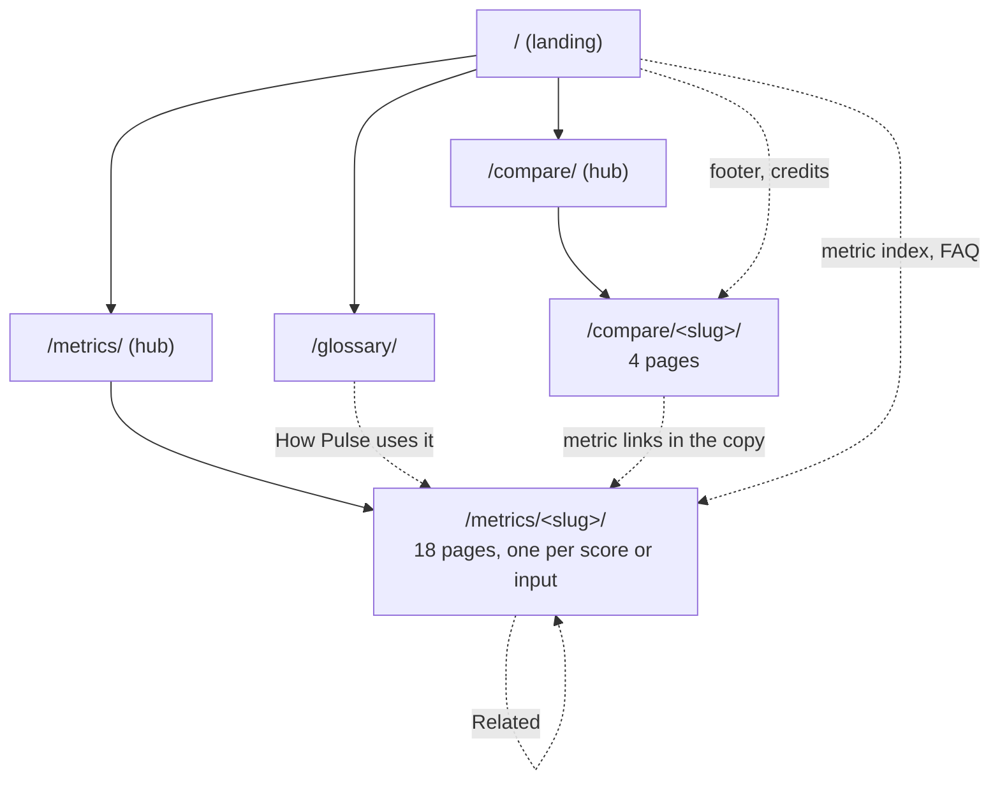
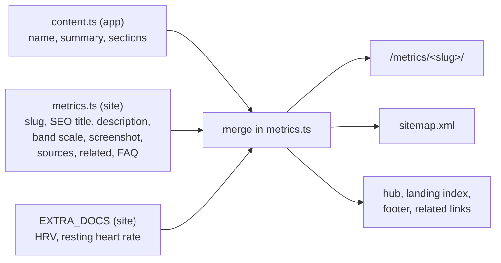
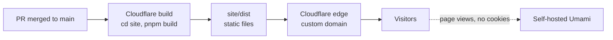

# Plan: public landing page and programmatic SEO pages

Date: 2026-10-03. Research: [docs/research/landing-and-seo.md](../research/landing-and-seo.md). Code: `site/`.

The app is private: every route is behind sign-in, and one owner runs one instance. So the marketing site is a separate, fully static site in `site/`. It never ships in the app's Docker image, and it never touches the app's build, typecheck or lint.

## Goals

- Fitbit Air owners who search for recovery, strain, subscriptions or the reference app alternatives find a page that answers their question first, then shows Pulse.
- Every score has a deep, honest page: inputs, weights, bands, limits and sources. "Pulse Age is an estimate" is said plainly, with the papers cited.
- One static build, zero client JavaScript, fast on a phone.
- Adding a metric or a comparison adds a page, a sitemap entry and the internal links, with no template work.

## Non-goals

- A hosted demo. The app needs a Google OAuth client per owner, and Google caps unverified apps at 100 users. The site points to demo mode on your own laptop instead.
- Hundreds of thin pages. Google's scaled-content policy penalises pages made for query variants. The site has about 30 deep pages.

## Stack: Astro, static output

| Option | Client JS | Fit |
|---|---|---|
| **Astro 7 (chosen)** | None by default | Built for content sites. `getStaticPaths` generates the programmatic pages. `astro:assets` turns the PNG screenshots into AVIF and WebP at several widths. Scoped CSS and plain `.astro` components, so no React runtime ships. |
| Next.js static export | The React runtime and hydration on every page (about 100 KB) | Matches the app's stack, but pays for interactivity this site does not need. It would also share the app's Next config and tooling, which is what we want to keep apart. |
| A hand-written Node script | None | No dependencies, but we would re-implement routing, HTML escaping and the image pipeline. |

Astro is clearly better here: the same component model as a framework, and the output of a hand-written script. The measured result on the landing page: 0 bytes of JavaScript, 84 KB transferred on a phone, LCP about 250 ms locally, CLS 0.

`site/` is its own pnpm workspace root (`site/pnpm-workspace.yaml`) with its own lockfile. The app's tooling skips it:

| App tooling | How `site/` is kept out |
|---|---|
| Docker image | `site` in `.dockerignore` |
| TypeScript | `site` in `tsconfig.json` `exclude` |
| ESLint | `site/**` in `globalIgnores` |
| Tailwind class scan | `@source not "../../site"` in `src/app/globals.css` |
| Vitest, Playwright | Their `include` and `testDir` already cover only `src/` and `e2e/` |

## Site structure



| Page | Template | Source of truth |
|---|---|---|
| `/` | `src/pages/index.astro` | Hand-written copy; the metric index comes from `METRICS` |
| `/metrics/` | `src/pages/metrics/index.astro` | `METRICS` |
| `/metrics/<slug>/` | `src/pages/metrics/[slug].astro` | `SCORE_DOCS` in `src/app/(app)/more/how-it-works/content.ts` (the app's own explainer), merged with `site/src/data/metrics.ts` |
| `/compare/`, `/compare/<slug>/` | `src/pages/compare/` | `site/src/data/compare.ts` |
| `/glossary/` | `src/pages/glossary.astro` | `site/src/data/glossary.ts` |
| `/sitemap.xml`, `/robots.txt` | `src/pages/*.ts` endpoints | The same data, so they never drift from the routes |

### How a metric page is built



The app's `content.ts` already holds every number from the code ("when the code changes, change this file"). The site imports it rather than copying it, so the site and the app's More › How Pulse works can never disagree. The site adds only what search needs. A new entry in `SCORE_DOCS` gets a page with default title and description even before anyone adds metadata. HRV and resting heart rate are inputs rather than scores, so their text lives in `EXTRA_DOCS` in the same shape.

Each metric page has:

1. H1 (the score's name) and the one-line summary.
2. The band scale, drawn from the band data in the app's colours, where the score has bands.
3. A real screenshot from `docs/screenshots/` (demo data), never a third-party image.
4. What goes in, how it is weighted, what the bands mean, and the limits, in the app's own words.
5. Sources: a link to the full spec in `docs/algorithms/` where one exists, then the papers with DOIs. Pulse's own models with no validation (Recovery forecast, Energy Bank) say so.
6. FAQ where we have real questions, related metrics, and the call to action.

## Keyword clusters and the pages that own them

From the research (autocomplete and ranking pages; there are no volume numbers).

| Cluster | Example queries | Page |
|---|---|---|
| Fitbit Air recovery and strain | fitbit air recovery score, does fitbit air track strain | `/compare/fitbit-air-recovery-and-strain/`, `/metrics/recovery/`, `/metrics/strain/` |
| Fitbit Air subscription | fitbit air without subscription, premium vs free | `/compare/google-health-premium/`, `/compare/refapp-alternative-without-subscription/` |
| Explaining the scores | how is recovery calculated, strain score meaning, refapp age calculator | `/metrics/recovery/`, `/metrics/strain/`, `/metrics/pulse-age/` |
| Health terms | what is a good hrv, sleep regularity index, vo2 max percentile, acwr | `/metrics/hrv/`, `/metrics/sleep-consistency/`, `/metrics/fitness-level/`, `/metrics/training-balance/`, `/glossary/` |
| Alternatives and open source | refapp alternative no subscription, open source refapp, self hosted fitness tracker | `/compare/refapp-alternative-without-subscription/`, `/compare/pulse-vs-refapp/`, `/` |

Rules for titles and copy:

- Titles stay under about 60 characters, and descriptions under about 155.
- Comparison pages open with a direct answer in under 60 words.
- Headlines say "recovery, strain and sleep scores for your Fitbit Air", never "the reference app for Fitbit Air". The reference app is named in body copy only, for factual comparison (see Risks).

## Internal linking

- Every page links to the metrics hub, the compare hub, the glossary and the setup guide through the header and footer. The footer lists every metric and comparison, generated from data.
- A metric page links to 3-5 related metrics (`related` in `metrics.ts`).
- Glossary terms link to the metric that uses them.
- Comparison pages link the scores they mention, and list the other comparisons.
- Calls to action use the same two labels everywhere: "Self-host Pulse" (the setup guide) and "View source" (the repository).

## Structured data

All JSON-LD is built in `site/src/lib/schema.ts` and rendered by `Base.astro` as one `@graph` per page.

| Page | Types |
|---|---|
| Landing | `SoftwareApplication` (free offer, license, repository; **no rating**, since none exists), `FAQPage` |
| Metric | `TechArticle`, `BreadcrumbList`, `FAQPage` when the page has questions |
| Compare | `Article` (`dateModified` = the date the facts were checked), `BreadcrumbList`, `FAQPage` when present |
| Glossary | `DefinedTermSet` with a `DefinedTerm` per entry, `BreadcrumbList` |
| Metrics hub | `ItemList`, `BreadcrumbList` |

Google retired FAQ rich results on 2026-05-07, and the SoftwareApplication rich result needs a rating. We keep both types because they describe the page accurately and other engines read them, but we expect no rich result from them. Breadcrumbs still produce one.

## Sitemap, robots, canonical, social cards

- `sitemap.xml` lists every page with `lastmod`: `CONTENT_UPDATED` in `src/config.ts` for our pages, `checked` for comparisons.
- `robots.txt` allows everything, AI search crawlers included, and points to the sitemap. No `llms.txt`: Google says it does not use it.
- Canonical URLs, `og:url` and the sitemap all come from `SITE_URL`, read in `site/astro.config.mjs`. **It is a placeholder (`https://pulse.example.com`) until the owner picks a domain.** It must not be the app's own hostname, because the app is private.
- `trailingSlash: "always"`, so each page has one URL.
- One OG card (`site/public/og.png`, 1200 × 630), rendered from the brand and the home screenshot by `pnpm og` and committed. Per-page cards (for example, the metric name over its band scale) are deferred until the pages have traffic worth optimising.

## Design

- Pulse's own dark world, not a new one: the app's tokens (`--background` #0f1113 under the #262e33 top gradient, Figtree, Barlow numerals), the wordmark and mark from `docs/design/brand.md`, and the app's data colours used only where they carry meaning (band scales, the metric index strips).
- The one moment of motion: the wordmark's heartbeat drawn once across the hero on load, then still. Reduced motion skips it.
- No eyebrows, no icon-card grids. The layouts differ per section: a split hero, a sticky intro beside the metric index, a screenshot strip, a connected five-step flow, a privacy panel, two code panels and a native `<details>` FAQ.
- Accessibility: a skip link, visible focus rings, 44 px targets in the nav, real headings, `aria-current` in the nav, and alt text that describes each screenshot.

## Hosting

| Host | Fit | Notes |
|---|---|---|
| **Cloudflare (recommended)** | The owner's domains are already on Cloudflare: DNS, TLS and caching in one place, and free for static sites | Connect the repo to Pages (or Workers static assets). Build command `cd site && pnpm install --frozen-lockfile && pnpm build`, output `site/dist`, env `SITE_URL` (and the Umami variables). Custom domain in one click. |
| Vercel | Easy, good previews | Root directory `site`. The domain would need DNS records pointing out of Cloudflare. |
| GitHub Pages | Free, next to the code | Needs a deploy workflow and a CNAME. No build-time environment UI, and fewer caching controls. |

Recommendation: **Cloudflare**, deploying on pushes to `main` that touch `site/`, `docs/screenshots/` or `src/app/(app)/more/how-it-works/content.ts`. That last path matters: metric pages are built from the app's explainer.



## Analytics

Umami, self-hosted by the owner. It is cookieless, so no consent banner is needed. `Base.astro` renders the script tag only when both build-time variables are set, so forks and local builds send nothing:

| Variable | Value |
|---|---|
| `PUBLIC_UMAMI_SRC` | The Umami script URL, `https://<umami-host>/script.js` |
| `PUBLIC_UMAMI_WEBSITE_ID` | The website ID from Umami's settings |

Worth watching: landing page → setup guide clicks (outbound links), which metric pages get search entries, and GitHub clicks.

## Risks

- **The reference app's IP enforcement.** the reference app sued another app in March 2026 over app look-and-feel trade dress, copyright, and patents on recovery and strain scores (reported; no ruling yet). The app openly follows the reference app's look, and the site shows the app. The site mitigates what it can: no the reference app name in titles or H1s outside comparison pages, no the reference app logos or imagery, Pulse's own metric names, dated and sourced comparisons, and a non-affiliation notice in every footer. The app's design itself is the owner's call.
- **Stale facts.** Prices and features of other products change. Each comparison has a `checked` date that is shown on the page and used as `dateModified`. Re-check on each content update.
- **Drift from the app.** Mitigated by importing `content.ts` rather than copying it. If that file's types change, update `site/src/data/metrics.ts` and the metric template in the same pull request (the Astro build does not typecheck).

## Follow-ups (not built)

- Search Console and Bing Webmaster Tools, with IndexNow, once the domain is live.
- A `/fitbit-air/export-data` guide (Takeout and the Google Health API), a strong query cluster in the research.
- Separate Hælan and fitbit-grafana pages, if the "without a subscription" page shows demand for them.
- Per-page OG cards.
- Read r/FitbitAir and r/FitbitAir_India by hand: our research tools could not reach Reddit.

## Working on the site

```sh
cd site
pnpm install
pnpm dev        # http://localhost:3316
pnpm build      # static output in site/dist
pnpm preview    # serves site/dist on :3316
pnpm og         # re-render public/og.png (needs the repo root's pnpm install, for Playwright)
```

- **New metric:** add it to `SCORE_DOCS` in the app (it shows in the app too). Optionally add metadata in `site/src/data/metrics.ts`.
- **New comparison:** add an entry to `COMPARISONS`.
- **New glossary term:** add it to `GLOSSARY`.
