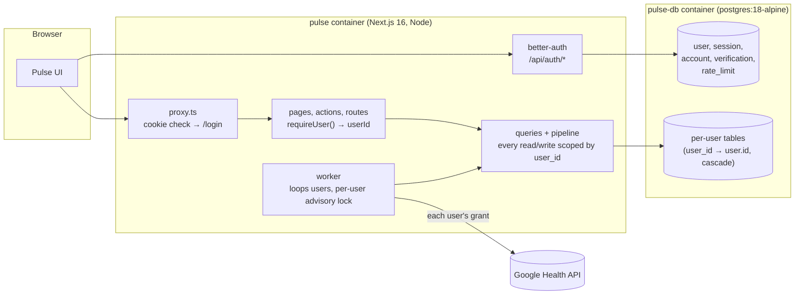
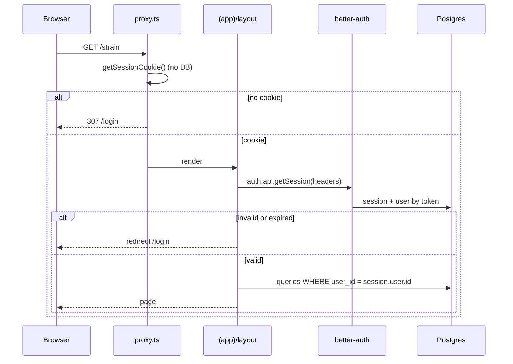
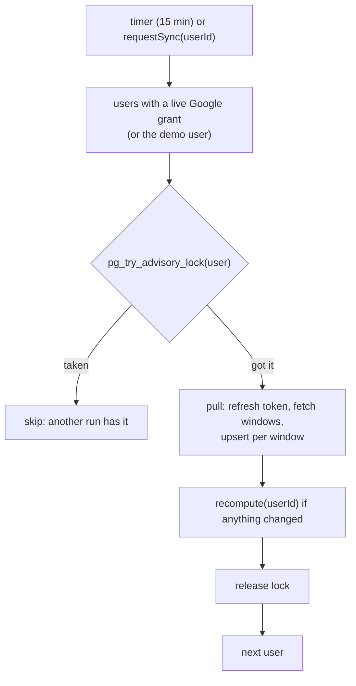
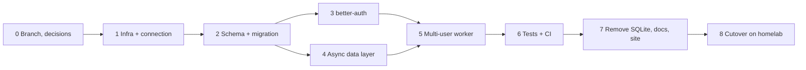

# SQLite → PostgreSQL, multi-user, better-auth

Pulse moves off SQLite onto PostgreSQL, becomes multi-user (anyone can sign up on an instance, connect their own Google account and see only their own data), and replaces the hand-written password auth (`8dde007`) with [better-auth](https://better-auth.com). Every trace of SQLite leaves the codebase: driver, native build, pragmas, file backups, docs and site copy.

There is no data migration. We are in testing: the new stack starts empty and every user signs up and syncs again. The old SQLite volume stays on disk, untouched, until the cutover is confirmed, so a rollback is one image tag away.

All paths are relative to the repo root. Counts come from two inventories run at `8dde007` on 2026-10-03.

## Summary

| | Today | After |
|---|---|---|
| Database | `data/pulse.db` / `data/demo.db` (better-sqlite3, sync, WAL) | PostgreSQL 18 (`postgres:18-alpine`) in compose, reached through a `pg` pool |
| ORM | Drizzle `sqlite-core` + ~99 raw `$client.prepare` statements | Drizzle `pg-core`; raw SQL only where the builder can't express it, through `sql\`\`` |
| Users | one person per instance | many; every per-person table has `user_id`, cascading on account delete |
| Auth | hand-written email + password, JWT cookie, setup code | better-auth: email + password, username plugin, DB sessions, built-in rate limit and CSRF |
| Google | one grant per instance | one grant per user, synced by one worker loop |
| Tests | temp SQLite files, a cached seeded template file | PGlite (in-process Postgres) per test file from a seeded snapshot; real Postgres in CI e2e |
| Backups | in-app SQLite file download | per-user JSON/CSV export in-app; `pg_dump` on the server |

Effort: **about 5–7 focused days**, mostly in phase 4 (the async data layer) and phase 6 (porting 36 test files).

## Decisions

Each has a recommendation. The ones marked **confirm** change the plan if answered differently.

| # | Decision | Recommendation |
|---|---|---|
| D1 | Postgres driver | `pg` (node-postgres). Pure JS, so the Docker build loses its python/make/g++ stage. It's what better-auth's docs use. |
| D2 | How better-auth reaches the database | **confirm.** The [Drizzle adapter](https://better-auth.com/docs/adapters/drizzle) with `provider: "pg"`, on the same Drizzle instance. Auth tables then live in `schema.ts`, come out of the same `drizzle-kit` migrations, and data tables can reference `user.id`. The [plain Postgres adapter](https://better-auth.com/docs/adapters/postgresql) works too, but brings a second migration system (`npx auth migrate`) beside Drizzle's. |
| D3 | User id type | better-auth `advanced.database.generateId: "serial"`: integer user ids, so `user_id` is 4 bytes on every row (it sits on ~13M heart-rate rows a year per person in the row-per-sample design). |
| D4 | Heart rate and steps storage | **confirm.** One row per user and day holding arrays (`hr_days`: second-of-day offsets `int4[]` + `bpm int2[]`; `steps_days`: `int4[1440]`) instead of one row per sample. About 365 rows a year per person instead of ~13.6M, TOAST-compressed, and stage 1 already reads a day at a time. The sync merges a window's samples into each day's arrays. Row-per-sample stays possible, but at roughly 1–1.5 GB per person per year with its index. |
| D5 | Test database | PGlite (`@electric-sql/pglite`, Postgres compiled to WASM) for unit tests: no Docker needed to run `pnpm test`, one instance per test file, seeded once and restored from a dump. Real Postgres for e2e and for one CI smoke job, so driver differences (`pg` vs PGlite) are caught. |
| D6 | Demo mode | An instance without Google (`GOOGLE_OAUTH_ENABLED=false`) seeds one demo user in the same database. The login screen keeps "Continue with demo data", which signs in as that user. Sign-up is off on a demo instance. |
| D7 | Forgot password (no email server) | A server command: `docker exec pulse node scripts/reset-password.mjs <email-or-username>` prints a one-time reset link (better-auth's reset token) or sets a temporary password. SMTP and better-auth's emailed reset can come later. |
| D8 | Backups | The in-app "download the database" goes away: with many users one file would hold everyone's data. Each user keeps the per-user export (CSV/JSON, extended to cover everything they own). The server owner backs up with `pg_dump`, documented in setup and in the runbook. |
| D9 | Data migration | None. Fresh database, fresh sign-ups, fresh sync. |
| D10 | Sign-up | Open by default. `DISABLE_SIGNUP=true` closes it (better-auth `emailAndPassword.disableSignUp`). |
| D11 | Identity fields | Name (free text, shown in the UI), username (3–30 chars, `a-z 0-9 _ .`, case-insensitive, unique), email (unique). Sign-in takes one "Email or username" field: containing `@` → `signIn.email`, else `signIn.username`. |
| D12 | Days and timestamps | Days as `date` (`mode: "string"`, still `YYYY-MM-DD` in JS). Unix-second timestamps as `bigint` (`mode: "number"`), since `integer` ends in 2038. |

## Target architecture





## Schema

Every table is rewritten with `pg-core` in `src/server/db/schema.ts`, and the migration history restarts from a new `drizzle/0000`. Type mapping:

| SQLite today | Postgres | Notes |
|---|---|---|
| `integer` unix seconds | `bigint({ mode: "number" })` | D12 |
| `text` day `YYYY-MM-DD` | `date({ mode: "string" })` | string in and out, compares the same |
| `real` | `doublePrecision` | **not** `real`, which is 4-byte float in Postgres and would change scores |
| `integer({ mode: "boolean" })` | `boolean` | `is_main`, `processed`, `is_default`, `hidden` |
| `text({ mode: "json" })` | `jsonb` | 13 `daily_scores` columns, `intraday_series.data`, `reports.data`, `health_records.data`, `logged_entries.data`; `daily_metrics.hr_zones` becomes `jsonb` too |
| `blob({ mode: "buffer" })` | `bytea` | `raw_payloads.gz_body`, avatars |
| `CHECK (id = 1)` single rows | `user_id` primary key | `oauth_tokens`, `profile` |
| `rowid` tie-break | explicit `serial`/`created_at` | `journal_tags` order (`queries/journal.ts:21`, `export.ts:48`) |
| `WITHOUT ROWID` hand edit | gone | D4 removes the two tables it was for |

Tables:

- **better-auth** (generated with `npx auth@latest generate` for the Drizzle adapter, then committed into `schema.ts`): `user` (+ `username`, `displayUsername` from the username plugin), `session`, `account`, `verification`, `rate_limit` (D3: serial ids).
- **Per user**: every one gets `user_id integer not null references user(id) on delete cascade`, which becomes the leading column of its primary key or unique index:
  - `oauth_tokens` (PK `user_id`; gains `google_email`, `google_name`, `google_picture`, which `instance` holds today)
  - `profile` (PK `user_id`), `avatars` (PK `user_id`, `bytes bytea`, `type`, `updated_at`)
  - `sync_state` (`user_id, type`), `raw_payloads` (dedupe unique gains `user_id`)
  - `hr_days`, `steps_days` (D4, PK `user_id, day`)
  - `daily_metrics`, `daily_values`, `daily_scores`, `intraday_series`, `intraday_dirty`, `reports`
  - `sleep_sessions`, `sleep_segments`, `exercises`, `health_records` (Google ids are only unique per account, so the PK is `user_id, id`)
  - `journal_tags`, `journal_entries`, `dashboard_metrics`, `logged_entries`
- **`instance`** goes away: the session secret moves to `BETTER_AUTH_SECRET`, and the owner columns move to `user`, `oauth_tokens` and `avatars`.

## Work by area

### 1. Connection, config, boot

- `package.json`: drop `better-sqlite3`, `@types/better-sqlite3`; add `pg`, `@types/pg`, `@better-auth/drizzle-adapter` (dev: `@electric-sql/pglite`). `pnpm-workspace.yaml`: drop `allowBuilds: better-sqlite3`.
- `src/server/config.ts`: `DATABASE_URL` (required), `BETTER_AUTH_SECRET` (required outside tests), `DISABLE_SIGNUP` (optional); remove `DATABASE_PATH` and the `demo.db` / `pulse.db` defaults.
- `src/server/db/index.ts`: one `pg.Pool` (`max: 10`) on `globalThis`, `drizzle(pool, { schema })`. Type parsers so `count(*)` (int8) and `numeric` come back as numbers. No pragmas.
- `src/instrumentation.ts`: `await migrate(db, { migrationsFolder })`, retrying for up to 60 s while Postgres starts, then start the worker.
- `drizzle.config.ts`: `dialect: "postgresql"`, `dbCredentials.url`.
- `next.config.ts`: remove `serverExternalPackages: ["better-sqlite3"]`.

### 2. Auth (replaces `8dde007`)

Removed: `src/server/account.ts`, the JWT half of `src/server/session.ts`, `src/app/setup/`, `src/app/login/password/`, `src/app/login/setup/`, the setup code, the hand-written throttle and `sameOrigin()` (better-auth checks Origin and Fetch Metadata itself).

Added:

- `src/server/auth.ts`: `betterAuth({ database: drizzleAdapter(db, { provider: "pg", schema }), secret, baseURL: APP_URL, trustedOrigins: [APP_URL], emailAndPassword: { enabled: true, minPasswordLength: 10, maxPasswordLength: 128, disableSignUp, autoSignIn: true, revokeSessionsOnPasswordReset: true }, user: { deleteUser: { enabled: true } }, session: { expiresIn: 30 days, updateAge: 1 day }, rateLimit: { enabled: true, storage: "database", customRules: { "/sign-in/*": { window: 60, max: 5 }, "/sign-up/*": { window: 3600, max: 10 } } }, advanced: { ipAddress: { ipAddressHeaders: ["cf-connecting-ip"] }, database: { generateId: "serial" } }, plugins: [username({ minUsernameLength: 3, maxUsernameLength: 30 }), nextCookies()] })`.
- `src/app/api/auth/[...all]/route.ts`: `toNextJsHandler(auth)`.
- `src/lib/auth-client.ts`: `createAuthClient({ plugins: [usernameClient()] })`.
- `requireUser()` (server): `auth.api.getSession({ headers: await headers() })`; redirects to `/login` in pages and returns `SIGNED_OUT` in actions. Every Server Action and route handler calls it first.
- `src/proxy.ts`: `getSessionCookie(req)` for the optimistic redirect (no DB on every request); the full check happens in `(app)/layout.tsx` and in each action and route.
- Pages, keeping today's look (heartbeat mark, caps labels, filled fields, pill button):
  - `/login`: "Email or username" + password, "Forgot password?", "Create account".
  - `/signup`: name, username, email, password.
  - `/forgot`: explains the server command (D7).
  - Demo instance: "Continue with demo data" only (D6).
- Settings › Account: name, username, email, change password (`changePassword`, `revokeOtherSessions: true`), sign out, delete account (confirm dialog; the cascade removes all their data).
- `scripts/reset-password.mjs` (D7), shipped in the image.

### 3. Schema and migrations

Rewrite `schema.ts` (see Schema), delete `drizzle/` and generate a fresh `0000` with `pnpm db:generate`. The CI drift check (`pnpm db:generate` writes nothing) stays.

### 4. Data layer: async and scoped by user

This is the bulk of the work. 41 server files and 17 app files touch the database: about 99 raw statements, about 51 synchronous Drizzle calls, 9 synchronous transactions.

Rules:

1. **No default context.** `ctx = defaultCtx()` default parameters go away. Every query takes `ctx: QueryCtx` with `userId`, and pages build it once: `const ctx = await userCtx()`.
2. **Every read and write names the user**, through a helper (`mine(table, ctx)` returning `eq(table.userId, ctx.userId)`) so a missing filter is visible in review. The isolation test (§6) is the safety net.
3. **Raw SQL becomes builder calls** wherever the builder can express it. What stays raw uses `sql\`\`` with parameters, never string interpolation (`queries/health.ts:379` interpolates column names today; those become a whitelist map).
4. **SQLite-only constructs**, with their Postgres replacements:
   - `insert or ignore` (`seed/generate.ts:592,593`, `profile.ts:69`) → `onConflictDoNothing()`
   - row-value `IS NOT` (`pipeline/stage2.ts:117`, `seed/generate.ts:586`) → `IS DISTINCT FROM`, or compare in JS
   - `WHERE c IS NOT excluded.c` upserts (6+) → `IS DISTINCT FROM excluded.c`
   - `json_extract(...)` (`queries/settings.ts:152,184-188`) → `->>` with casts
   - `sum(hidden = 0)` → `count(*) filter (where not hidden)`
   - `.pluck()` / `.raw()` / `.iterate()` → plain selects
   - `.changes` (~20) → `.returning({ id })` length or `rowCount`
   - `round(avg(bpm))` → `round(avg(bpm))::int`
5. **Transactions** (9 sites) become `await db.transaction(async (tx) => …)`. The one in `sync.ts:160` sits between awaits today and stays per window.
6. **Round trips.** better-sqlite3 calls cost microseconds; Postgres calls cost about 0.3–1 ms on the same host. A 3-year recompute does about 4–5k calls today, so:
   - stage 1: read the dirty days' `hr_days` / `steps_days` in one query per 30-day batch; write `daily_scores` and series with one multi-row upsert per batch
   - stage 2: prefetch the series the scorers read lazily (`seriesOf`, used by `scores.ts:358,416` through `inputs.stillHr` / `inputs.loadSeries`) for the whole range up front, so scorers stay synchronous and pure; replace the per-day `UPDATE` (`stage2.ts:115`) with one `INSERT … ON CONFLICT DO UPDATE … WHERE … IS DISTINCT FROM` per 500 days
   - sync: one upsert per window per table (multi-row `VALUES`, or `unnest` arrays), not one per sample; with D4 heart rate is one row per day anyway
   - seed: 180 days × 5,760 HR samples today is about 1M single inserts; with D4 it is 180 day rows
   - pages: `loadDays` already loads ranges; Home is about 20–28 queries per render today, so run the independent ones with `Promise.all`
7. **Determinism.** "Write only when the JSON changed" keeps working with `jsonb` (`IS DISTINCT FROM` compares values, ignoring key order). Golden fingerprints (`pipeline/golden.test.ts`) hash what is read back; `jsonb` reorders keys, so the hash input sorts keys first and the goldens are regenerated once, with an independent check that the scores themselves did not move (§6).

Files, by group:

| Group | Files | Notes |
|---|---|---|
| Queries | `queries/*.ts` (17 with SQL or `loadDays`) | async, `ctx` required; `getShellStatus` per user |
| Pipeline | `pipeline/{index,data,stage1,stage2,scores}.ts` | async I/O, prefetch, batched writes, `opts.userId` |
| Sync | `sources/google/{sync,client,oauth,probe}.ts` | per-user grant and state; window upserts; `archivePage` per user |
| Seed | `sources/seed/{generate,heartRhythm}.ts` | demo user; day arrays |
| Server helpers | `profile.ts`, `avatar.ts`, `journalTags.ts`, `log.ts`, `export.ts`, `worker.ts` | async + `userId`; `forgetSyncedData(userId)` deletes by user, not the whole table |
| Actions | `server/actions/*`, `app/(app)/settings/actions.ts` | `requireUser()` first |
| Routes | `status`, `sync`, `avatar`, `export/*`, `oauth/*`, `login/demo` | `requireUser()`; `export/backup` deleted (D8) |
| Pages | about 22 RSC pages, `(app)/layout.tsx`, `(home)/loading.tsx`, `onboarding` | `await userCtx()` |

### 5. Worker, multi-user



- `createWorker` keeps its shape but runs over users one after another, so one person's backfill can't flood Google's 5 QPS limit for everyone. `requestSync({ userId, force })` replaces the instance-wide call. `syncAndWait(userId)` backs the `/sync` route.
- The worker state (running, last run, last error) is per user; `/status` returns the signed-in user's.
- The advisory lock also makes a second app replica safe later.
- OAuth `state` stays in memory, now with the user id bound to it, and the callback checks the session user matches. That closes the login-CSRF class for account linking.

### 6. Tests

- **Harness** (`src/server/testing.ts`, `vitest.global-setup.ts`): global setup seeds the 180-day demo user once into a PGlite instance and dumps it (`dumpDataDir`), cached by the same source hash as today. `seeded()` restores the dump into a fresh PGlite per test file; `copyDb()` becomes another restore. `openDb(":memory:")` (17 files) becomes `freshDb()`, a migrated empty PGlite.
- **Port 36 test files**:
  - `$client.prepare(...)` → builder or `db.execute(sql…)`
  - `sqlite_master` / `pragma_table_info` → `information_schema`
  - `insert or replace` → upserts
  - `order by rowid` → the new order column
  - `total_changes()` → row counts
  - `date(?, '-30 days')` → JS date math
- **Delete**: `db/index.test.ts` (pragmas, WITHOUT ROWID); the SQLite parts of `db/migrations.test.ts` (fixtures restart at the new `0000`; the destructive-SQL guard is rewritten for Postgres `ALTER`/`DROP`); `session.test.ts`, `account.test.ts`, `login/auth-routes.test.ts` (hand-written auth).
- **New**:
  - **User isolation**: seed two users with different data, build every screen's view model, export and status for user A, and assert none of user B's values appear. Also run the pipeline for A and assert B's `daily_scores` didn't change.
  - **better-auth contract**: sign-up, sign-in by email and by username, wrong password, rate limit, change password revoking other sessions, delete account cascading every per-user table to zero rows. The existing auth contract test (every action and route refuses a signed-out caller) moves to `requireUser()`.
  - **Score parity**: before the switch, record per-day Recovery, Strain and Sleep for the default seed (SQLite); after, the same seed on Postgres must produce the same numbers to 1e-9. This guards the `doublePrecision` and determinism points.
  - **Recompute budget**: a 3-year recompute on PGlite under a set time, so round-trip regressions show up.
- **e2e** (`playwright.config.ts`, `e2e/days.ts`): a Postgres per run (local: compose `db`; CI: a `services: postgres` container). Before each server start, drop and recreate `pulse_e2e` and `pulse_e2e_onboarding`. `e2e/days.ts` reads with `pg`. New journeys: sign up, sign in by username, sign out, a second user sees none of the first user's data.
- **CI** (`.github/workflows/ci.yml`): `checks` stays Docker-free (PGlite); `e2e` gets the Postgres service and `DATABASE_URL`; one smoke job runs the query tests against real Postgres.

### 7. Docker and compose

```yaml
services:
  db:
    image: postgres:18-alpine
    container_name: pulse-db
    restart: unless-stopped
    environment:
      POSTGRES_USER: pulse
      POSTGRES_DB: pulse
      POSTGRES_PASSWORD: ${POSTGRES_PASSWORD:?set it in .env}
    command: ["postgres", "-c", "shared_buffers=64MB", "-c", "max_connections=20", "-c", "work_mem=4MB"]
    mem_limit: 256m
    volumes:
      - pulse-pg:/var/lib/postgresql   # 18's image keeps PGDATA in a versioned subdirectory under here
    healthcheck:
      test: ["CMD-SHELL", "pg_isready -U pulse -d pulse"]
      interval: 5s
      timeout: 3s
      retries: 20
    # no ports: only the app reaches it, over the compose network
  pulse:
    build: .
    image: pulse:latest
    container_name: pulse
    restart: unless-stopped
    env_file: .env
    environment:
      DATABASE_URL: postgres://pulse:${POSTGRES_PASSWORD}@db:5432/pulse
    depends_on:
      db: { condition: service_healthy }
    mem_limit: 384m
    ports:
      - "127.0.0.1:3000:3000"
volumes:
  pulse-pg:
```

- `compose.dev.yaml` (or a profile): `db` alone with `127.0.0.1:5432:5432`, for `pnpm dev` and e2e.
- `Dockerfile`: drop the python3/make/g++ stage and the `/app/data` volume; copy `scripts/reset-password.mjs`. The image gets smaller and builds anywhere, with no native module.
- `scripts/deploy.sh`: wait for both containers to report healthy; take a `pg_dump` before running migrations so a rollback can restore it.
- Homelab (`~/personal/homelab/pulse-compose.yaml`, local only): `db` on an internal network only; `pulse` on `proxy` + internal; `POSTGRES_PASSWORD` in the server's `.env`.

### 8. Remove SQLite everywhere

- Code:
  - `src/server/export.ts` `backupCopy`, and `src/app/export/backup/`
  - "Your data" copy (`more/data/page.tsx:28,61`, `loading.tsx:34`)
  - More's "CSV, JSON, SQLite" (`more/page.tsx:68`)
  - comments in `pipeline/index.ts:42`, `sources/google/client.ts:122`
- Files: `.gitignore` / `.dockerignore` `*.db` lines, `data/`.
- Docs:
  - `README.md:3,18,32`, `docs/setup.md` (3, 28, 73, 77, 85–88, 124, 130, 134–154 → Postgres setup, `pg_dump`/`pg_restore`)
  - `AGENTS.md:9,14,49`, `CONTRIBUTING.md:56–57,72–73,79`, `SECURITY.md:41`
  - `.env.example`
- Plans: add a superseding decision to the main plan (KTD14 "SQLite through better-sqlite3", U20 "SQLite stays") rather than rewriting history.
- Site:
  - `site/src/pages/index.astro:69,77`
  - `site/src/data/compare.ts:71,112`
  - `site/src/data/glossary.ts:23` ("one Docker container" → app + database)
  - rebuild and redeploy the site.

## Phases



| Phase | Done when | Estimate |
|---|---|---|
| 0 | Branch `feat/postgres`; D2, D4 confirmed; score parity snapshot taken on SQLite | 0.5 h |
| 1 | `docker compose up` brings up Postgres; the app connects, migrates and answers `/healthz` | 0.5 day |
| 2 | Fresh `0000` migration applies on Postgres and PGlite; drift check clean | 0.5 day |
| 3 | Sign-up, sign-in (email and username), sign-out, change password, delete account work in the browser; hand-written auth deleted | 1 day |
| 4 | Every screen renders for a signed-in user from Postgres; typecheck clean; no `$client.prepare` left | 2–2.5 days |
| 5 | Two users with two Google accounts sync side by side; the demo user seeds on a demo instance | 0.5 day |
| 6 | All unit tests on PGlite, isolation and parity tests pass, e2e green on CI with Postgres | 1–1.5 days |
| 7 | `grep -ri sqlite` finds nothing outside the plans' history; docs and site updated | 0.5 day |
| 8 | pulsefit runs on Postgres; you sign up, connect the Fitbit account and the backfill finishes | 0.5 h |

Phases 3 and 4 can run in parallel after phase 2. Nothing lands on `main` until phase 6 is green: this is one branch, merged once.

## Cutover (phase 8)

1. Merge `feat/postgres`; add `POSTGRES_PASSWORD` and `BETTER_AUTH_SECRET` (`openssl rand -base64 32`) to the server's `.env`; remove `OWNER_EMAIL`, `DATABASE_PATH`.
2. Swap in the new homelab compose; `COMPOSE_FILE=pulse-compose.yaml scripts/deploy.sh`. The old `pulse-data` volume (SQLite) is no longer mounted but still exists.
3. Open pulsefit, sign up, onboard, Connect Google with the Fitbit Air account, and wait for the backfill.
4. Family members sign up on the same URL.
5. After a week without problems: `docker volume rm pulse_pulse-data`.

Rollback before step 5: put back the previous compose file and image tag (`pulse:previous`). The SQLite volume is untouched, so the old app comes back as it was.

## Risks

| Risk | Mitigation |
|---|---|
| Recompute gets slow from round trips | Batching and prefetch rules in §4.6; the recompute budget test |
| Scores drift (float4, numeric strings, JSON key order) | `doublePrecision`, pg type parsers, `IS DISTINCT FROM` on jsonb, the score parity test |
| A query misses `user_id` and leaks another person's data | Required `ctx`, the `mine()` helper, the isolation test over every view model |
| PGlite and `pg` behave differently | The CI smoke job and e2e on real Postgres |
| Memory on the home server | Postgres capped at 256 MB with small buffers; the app stays at 384 MB |
| Strangers sign up on the public URL | Their data is theirs only (isolation). Google shows its unverified-app warning before sharing. `DISABLE_SIGNUP=true` closes sign-up if needed |
| No email for password resets | The server reset command (D7); SMTP later |
