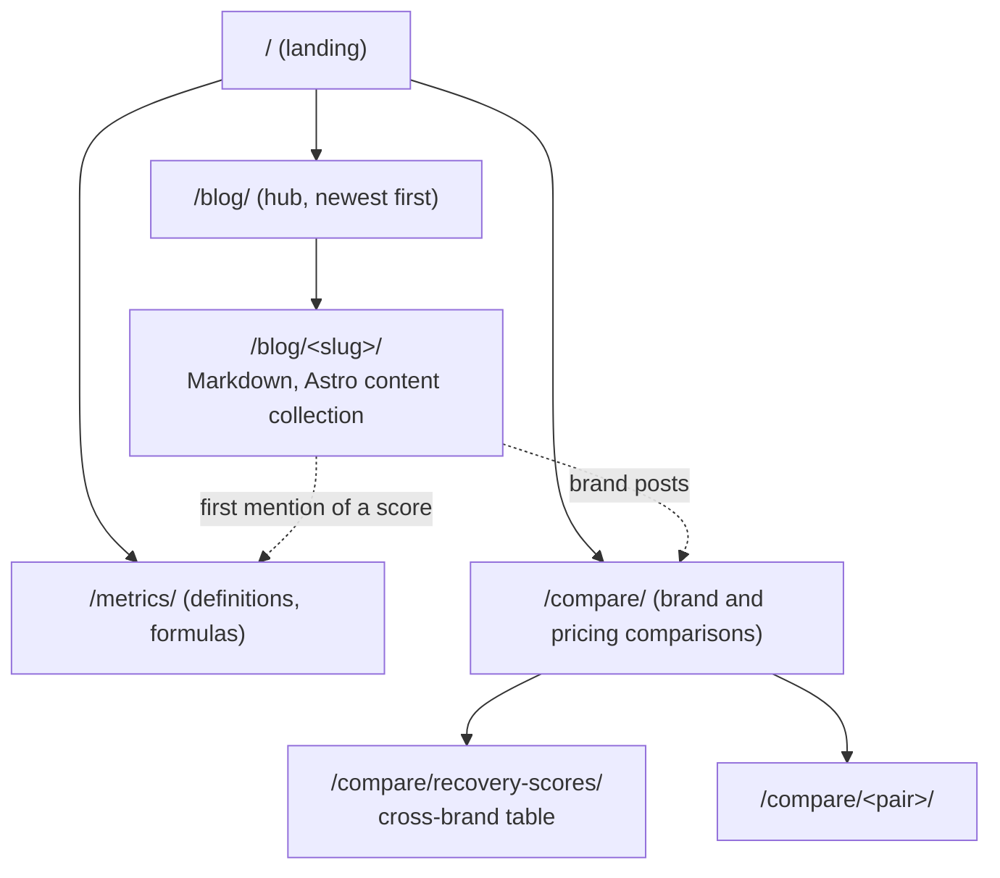

# Plan: blog, brand comparisons and broader positioning

Date: 2026-10-09. Research, in `docs/research/blog/`:

| File | Covers |
|---|---|
| [google-ecosystem.md](../research/blog/google-ecosystem.md) | Fitbit Air, Pixel Watch, older Fitbits, the Google Health app, Premium |
| [whoop.md](../research/blog/whoop.md) | WHOOP metrics, prices, search demand, trademark and litigation risk |
| [garmin-amazfit-others.md](../research/blog/garmin-amazfit-others.md) | Garmin, Amazfit, a short look at Oura, Samsung and Apple, and a cross-brand equivalence table |
| [strategy.md](../research/blog/strategy.md) | Which brand pairs have demand, Google's 2026 spam and helpful-content policies, blog architecture, positioning lines |

Method: Google autocomplete (about 1,000 seeds across the four files), WebSearch and WebFetch. There are no search-volume numbers, only whether a suggestion exists and its position. Reddit was not reachable.

This plan picks from roughly 70 raw ideas: duplicates are merged, and ideas with no demand, or no honest angle for Pulse, are dropped.

## Decisions for the owner first

Resolved 2026-10-09: the WHOOP posts and pages are published, with one rule: **no page that names WHOOP shows the app's screens.** Blog posts and comparison pages carry no device frames at all, and the landing page names WHOOP only in the not-affiliated notice. Pixel Watch posts are written but say plainly that Pulse is tested on Fitbit Air only.

1. **Naming WHOOP.** 13 items below name WHOOP in the title. The 2026-10-03 plan kept competitor names out of titles and slugs because Pulse's UI is inspired by WHOOP. WHOOP sued Bevel on 2026-03-17 (D. Delaware, 1:2026cv00289) over a WHOOP-like app interface [reported, see `whoop.md` §4]. The facts there are close to Pulse's. Naming WHOOP in factual comparisons is normal practice (Tom's Guide, BGR and others do it), but publishing "WHOOP-style" next to screenshots of a WHOOP-inspired UI invites exactly that scrutiny. Options: publish the WHOOP set; publish it without app screenshots on those pages; or skip it. Getting a lawyer's view is worth it before publishing.
2. **Pixel Watch claims.** "Pixel Watch readiness", "Pixel Watch HRV" and "pixel watch vs whoop" all have demand, but nobody has run Pulse on Pixel Watch data. Pages that name Pixel Watch wait until one real Pixel Watch account has been checked in Pulse.
3. **Landing repositioning.** See Positioning below.

## Found while writing (2026-10-09)

- **Google Health API onboarding is paused.** Google's API overview page says: "While we are not onboarding new projects at this time, we are actively working to open access to more developers". Pulse's setup needs each owner's own Google Cloud project with this API, so new self-hosters may be blocked until Google reopens access. The self-hosting and export posts tell readers to check the current status.
- **Apple Watch Series 12 has a 0-10 Readiness score** (Apple Newsroom, September 2026). The research files predate it.
- **Amazfit may have replaced BioCharge with HybridCharge** in May 2026 (reported by one review site, not confirmed by Amazfit).

## Honesty rules for every post

- The Google Health API has no Readiness, Cardio Load, Sleep Score or Resilience type. Posts explain Google's scores and compare them with Pulse's own. They never say Pulse shows your Fitbit Readiness.
- Garmin's own pages, Zepp's help pages and whoop.com could not be fetched. Every Garmin, Amazfit and WHOOP fact is re-read from the vendor's page by hand before it is published, and each comparison has a `checked` date.
- Per-device metric support (which Fitbit or Pixel has which metric) came out of image grids that did not come through as text. Check by hand.
- Pixel Watch 5 already exists; do not write "Pixel Watch 1-4".
- Title phrasing: "X vs Y", not "X equivalent". "whoop strain equivalent" and "whoop recovery equivalent" have no demand.

## Architecture

- `/blog/` is a new Astro content collection (`site/src/content/blog/*.md`). `/metrics/`, `/compare/` and `/glossary/` stay as they are.
- **One owner per query.** Definitions and formulas belong to `/metrics/<slug>/`. A post must target a different intent: troubleshooting ("always low", "0"), ranges ("by age"), or another brand's metric. If a searcher would be equally happy on the metric page, the post is not written.
- Posts link to the metric page on first mention instead of restating it.
- `article()` in `site/src/lib/schema.ts` gains `datePublished`. Each post has `published`, `updated` and, where it quotes another product, `checked`.
- Tag pages only once a tag has 4 or more posts.

## Comparison pages (`/compare/`)

The full grid of brand pairs (about 120) is not built: that pattern is what Google's spam policy (updated 2026-08-28) calls scaled content abuse, and most pairs have no demand. These pairs do:

| # | Page | Kind | Gate |
|---|---|---|---|
| C1 | Fitbit Air vs WHOOP: the scores, not the hardware | Extend `/compare/fitbit-air-recovery-and-strain/` | WHOOP decision |
| C2 | Google Health Premium vs WHOOP vs free | Extend `/compare/google-health-premium/` | WHOOP decision |
| C3 | Fitbit Air vs Garmin Cirqa: scores compared | New | |
| C4 | Fitbit Air vs Amazfit Helio Strap | New | |
| C5 | Fitbit Air vs Oura Ring: sleep and readiness | New | |
| C6 | Google Health app vs Garmin Connect | New | |
| C7 | Pixel Watch vs WHOOP | New | WHOOP decision and Pixel Watch test |
| C8 | How each brand builds a recovery score | New hub, `/compare/recovery-scores/`, the equivalence table | Verify the Samsung, Oura and Apple cells |

## Blog posts (43)

Priority: **1** is the launch set (weak competition, no gate), **2** is the next wave, **3** is later or low odds. Linked page means the `/metrics/` or `/compare/` page the post points to.

### Google Health, Fitbit Air and Pixel Watch (14)

| # | Title | Target queries | Links to | P |
|---|---|---|---|---|
| 1 | Fitbit readiness always low? Check these 6 things | fitbit readiness always low, stuck at 15, not calibrating | recovery, hrv, resting-heart-rate | 1 |
| 2 | Fitbit Daily Readiness explained, and how Recovery differs | fitbit readiness meaning, how is it calculated | recovery | 2 |
| 3 | Cardio Load vs Strain: what the numbers mean | fitbit cardio load meaning, cardio load vs whoop strain | strain, training-balance | 1 |
| 4 | Fitbit Target Load too high or low? How it is set | fitbit target load too high, is low | strain-target, training-balance | 2 |
| 5 | HRV 0 or "not tracked" on Fitbit Air? What to check | fitbit air hrv 0, not tracked, pixel watch hrv 0 | hrv | 1 |
| 6 | What is a good HRV by age? Why your baseline matters more | what is a good hrv, hrv by age, fitbit hrv normal range | hrv, health-monitor | 1 |
| 7 | Fitbit Resilience replaced the stress score. Now what? | fitbit stress score gone, fitbit resilience | stress-monitor | 2 |
| 8 | Fitbit sleep score: the six parts and what is good | what is a good sleep score on fitbit, is 80 good | sleep-performance | 2 |
| 9 | Pixel Watch readiness or sleep score missing? What to check | pixel watch no readiness, sleep score not showing | recovery, sleep-performance | 2 (Pixel gate) |
| 10 | Fitbit resting heart rate high? Likely causes | fitbit resting heart rate high, suddenly increased | resting-heart-rate | 2 |
| 11 | Active Zone Minutes: what your Fitbit really counts | fitbit active zone minutes, cardio load vs zone minutes | strain | 3 |
| 12 | Fitbit VO2 max and Cardio Fitness: how accurate? | fitbit vo2 max accurate, what is a good vo2 max | fitness-level | 3 |
| 13 | Which Fitbit and Pixel devices track which metrics | fitbit charge 6 readiness, pixel watch skin temperature | metrics hub | 3 (hand check) |
| 14 | Google Health vs Health Connect vs Apple Health | google health vs health connect, not syncing with apple health | home | 3 |

### Data and self-hosting (5)

| # | Title | Target queries | Links to | P |
|---|---|---|---|---|
| 15 | How to export your Fitbit data in 2026 | export fitbit data, fitbit takeout, csv | home, setup guide | 1 |
| 16 | Google Health API for self-hosters: scopes and the 100-user cap | google health api, scopes, pricing | home | 1 |
| 17 | A Fitbit dashboard on your own server: Grafana vs Pulse | fitbit grafana, fitbit dashboard desktop | home | 2 |
| 18 | Google Health Premium vs free: what you actually lose | google health premium worth it, fitbit without premium | google-health-premium | 2 |
| 19 | Sleep Regularity Index: what it is and how to improve it | sleep regularity index, formula, calculator | sleep-consistency | 2 |

### WHOOP (10, all behind decision 1)

| # | Title | Target queries | Links to | P |
|---|---|---|---|---|
| 20 | WHOOP strain explained, and how to get it from a Fitbit | whoop strain explained, what is a good strain | strain | 2 |
| 21 | What a WHOOP recovery score actually measures | whoop recovery meaning, how is it calculated | recovery, hrv | 2 |
| 22 | WHOOP alternatives with no subscription in 2026 | whoop alternative no subscription, whoop free alternative | recovery-tracking-without-subscription | 2 |
| 23 | Open-source WHOOP alternatives: what exists | whoop open source, whoop alternative github | pulse-vs-subscription-wearables | 2 |
| 24 | WHOOP membership cost: One, Peak and Life in 2026 | whoop membership cost, whoop price india | pulse-vs-subscription-wearables | 3 |
| 25 | WHOOP Healthspan and Pace of Aging, explained | whoop healthspan, pace of aging, whoop age | pulse-age | 3 |
| 26 | WHOOP Strength Trainer vs heart-rate-only strain | whoop strength trainer, strain for weightlifting | strain | 3 |
| 27 | WHOOP Journal: which behaviours move your recovery | whoop journal list, what to track | behaviour-insights | 3 |
| 28 | WHOOP sleep need and sleep performance, explained | whoop sleep need, sleep performance | sleep-performance, sleep-planner | 3 |
| 29 | WHOOP recovery vs Garmin Body Battery vs Oura Readiness | whoop recovery vs body battery, vs oura readiness | recovery, energy-bank | 2 |

### Garmin (10)

| # | Title | Target queries | Links to | P |
|---|---|---|---|---|
| 30 | Does Fitbit Air have Body Battery? The closest match | does fitbit air have body battery, fitbit body battery | energy-bank | 1 |
| 31 | What is a good Body Battery? Garmin's bands explained | what is a good body battery, always low | energy-bank | 2 |
| 32 | Garmin Training Readiness always low: causes | garmin training readiness always low, stuck at 1 | recovery | 1 |
| 33 | Garmin HRV Status unbalanced: what it means | garmin hrv status unbalanced, baseline | hrv | 2 |
| 34 | Garmin Load Ratio and Acute Load: the ACWR link | garmin load ratio, acute load very high | training-balance | 2 |
| 35 | Garmin Training Status unproductive: what to do | garmin training status unproductive, strained | fitness-fatigue-form | 3 |
| 36 | Garmin sleep score explained, and a published alternative | garmin sleep score explained, always low | sleep-performance | 3 |
| 37 | Garmin stress level always high? What it measures | garmin stress level always high, normal | stress-monitor | 3 |
| 38 | Fitness Age vs Pulse Age vs WHOOP Age | garmin fitness age, vs whoop age | pulse-age | 3 (WHOOP gate) |
| 39 | Garmin VO2 max accuracy: watch vs lab | garmin vo2 max accuracy | fitness-level | 3 |

### Amazfit and others (4)

| # | Title | Target queries | Links to | P |
|---|---|---|---|---|
| 40 | What is Amazfit PAI? Points, target and daily strain | amazfit pai meaning, how to get pai | strain | 1 |
| 41 | Amazfit BioCharge vs Garmin Body Battery | amazfit biocharge vs body battery, always low | energy-bank | 2 |
| 42 | Does Apple Watch have a WHOOP-style recovery score? | apple watch recovery score like whoop | recovery | 3 (WHOOP gate) |
| 43 | Oura Readiness explained, and how Recovery differs | oura readiness meaning, always low | recovery | 3 |

### Launch set (8)

1, 3, 5, 6, 15, 16, 30, 32 — plus 40 if a ninth fits. None needs the WHOOP or Pixel Watch decision, and most face forum threads or thin pages rather than big publishers. After launch, about 2 posts a week: around 4 months to the end of the list. More than about 10 posts in one go makes a fresh domain look like bulk content and can't be fact-checked properly.

Dropped: "Is WHOOP worth it" (no honest angle, big publishers), Garmin Hill score, Endurance score, Load Focus and Intensity Minutes (no Pulse counterpart), a Samsung series (no demand), "whoop recovery for fitbit" phrasing (no demand).

## Positioning beyond Fitbit Air

Searches for "pixel watch recovery score", "pixel watch strain" and "fitbit web api shutdown" return no suggestions. "Pixel watch readiness/HRV/sleep score", "whoop alternative no subscription", "open source whoop", "google health api" and "export fitbit data" do. So the site broadens through those words, not through "recovery score".

Proposed landing copy (from `strategy.md` §3):

| Slot | Copy |
|---|---|
| `<title>` | Pulse: Recovery and Strain from Google Health Data |
| Description | Open-source, self-hosted app that scores your Google Health data: Recovery, Strain, Sleep, Pulse Age and more. Tuned on Fitbit Air. No subscription. |
| H1 | Recovery, strain and sleep from the Google Health data you already have. |
| Sub-line | Built and tuned on Fitbit Air. Other devices that sync to Google Health send the same data. |
| Alternates | "Your watch collects the data. Pulse turns it into Recovery, Strain and Pulse Age. No subscription." / "Google Health data, scored. Self-hosted, open source, yours." |

"If it syncs to Google Health, Pulse can score it" waits for the Pixel Watch test. The "WHOOP-style scores" line waits for decision 1. The FAQ answer "Does it work with other Fitbit devices?" is updated in the same change.

## Schedule

Changed 2026-10-09 at the owner's request: every post carries a past date, between 2026-06-01 and 2026-10-09, one per day. No post is dated before an event it describes (the Apple Watch post follows Apple's September announcement; posts citing July or August events come after them). Posts that quote facts "as of October 2026", or list devices released since their date, carry `updated: "2026-10-09"`, shown on the page as the update date. `getPosts()` still hides a post dated after the build day, should a future date ever be used.

| Published | File (`site/src/content/blog/`) | Title | Updated |
|---|---|---|---|
| 2026-06-01 | `fitbit-readiness-always-low.md` | Fitbit readiness always low? Check these 6 things |  |
| 2026-06-05 | `good-hrv-by-age.md` | What is a good HRV by age? Your baseline matters more |  |
| 2026-06-06 | `cardio-load-vs-strain.md` | Cardio Load vs Strain: what the numbers mean |  |
| 2026-06-10 | `whoop-strain-explained.md` | WHOOP Strain explained: scale, levels, what is good |  |
| 2026-06-14 | `garmin-training-readiness-always-low.md` | Garmin Training Readiness always low: causes |  |
| 2026-06-16 | `fitbit-air-hrv-zero.md` | HRV 0 or \"not tracked\" on Fitbit Air? What to check |  |
| 2026-06-19 | `amazfit-pai-explained.md` | What is Amazfit PAI? Points, target and daily strain |  |
| 2026-06-24 | `fitbit-daily-readiness-explained.md` | Fitbit Daily Readiness explained, and how Recovery differs | 2026-10-09 |
| 2026-06-26 | `whoop-recovery-score-explained.md` | What a WHOOP Recovery score actually measures |  |
| 2026-06-28 | `good-body-battery.md` | What is a good Body Battery? Garmin's bands explained |  |
| 2026-07-02 | `fitbit-sleep-score-explained.md` | Fitbit sleep score: the six parts and what is good |  |
| 2026-07-06 | `fitbit-resilience-stress-score.md` | Fitbit Resilience replaced the stress score. Now what? | 2026-10-09 |
| 2026-07-07 | `garmin-hrv-status-unbalanced.md` | Garmin HRV Status unbalanced: what it means |  |
| 2026-07-11 | `fitbit-target-load.md` | Fitbit Target Load too high or low? How it is set | 2026-10-09 |
| 2026-07-15 | `whoop-sleep-need-explained.md` | WHOOP sleep need and sleep performance, explained |  |
| 2026-07-17 | `fitbit-air-body-battery.md` | Does Fitbit Air have Body Battery? The closest match | 2026-10-09 |
| 2026-07-20 | `garmin-load-ratio-acute-load.md` | Garmin Load Ratio and Acute Load: the ACWR link |  |
| 2026-07-25 | `sleep-regularity-index.md` | Sleep Regularity Index: what it is and how to improve it |  |
| 2026-07-27 | `fitbit-resting-heart-rate-high.md` | Fitbit resting heart rate high? Likely causes |  |
| 2026-07-29 | `whoop-healthspan-pace-of-aging.md` | WHOOP Healthspan and Pace of Aging, explained |  |
| 2026-08-02 | `amazfit-biocharge-vs-garmin-body-battery.md` | Amazfit BioCharge vs Garmin Body Battery |  |
| 2026-08-06 | `garmin-sleep-score-explained.md` | Garmin sleep score explained, and a published alternative |  |
| 2026-08-07 | `fitbit-active-zone-minutes.md` | Active Zone Minutes: what your Fitbit really counts |  |
| 2026-08-11 | `whoop-journal-behaviours.md` | WHOOP Journal: which behaviours move your recovery |  |
| 2026-08-15 | `garmin-stress-level-always-high.md` | Garmin stress level always high? What it measures |  |
| 2026-08-17 | `export-fitbit-data.md` | How to export your Fitbit data in 2026 | 2026-10-09 |
| 2026-08-19 | `fitbit-vo2-max-accuracy.md` | Fitbit VO2 max and Cardio Fitness: how accurate? |  |
| 2026-08-25 | `garmin-vo2-max-accuracy.md` | Garmin VO2 max accuracy: watch vs lab |  |
| 2026-08-27 | `whoop-strength-trainer-vs-heart-rate-strain.md` | WHOOP Strength Trainer vs heart-rate-only strain |  |
| 2026-08-29 | `google-health-premium-vs-free.md` | Google Health Premium vs free: what you actually lose | 2026-10-09 |
| 2026-09-02 | `fitbit-grafana-vs-pulse.md` | Fitbit dashboard on your own server: Grafana or Pulse | 2026-10-09 |
| 2026-09-06 | `garmin-training-status-unproductive.md` | Garmin Training Status 'Unproductive': what to do |  |
| 2026-09-07 | `whoop-alternatives-no-subscription.md` | WHOOP alternatives with no subscription (Oct 2026) | 2026-10-09 |
| 2026-09-11 | `oura-readiness-explained.md` | Oura Readiness explained, and how Recovery differs |  |
| 2026-09-15 | `open-source-whoop-alternatives.md` | Open-source WHOOP alternatives: what exists in 2026 | 2026-10-09 |
| 2026-09-17 | `fitness-age-vs-pulse-age-vs-whoop-age.md` | Fitness Age vs Pulse Age vs WHOOP Age |  |
| 2026-09-19 | `whoop-recovery-vs-body-battery-vs-oura-readiness.md` | WHOOP Recovery vs Body Battery vs Oura Readiness | 2026-10-09 |
| 2026-09-25 | `google-health-vs-health-connect-vs-apple-health.md` | Google Health vs Health Connect vs Apple Health |  |
| 2026-09-27 | `pixel-watch-readiness-sleep-score-missing.md` | Pixel Watch readiness or sleep score missing? Checks |  |
| 2026-09-29 | `whoop-membership-cost.md` | WHOOP membership cost: One, Peak and Life in 2026 | 2026-10-09 |
| 2026-10-03 | `google-health-api-for-self-hosters.md` | Google Health API for self-hosters: scopes and the 100-user cap | 2026-10-09 |
| 2026-10-07 | `fitbit-pixel-metrics-by-device.md` | Which Fitbit and Pixel devices track which metrics | 2026-10-09 |
| 2026-10-09 | `apple-watch-recovery-score.md` | Does Apple Watch have a recovery score? |  |

## Writing process

Each post: the target query in its frontmatter, a direct answer in the first 60 words, sources linked to primary pages, a `checked` date on any other product's facts, what Pulse cannot do stated plainly, and a human read before merge. Writing is delegated in batches of 4 to 5 posts per agent, by topic, on Sonnet.
