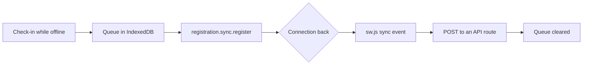

# Future plan

Work agreed but not scheduled. Each item says why it waits and what it needs. Move an item into its own dated plan
in this folder when work starts.

## Share stats as an image (Web Share API)

People want to share a screenshot of their stats (a recovery card, a week of sleep). The plan:

1. Render the chosen card to an image on the device.
2. Call `navigator.share({ files: [image] })`, which opens the phone's own share sheet.
3. Where `navigator.canShare({ files })` is false (most desktops, older browsers), download the image instead.

Coach's "copy" stays on the clipboard. Web Share comes in with this feature, not before.

## Send queued check-ins after the app is closed (Background Sync API)

Today, check-in answers saved offline (`src/lib/offline-queue.ts`) are sent only when the app is open again. With
Background Sync, the service worker sends them as soon as the connection returns, even with the app closed.

What it needs:

- The queue moves from `localStorage` to IndexedDB, because a service worker cannot read `localStorage`.
- An API route for the check-in upsert, because a service worker cannot call a Server Action.
- The page keeps sending the queue itself where Background Sync does not exist (Safari, Firefox).

It is Chromium only, so it improves Android and desktop Chrome and changes nothing on iPhone.
