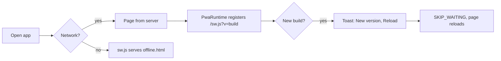
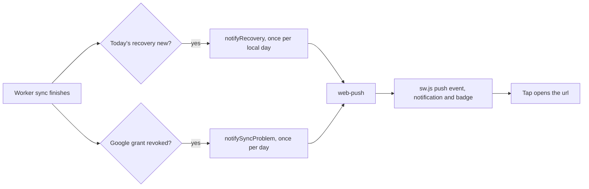

# Pulse as an installed app (PWA)

What makes Pulse behave like an app when it is added to the Home Screen or installed from the browser.

| Piece | Where | Notes |
|---|---|---|
| Manifest | `src/app/manifest.ts` | `id`, scope, portrait, shortcuts (Check in, Recovery, Sleep), screenshots, `launch_handler`. |
| Icons and launch screens | `public/icons`, `public/splash`, `scripts/gen-pwa-assets.py` | Icons are the mark only (`any` and `maskable`, the latter inside the 80% safe zone). Android 12+ draws its launch screen from the maskable home-screen icon and cannot show text, so the name appears only on the iOS launch screens (`public/splash`, per device size, dark and light). Shortcut icons are `icons/shortcut-*.png`, declared maskable so the launcher fills its circle. Icon URLs carry `?v=` in `manifest.ts`: Android caches icons by URL, so bump it whenever the pictures change. Rerun the script to regenerate. |
| Service worker | `public/sw.js` | Caches only `/_next/static/*` and `/offline.html`. Never pages or health data. Also handles Web Push. |
| Registration, update prompt, offline toast | `src/components/pwa/PwaRuntime.tsx` | Production builds only. Registered as `/sw.js?v=<build id>`, so each build installs a new worker and the user is asked before the page swaps. |
| Foreground refresh, pull to sync, offline queue flush | `src/components/shells/AppLifecycle.tsx` | Signed-in screens only. |
| Offline check-in queue | `src/lib/offline-queue.ts` | Check-in answers saved offline are kept in `localStorage` and replayed when back online. |
| Install button / iOS steps, notifications switch | Settings › App (`settings/AppSettings.tsx`), `src/lib/install.ts`, `src/lib/push-client.ts` | |
| Push backend | `src/server/push.ts`, `src/app/push/route.ts` | Needs `VAPID_*` env vars (see `setup.md`). Without them the switch is hidden. |
| Route transitions | Removed: React View Transitions snapshot the page, and the glass nav and headers (backdrop-filter) flickered during every route change. | |

## Flows

## Testing locally

- Service worker, update toast and install: production build only (`pnpm build`, then `node .next/standalone/server.js`, or `pnpm dev` for everything except the worker).
- Push: set the `VAPID_*` vars, restart, then Settings › App › Notifications. On iOS, push works only from the Home Screen app (16.4+).
- Phone on the LAN needs HTTPS for the worker and push (or `localhost` / a tunnel).
- Android launch screen and iOS launch screens are cached by the OS: reinstall the app to see a change.
- Tests: `src/app/manifest.test.ts`, `src/lib/offline-queue.test.ts`, `src/server/push.test.ts`, `e2e/pwa.spec.ts` (the offline case runs only with `E2E_PROD=1`).
