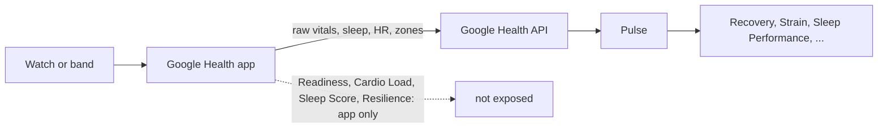

# Blog research: Google's own ecosystem

Research date: 2026-10-09. Slice: Fitbit Air, Pixel Watch, older Fitbits, the Google Health app and Google Health Premium. Method: fetched Google help pages, Google autocomplete and WebSearch. No paid keyword tool, so there are no volume numbers.

Labels, as in [landing-and-seo.md](../landing-and-seo.md):
- **[observed]**: seen directly in a fetched page or in autocomplete on the research date.
- **[reported]**: stated by a third party, not checked against a primary source.
- **[inferred]**: our own judgement.

Reddit was skipped (blocked to our tools). Fetched summaries of help pages come from a small model that read the page; wording is quoted from its output and the per-device grids on the help pages did not come through as text, so check those by hand before publishing a device claim.

---

## 1. What the Google Health app shows

### 1.1 Metric table

"Premium" below means Google Health Premium ($9.99/month or $99.99/year, [reported, Android Authority and others, see section 1.3]).

| Metric | Devices (per Google) | Free or Premium | How Google says it is calculated | Official page |
|---|---|---|---|---|
| **Daily Readiness** (1-100; Low 1-29, Moderate 30-64, High 65-100) | Pixel Watch 1-5; Fitbit Charge 5/6, Sense, Sense 2, Versa 2/3/4, Inspire 2/3, Luxe; Fitbit Air [observed] | Score is free (made free in Sept 2024 [reported, 9to5Google]). Premium adds a coach that "proactively advises adjustments to your training" [observed] | Combines HRV, resting heart rate and recent sleep (past week). Activity was removed and replaced by RHR in the updated algorithm. Needs 7 nights of sleep wear for a first score, sleep of at least 3 hours, about a month of wear for a good baseline [observed] | [Readiness][r] |
| **Cardio Load** (daily) | Fitbit Inspire 2/3, Luxe, Sense/2, Versa 2-4, Charge 5/6, Air; Pixel Watch 1-5. Calculated on-device on Pixel Watch 3, 4, 5. Third-party sources via Health Connect also count. Needs app 4.26+ [observed] | Free [observed] | TRIMP model: heart rate during activity plus age, resting HR and sex. Intensity and duration both count. Resets to zero at midnight; "no practical maximum" [observed]. The Google paper says intensity is exponentially weighted as %HRR rises [reported, [arXiv 2508.11613][ax]] | [Cardio Load][cl] |
| **Target Load** | Same as Cardio Load | Free: weekly target follows your average over the previous 4 weeks. Premium with Coach on: the coach sets and adjusts a weekly target from a Training Focus of Recovery, Maintain or Build [observed] | Inputs: training goal (maintain or improve), last week vs last month (ACWR), and daily readiness (low readiness lowers the target). First target after 7 consecutive days of wear; the page also says two weeks elsewhere and does not reconcile them [observed] | [Cardio Load][cl] |
| **Sleep Score** (0-100; Excellent 90-100, Good 80-89, Fair 60-79, Poor under 60; most people average 72-83) | Wrist Fitbits and Pixel Watches; needs sleep-stage data [observed] | Free. Premium adds "deeper sleep insights" and the sleep coach [observed] | Six components: sleep duration, time to sound sleep, sound sleep, restlessness, full awakenings, interruptions. Compared with targets adjusted for age, gender and time spent trying to sleep [observed]. This is the current page; the older "time asleep + deep and REM + restoration" description is outdated [inferred from the search snippet vs the fetched page] | [Sleep Score][ss] |
| **Sleep stages** (awake, light, deep, REM) | Same as above | Free | Detected automatically when worn to bed. "Deep" maps to N3 slow-wave sleep. Without stage data no Sleep Score is made [observed] | [Sleep Score][ss] |
| **HRV** | Listed among vitals on compatible Fitbits and Pixel Watches; per-model grid not readable in our fetch [observed] | Not stated on the page; free in practice [reported, [Android Authority / Droid Life][wi]] | RMSSD from heart-rate data. Most metrics need 3 hours of quality sleep. Personal range from up to 30 days of data [observed] | [Health metrics][hm] |
| **Resting heart rate** | Broad | Free | Estimated daily; sleeping HR is a separate overnight reading and is often lower. Method is behind "About resting heart rate, Learn more" in the app [reported via search summary; not fetched] | [RHR][rhr] |
| **SpO2 (blood oxygen)** | Table includes Air, Charge 2-6, Inspire 2/3/HR, Luxe, Sense, Versa, Pixel Watch 1-4 [reported via search summary]. Older models need an SpO2 clock face or app. Fitbit Air: SpO2 not available in all regions [reported, [Kygo][kygo-spo2]] | Free | Estimate of blood oxygen, usually above 90 percent; overnight is lower than daytime [reported via search summary] | [Health metrics][hm] |
| **Skin temperature variation** | Same table | Free | Variation of wrist skin temperature during sleep, not core temperature. Needs 3 nights of data [reported via search summary] | [Health metrics][hm] |
| **Breathing rate** | Same table | Free | Breaths per minute, typically 12-20 for adults, best as a sleep average [reported via search summary] | [Health metrics][hm] |
| **Resilience** (Optimal / Balanced / Low) | Fitbit Air is on the compatibility list; Charge 5/6 and Sense keep their stress features. Air has no EDA sensor, so no EDA scan or Body Responses [reported, [Kygo][kygo-stress]; [9to5Google][9to5]] | Not confirmed | Replaced the 0-100 Stress Management Score on 2026-05-19, in the "Mental wellbeing" section. Google's current help page for it was not found; the old stress page (14237928) still describes the numeric score [observed absence] | no current page found |
| **Active Zone Minutes** | Broad | Free | 1 minute per minute in the moderate zone, 2 per minute in vigorous or peak. Zones are personalised by fitness level and age. The API docs describe Karvonen zones per day [observed, [AZM][azm]; [reported, API docs]] | [AZM][azm] |
| **Cardio Fitness Score (VO2 max)** | Wrist devices that do GPS or phone-assisted runs [reported] | Free | From a 10-minute outdoor run: pace vs heart rate gives running efficiency, set against resting HR to estimate VO2 max, then compared with age/sex/weight benchmarks. May take up to three runs in 30 days; shown as a range without GPS [reported via search summary] | [VO2][vo2] |

[r]: https://support.google.com/googlehealth/answer/14236710?hl=en
[cl]: https://support.google.com/googlehealth/answer/15402655?hl=en
[ss]: https://support.google.com/fitbit/answer/14236513?hl=en
[hm]: https://support.google.com/googlehealth/answer/14236917?hl=en
[rhr]: https://support.google.com/googlehealth/answer/14237938?hl=en
[azm]: https://support.google.com/googlehealth/answer/14236509
[vo2]: https://support.google.com/googlehealth/answer/14237924?hl=en
[ax]: https://arxiv.org/abs/2508.11613v2
[kygo-stress]: https://www.kygo.app/post/fitbit-air-stress-tracking
[kygo-spo2]: https://www.kygo.app/post/fitbit-air-spo2-not-tracked
[9to5]: https://9to5google.com/2026/05/07/google-health-fitbit-features/
[wi]: https://www.droid-life.com/2026/05/15/google-health-premium-vs-basic-features-price/

### 1.2 Other facts worth a post

- **Pixel Watch 5 already appears** on the Readiness, Cardio Load and Sleep pages [observed]. Autocomplete also shows "pixel watch 5 vs fitbit charge 6" and "pixel watch 5 skin temperature" [observed]. Do not write "Pixel Watch 1-4" in new posts.
- **Readiness help page contradicts itself on the range**: "0 to 100" in one place, "1 to 100" in another [observed].
- **Readiness vs older copy**: Fitbit's older product pages say activity, sleep and HRV; the current page says HRV, sleep and RHR [observed]. A forum reply still lists "activity" [reported]. Posts must say which version they describe.
- **Readiness "calibration" problems**: "stuck at 15", "always low", "calibrating", "not showing" all appear in autocomplete [observed]; one Notebookcheck report ties it to algorithm updates [reported in landing-and-seo.md].
- **Missing HRV**: a forum reply says HRV and breathing rate are not returned if the sleep algorithm cannot determine sleep stages [reported, Inspire 3 thread via search]. This is an inference for the Air.
- **Cardio Load per-day vs weekly**: Lifehacker/Yahoo coverage says Google moved to a weekly view; the help page still says daily and weekly [reported/observed].

### 1.3 Premium

- $9.99/month or $99.99/year; adds the Gemini-based Health Coach, adaptive plans, deeper sleep insights, medical-record summaries, workout library. Included with Google AI Pro and Ultra. Basic tracking, including steps, sleep stages, HR, HRV and SpO2, is free [reported, [Android Authority][aa-nw], [Droid Life][wi], [Sensai][sensai]].
- Android Authority concluded Premium was "still not worth it" even when free via AI Pro [reported].
- Medical records sync is US only [reported].

[aa-nw]: https://www.androidauthority.com/google-health-premium-not-worth-it-3685642/
[sensai]: https://www.sensai.fit/blog/google-health-premium-fitbit-ai-coach-2026

### 1.4 What the Google Health API exposes (matters for what Pulse can say)

The API lists 44 data types [observed, [developers.google.com/health/data-types](https://developers.google.com/health/data-types)]. Among them: Daily HRV, Daily RHR, Daily Respiratory Rate, Daily Oxygen Saturation, Daily Sleep Temperature Derivations, Daily VO2 Max, Daily Heart Rate Zones, Time in Heart Rate Zone, Active Zone Minutes, Sleep, Heart Rate, Exercise, ECG, Irregular Rhythm Notification. **There is no readiness, cardio load, sleep score, or Resilience type** [observed]. This matches `docs/research/google-vs-pulse-metrics.md` [observed]. Consequence: Pulse cannot read Google's Readiness or Cardio Load; it computes Recovery and Strain from the raw inputs, so a post must never claim Pulse "shows your Fitbit Readiness".



---

## 2. Search demand (autocomplete)

Raw output is in the collapsed section at the end: 251 seeds run on 2026-10-09 [observed]. No volume data. "Strength" below counts how many suggestion variants appear and whether they recur across seeds [inferred].

### 2.1 Clusters that stand out

| Cluster | Example suggestions [observed] | Why it matters |
|---|---|---|
| **Readiness: meaning, low, calibration, not showing** | fitbit readiness score always low / 15 / stuck at 15 / meaning / explained; fitbit air readiness calibration; fitbit daily readiness not calibrating; fitbit readiness score without premium; fitbit improve readiness score; fitbit readiness vs cardio load; fitbit high readiness low cardio load; fitbit readiness and resilience | Largest, most repeated cluster. Dozens of variants over many seeds. Pure troubleshooting plus "what does it mean" |
| **Cardio Load: meaning, target, vs other things** | fitbit cardio load meaning / chart by age / target too high / vs zone minutes / vs active zone minutes; fitbit target load is low; what is a good cardio load per week; fitbit air cardio load 0; fitbit cardio load vs whoop strain | Second largest. People do not understand the unit |
| **Fitbit Air metric troubleshooting** | fitbit air hrv not tracked / 0 / low / apple health; fitbit air spo2 not tracked / countries; fitbit air sleep score not working / 100 sleep score; fitbit air skin temperature no data; fitbit air resilience always low; fitbit air resting heart rate not tracked | Every Air metric has a "not tracked / no data" variant |
| **Fitbit Air recovery and strain** | does fitbit air have strain and recovery; fitbit air recovery score; fitbit air strain score; fitbit air metrics; fitbit air tracks what; fitbit air zone 2; fitbit air zones | Already covered by the site's `fitbit-air-recovery-and-strain` page |
| **Premium vs free** | google health premium worth it (+ reddit); google health premium vs free; premium free with ai pro / gemini pro / fitbit air; fitbit readiness score without premium; fitbit air does it need subscription; fitbit air has subscription; google health premium price (india, uk, canada, singapore, malaysia, ireland, australia, usa, nz) | Strong; price queries are local and change often |
| **Google Health app rename and basics** | fitbit app now google health; why does my fitbit app now say google health; google health app vs fitbit app; google health vs google fit; google health vs health connect; google health vs apple health; google health vs samsung health; google health vs strava; google health vs bevel; fitbit air x bevel | Confusion about the rename. "vs bevel" is a direct competitor mention (see 4) |
| **Syncing and data portability** | google health not syncing with apple health / fitbit / strava; google health app write to apple health; google health to apple health sync; fitbit to apple health sync (free, app review); fitbit to health connect; health connect fitbit not working; health connect sync old data / historical data; fitbit data export (stuck, to garmin, to excel, raw); google health data export; fitbit takeout | Large and practical. Pulse can speak on the export and API side |
| **API / developer** | fitbit api deprecation; fitbit api for personal use; google health api (docs, v4, pricing, scopes, mcp, key); google health mcp server; google health home assistant | Small but high intent for self-hosters. Matches the legacy Fitbit Web API shutdown [reported in landing-and-seo.md] |
| **Web and desktop access** | google health web / web login / web app / on desktop / on pc / dashboard; fitbit dashboard (online, desktop, login); google health app web version | Signals people want a browser dashboard. This is Pulse's product shape [inferred] |
| **Zones** | google health heart rate zones / zone 2 / zone minutes; fitbit air zone 2 / zones | Small, link to Strain and Active Zone Minutes |
| **Comparisons** | fitbit air vs whoop / whoop 5.0 / oura / garmin cirqa / amazfit helio strap / noise rep / charge 6 / inspire 3 / apple watch / pixel watch 4 and 5; pixel watch vs apple watch / galaxy / garmin / fitbit air; pixel watch 4 vs 3; pixel watch vs fitbit charge 6 | Biggest by variety. Dominated by major outlets, so low odds for Pulse [inferred] |
| **Normal ranges ("what is a good ...")** | what is a good hrv (for age, at night, apple watch); fitbit hrv normal range (by age, chart, female); what is a good sleep score on fitbit / google health; what is a good readiness score on fitbit / google health; what is a good cardio load (per week, per day, on fitbit); fitbit sleep score excellent; is a fitbit sleep score of 80 good | Big. Needs honest "no universal range" answers |
| **Pixel Watch metrics** | pixel watch 4 readiness; pixel watch 3 no readiness score; pixel watch hrv 0 / accuracy; pixel watch vo2 max not tracked / accuracy; pixel watch 4 skin temperature not working; pixel watch spo2 no data; pixel watch stress notifications | Mostly device-model modifiers. "no readiness score" and "not tracked" are the troubleshooting forms |
| **Air launch / shopping** | india, price, buy, flipkart, dubai, launch date, bands, whoop adapter | Not Pulse's lane |

### 2.2 Top queries for this slice

My ranking from the harvest for relevance to Pulse and presence across several seeds [inferred]:

1. fitbit readiness score always low / stuck at 15
2. fitbit readiness score meaning / how is fitbit readiness calculated
3. fitbit cardio load meaning / what is a good cardio load
4. fitbit cardio load vs whoop strain / fitbit readiness vs cardio load
5. fitbit air readiness calibration / readiness not showing
6. does fitbit air have strain and recovery
7. fitbit air hrv not tracked / 0 / low
8. google health premium worth it / vs free
9. fitbit readiness score without premium
10. what is a good hrv / fitbit hrv normal range by age
11. fitbit target load too high / is low
12. google health not syncing with apple health
13. fitbit api deprecation / google health api
14. google health web / dashboard / desktop
15. fitbit readiness and resilience (also: fitbit resilience always low)

---

## 3. Who ranks now

SERP checks via WebSearch on 2026-10-09. WebSearch is US-only and does not give true rank order, so treat the lists as "who appears" [observed].

| Query | Who appears [observed] | Format winning [inferred] | Gap Pulse could fill honestly |
|---|---|---|---|
| fitbit air recovery score | Retailer pages, Thurrott review, Google Store page | Product and review pages. No page answers "Readiness vs Recovery" head-on | An explainer with the exact mapping Readiness to Recovery, and a way to compute a Recovery. Already partly the site's compare page |
| fitbit cardio load explained | Google help page, Android Central explainer, Yahoo, Google Research paper and blog, Fitbit community threads | Official help plus news explainer plus forum | Nobody ties Cardio Load to the underlying math (TRIMP, ACWR) with a worked example, or compares it with Strain. Pulse can, because it implements TRIMP-style load and ACWR |
| fitbit readiness score low why | Fitbit community threads (many), Google help, Boston Globe piece | Forum threads | Forum answers say "check the breakdown". A checklist grounded in the three inputs and the calibration rules would be new |
| google health premium worth it | Android Authority, Droid Life, Sensai, German blogs | Opinion and review articles | Hard to beat for the verdict. Pulse could contribute only a "what the free tier already gives you, and what the API exposes" angle |
| fitbit air hrv not tracked | Fitbit community threads for other models, the5krunner HR/HRV test, Kygo guides for Air SpO2 and stress | Forum plus niche blogs. No Google page for the Air | Troubleshooting checklist, honest about what is known and unknown. Pulse can add how to see whether HRV reached the API |
| pixel watch 4 readiness score | Google Store pages (many locales), Google help page | Official only | Small gap: a plain explainer of the score bands and the three inputs, with the 1-vs-0 range inconsistency noted |
| fitbit air without subscription | Digital Trends, Tom's Guide, Techlicious, Expert Reviews, WePC | Reviews and news | Taken by major outlets. Pulse's angle is "what is free, and what extra scores you can add without paying" |
| fitbit data export google health | Google help page (14236615), FitMesh blogs | Official page plus vendor blogs | Practical "what is in the export and what Pulse does with it" guide; vendor posts have unverified claims per the search summary |
| what is a good hrv by age | Many near-duplicate chart pages with no clear source | Thin chart pages | Strong gap for an honest page: no universal range, compare with your own baseline, show how Google builds a 30-day personal range and how Pulse does it |
| fitbit stress management score gone resilience | Google blog posts (old stress), 9to5Google, Kygo, Wareable, patents | News plus one niche blog; no current Google page | One of the few where Google's own page is missing. A clear "what replaced it" explainer is open [inferred] |

Takeaways:
- Official Google pages win "how is X calculated" but are short, change often and contradict each other. A neutral page that cites them and flags the contradictions is useful [inferred].
- Forums win "why is my score low / not showing". Posts that answer with a checklist and explain calibration can compete [inferred].
- Reviews and comparisons are held by large outlets. Skip them.

---

## 4. Blog post ideas

All titles are under 60 characters. Each post should state its Google source and date, and say "Google does not publish the exact formula" where true. Link targets are existing `/metrics/` pages.

| # | Title | Target queries | Intent | Why Pulse can write it | Link to |
|---|---|---|---|---|---|
| 1 | Fitbit readiness always low? Check these 6 things | fitbit readiness score always low, stuck at 15, not calibrating, readiness not showing, fitbit air readiness calibration | Troubleshooting | The three inputs (HRV, RHR, sleep) are the same ones Pulse's Recovery uses, so Pulse can explain how a short night or a raised RHR drags a score down. The 7-night, 3-hour and wear rules are in Google's help page | `/metrics/recovery/`, `/metrics/hrv/`, `/metrics/resting-heart-rate/` |
| 2 | Fitbit Daily Readiness explained (and how it differs) | fitbit readiness score meaning, how is fitbit readiness calculated, what is a good readiness score on google health, pixel watch 4 readiness | Informational | Covers the 2024 change (activity out, RHR in), the bands and the 0 vs 1 range contradiction, then compares with Pulse's Recovery, which uses more inputs (including respiratory rate and skin temperature) | `/metrics/recovery/` |
| 3 | Cardio Load vs Strain: what the numbers mean | fitbit cardio load meaning, cardio load vs whoop strain, fitbit cardio load vs zone minutes, what is a good cardio load | Informational, comparison | Google says Cardio Load is TRIMP. Pulse computes Strain from heart-rate reserve and zone weights, so it can show both from the same workout. Caveat: the two are not the same scale | `/metrics/strain/`, `/metrics/training-balance/` |
| 4 | Fitbit Target Load too high or low? How it is set | fitbit target load too high, is low, no target load, fitbit cardio load target | Troubleshooting | Google lists the inputs (goal, ACWR, readiness). Pulse has a Strain Target and an ACWR page, so it can explain the logic and where Google's own page is unclear (7 days vs 2 weeks) | `/metrics/strain-target/`, `/metrics/training-balance/` |
| 5 | Fitbit Air HRV missing or zero? What to check | fitbit air hrv not tracked / 0 / low, pixel watch hrv 0, fitbit hrv not working | Troubleshooting | Pulse reads Daily HRV from the API and can say whether the data arrived. Google's page says 3 hours of sleep and stages are needed. Label the stage-dependency claim as a forum report | `/metrics/hrv/` |
| 6 | What is a good HRV? Use your own baseline, not a chart | what is a good hrv, fitbit hrv normal range by age, what should hrv be on fitbit | Informational | SERP is thin chart pages. Pulse can explain RMSSD (Google names it), the 30-day personal range Google shows, and Pulse's baseline method, and refuse to invent age tables | `/metrics/hrv/`, `/metrics/health-monitor/` |
| 7 | Google Health Premium vs free: what you actually lose | google health premium worth it, vs free, fitbit readiness score without premium, fitbit air without subscription | Commercial investigation | The free tier already includes Readiness, Cardio Load, Sleep Score and the vitals. Pulse can say which scores are free, and what a self-hosted app adds. Must carry an "as of" date for prices | `/metrics/recovery/`, `/metrics/strain/` (and the existing compare page) |
| 8 | Fitbit Resilience replaced the stress score. Now what? | fitbit stress management score gone, fitbit resilience always low, fitbit readiness and resilience, google health app stress | Informational | No current Google page was found (observed absence), so there is an open slot. Pulse's Stress Monitor is HR-based, not EDA, which is honest about the Air having no EDA sensor | `/metrics/stress-monitor/` |
| 9 | Fitbit sleep score: the six parts and what is a good one | what is a good sleep score on fitbit / google health, fitbit sleep score calculation, is 80 good, sleep score not working | Informational | Google's current page lists six components and four bands. Many sites repeat the old three-part description. Compare with Pulse's Sleep Performance | `/metrics/sleep-performance/`, `/metrics/sleep-planner/` |
| 10 | Export your Fitbit data: Takeout, Health API, what is kept | fitbit data export, google health data export, fitbit takeout, fitbit api deprecation, google health api | Informational, navigational | Pulse is built on the Google Health API. It can list the 44 data types and what is missing (no Readiness). Also covers the legacy Fitbit Web API end date [reported] | `/metrics/hrv/` (data example) and the home page |
| 11 | Fitbit Air zones: what Active Zone Minutes really count | fitbit cardio load vs active zone minutes, fitbit air zones, google health zone minutes, zone 2 | Informational | Google gives 1 and 2 points per minute. Pulse reads `daily-heart-rate-zones` and `time-in-heart-rate-zone` from the API | `/metrics/strain/`, `/metrics/fitness-fatigue-form/` |
| 12 | Which Google devices give which health metrics | fitbit charge 6 readiness, pixel watch skin temperature, fitbit inspire 3 readiness, pixel watch 4 vs charge 6 metrics | Informational | A compatibility matrix built from Google's own pages. Larger sites sell hardware; this one maps metrics to devices. Needs a manual check of the grids that did not fetch | `/metrics/` index |
| 13 | Fitbit VO2 max and cardio fitness score: how accurate? | fitbit vo2 max accurate, pixel watch vo2 max not tracked, fitbit air vo2 max, what is a good vo2 max | Informational | Google's three-step method is public. Pulse's Fitness level compares against age and sex norms | `/metrics/fitness-level/` |
| 14 | Google Health vs Health Connect vs Apple Health | google health vs health connect, google health app write to apple health, google health not syncing with apple health | Informational | Pulse reads from the API. HRV not syncing to Apple Health is a Reddit-sourced claim only [reported], so state it as unverified | home page |
| 15 | Fitbit resting heart rate high? Likely causes | fitbit resting heart rate high / suddenly increased, sleeping heart rate higher than resting heart rate | Troubleshooting | Google says sleeping HR is separate and often lower than daily RHR (a good "why do these differ" hook). Pulse uses daily RHR first | `/metrics/resting-heart-rate/` |

### Top 8 recommended first

1. Fitbit readiness always low? Check these 6 things (highest demand, forum-only competition)
2. Fitbit Daily Readiness explained (and how it differs)
3. Cardio Load vs Strain: what the numbers mean
4. Fitbit Target Load too high or low? How it is set
5. Fitbit Air HRV missing or zero? What to check
6. What is a good HRV? Use your own baseline, not a chart
7. Fitbit Resilience replaced the stress score. Now what?
8. Google Health Premium vs free: what you actually lose

### Honesty rules for this slice

- Google does not publish exact formulas for Readiness or Sleep Score. Say so; describe inputs only.
- Pulse does not reproduce Google's scores. It cannot read them from the API, and it computes its own. Never write "Pulse shows your Readiness".
- Date every price and device list. Premium prices and "supported devices" changed within the last six months.
- Check the device grids by hand. Our fetches did not return the checkmarks.
- Watch for the competitor mention "google health vs bevel" and "fitbit air x bevel". Check what those results are before writing about them [observed in autocomplete, not investigated].

---

<details>
<summary>Raw autocomplete harvest (251 seeds, 2026-10-09)</summary>

```text
fitbit air daily readiness => fitbit air daily readiness | fitbit air daily readiness score | fitbit breathing rate no data
fitbit air readiness score => fitbit air readiness score | fitbit air readiness score reddit | fitbit air readiness score not showing | fitbit air readiness score not working | fitbit air readiness score always low | fitbit air readiness score low | google fitbit air readiness score | fitbit air daily readiness score | fitbit air no readiness score | does fitbit air have readiness score
fitbit air cardio load => fitbit air cardio load | fitbit air cardio load meaning | fitbit air cardio load reddit | fitbit air cardio load explained | fitbit air cardio load 0 | google fitbit air cardio load | fitbit air weekly cardio load | how does fitbit air calculate cardio load
fitbit air target load => (none)
fitbit air sleep score => fitbit air sleep score not working | fitbit air sleep score | fitbit air sleep score not showing | fitbit air sleep score reddit | fitbit air sleep score accuracy | fitbit air sleep score no data | google fitbit air sleep score | fitbit air no sleep score reddit | fitbit air 100 sleep score | google fitbit air sleep score not working
fitbit air hrv => fitbit air hrv | fitbit air hrv accuracy | fitbit air hrv not tracked | fitbit air hrvatska | fitbit air hrv 0 | fitbit air hrv apple health | fitbit air hrv tracking | fitbit air hrv reddit | fitbit air hrv low | fitbit air hrv frequency
fitbit air resting heart rate => fitbit air resting heart rate | fitbit air resting heart rate not tracked | fitbit air resting heart rate high | fitbit air resting heart rate reddit | fitbit air resting heart rate accuracy | fitbit air resting heart rate poor | google fitbit air resting heart rate | does fitbit air tracker resting heart rate | how does fitbit air calculate resting heart rate | does google fitbit air track resting heart rate
fitbit air spo2 => fitbit air spo2 | fitbit air spo2 not tracked | fitbit air spo2 no data | fitbit air spo2 not working | fitbit air spo2 accuracy | fitbit air spo2 tracking | fitbit air spo2 not tracked reddit | fitbit air spo2 low | fitbit air spo2 countries | fitbit air spo2 sensor
fitbit air skin temperature => fitbit air skin temperature | fitbit air skin temperature no data | fitbit air skin temperature variation | fitbit air skin temperature sensor | fitbit air skin temperature not working | fitbit air skin temperature not showing | fitbit air skin temperature not tracked | fitbit air body temperature | fitbit air body temperature sensor | fitbit air body temperature no data
fitbit air breathing rate => fitbit air breathing rate | fitbit air breathing rate not tracked | fitbit air breathing rate no data | google fitbit air breathing rate | fitbit air track breathing rate | does fitbit air track breathing rate | does google fitbit air track breathing rate | breathing rate on fitbit | how does fitbit calculate breathing rate | fitbit not showing breathing rate
fitbit air stress => fitbit air stress tracking | fitbit air stress monitor | fitbit air stress | fitbit air stress level | fitbit air stress score | fitbit air stress tracker | fitbit air stress management | fitbit air stress management score | fitbit air stress sensor | fitbit air stress measurement
fitbit air resilience => fitbit air resilience | fitbit air resilience score | fitbit air resilience always low | fitbit air resilience no data | fitbit air resilience low | fitbit air resilience reddit | fitbit air resilience and readiness | google fitbit air resilience | fitbit aria air reset
fitbit air active zone minutes => fitbit air active zone minutes | what is active zone minutes fitbit | what does active zone minutes mean on fitbit
fitbit air vo2 max => fitbit air vo2 max | fitbit air vo2 max not tracked | fitbit air vo2 max accuracy | fitbit air vo2 max tracking | fitbit air vo2 max reddit | fitbit air vo2 max not working | fitbit air vo2 max cycling | google fitbit air vo2 max | fitbit air measure vo2 max | does fitbit air vo2 max
fitbit air cardio fitness score => fitbit air cardio fitness score
fitbit air sleep stages => fitbit air sleep stages | fitbit air sleep cycle | fitbit air sleep cycle alarm | fitbit air not tracking sleep stages | how does fitbit air track sleep stages
fitbit air recovery => fitbit air recovery | fitbit air recovery tracking | fitbit air recovery score | fitbit air recovery metrics | fitbit air recovery mode | fitbit air recovery reddit | fitbit air recovery data | fitbit air restore | google fitbit air recovery | google fitbit air recovery score
fitbit air strain => fitbit air strain | fitbit air strain score | fitbit air strain and recovery | google fitbit air strain | does fitbit air track strain | does fitbit air show strain | does fitbit air have strain and recovery | does fitbit air measure strain | does fitbit air have a strain score | fitbit air review
fitbit air health coach => fitbit air health coach | fitbit air google health coach | fitbit health coach review
fitbit air premium => fitbit air premium price | fitbit air premium subscription | fitbit air premium | fitbit air premium subscription price | fitbit air premium features | fitbit air premium band | fitbit air premium vs free | fitbit air premium strap | fitbit air premium vs non premium | fitbit air premium armband
fitbit air battery life => fitbit air battery life | fitbit air battery life reddit | fitbit air battery life vs whoop | fitbit air battery life issues | fitbit air battery drain | fitbit air battery duration | fitbit air battery pack | fitbit air battery charge time | fitbit air battery last | fitbit air battery charge
fitbit air heart rate accuracy => fitbit air heart rate accuracy | fitbit air heart rate accuracy reddit | fitbit air heart rate review | google fitbit air heart rate accuracy | fitbit air resting heart rate accuracy | fitbit air heart rate variability accuracy | fitbit air heart rate not accurate | fitbit air heart rate monitor review | how accurate is heart rate on fitbit | can fitbit heart rate be inaccurate
pixel watch readiness => pixel watch readiness score | pixel watch readiness | pixel watch 4 readiness score | pixel watch daily readiness score | pixel watch 3 readiness score | pixel watch 2 readiness score | pixel watch 4 readiness | pixel watch daily readiness | pixel watch no readiness score | pixel watch 4 daily readiness
pixel watch cardio load => pixel watch cardio load | pixel watch cardio load compilation | pixel watch 4 cardio load | pixel watch 3 cardio load | pixel watch 2 cardio load | how does apple watch measure cardio fitness | what is a good cardio load
pixel watch sleep score => pixel watch sleep score | pixel watch 4 sleep score | pixel watch no sleep score | pixel watch 3 sleep score | pixel watch not showing sleep score | pixel watch 3 no sleep score | pixel watch not giving sleep score | does apple watch give a sleep score | does garmin give a sleep score | does sleep score work with apple watch
pixel watch hrv => pixel watch hrv | pixel watch hrv accuracy | pixel watch hrv app | pixel watch hrv reddit | pixel watch hrv 0 | pixel watch heart rate variability | pixel watch 4 hrv | pixel watch 3 hrv | pixel watch 2 hrv | pixel watch 4 hrv accuracy
pixel watch resting heart rate => pixel watch resting heart rate | pixel watch resting heart rate accuracy | pixel watch 3 resting heart rate | pixel watch 4 resting heart rate | how does pixel watch calculate resting heart rate | how does garmin watch measure resting heart rate | how does garmin measure resting heart rate | does apple watch show resting heart rate | does apple watch do resting heart rate
pixel watch spo2 => pixel watch spo2 | pixel watch spo2 on demand | pixel watch spo2 accuracy | pixel watch spo2 issues | pixel watch spo2 app | pixel watch spo2 how to use | pixel watch spo2 no data | pixel watch oxygen saturation | pixel watch oximeter | pixel watch 4 spo2
pixel watch skin temperature => pixel watch skin temperature | pixel watch body temperature | pixel watch 4 skin temperature | pixel watch 3 skin temperature | pixel watch 2 skin temperature | pixel watch 4 skin temperature not working | pixel watch 5 skin temperature | pixel watch 4 skin temperature sensor | pixel watch 1 skin temperature | pixel watch 2 skin temperature no data
pixel watch stress => pixel watch stress monitor | pixel watch stress notifications | pixel watch stress detection | pixel watch stress | pixel watch stress management | pixel watch stress level | pixel watch 4 stress monitor | pixel watch 3 stress tracking | google pixel watch stress monitor | pixel watch 4 stress tracking
pixel watch vo2 max => pixel watch vo2 max not tracked | pixel watch vo2 max | pixel watch vo2 max accuracy | pixel watch 4 vo2 max | pixel watch 3 vo2 max | pixel watch 2 vo2 max | pixel watch 3 vo2 max accuracy | pixel watch 4 vo2 max accuracy | pixel watch 5 vo2 max | pixel watch 2 vo2 max accuracy
pixel watch active zone minutes => pixel watch active zone minutes | what does active zone minutes mean | what are active zone minutes | what is active zone minutes fitbit
pixel watch battery => pixel watch battery life | pixel watch battery replacement | pixel watch battery | pixel watch battery drain | pixel watch battery suddenly draining fast | pixel watch battery health | pixel watch battery saver | pixel watch battery saver mode | pixel watch battery life comparison | pixel watch battery usage stats
pixel watch recovery => pixel watch recovery mode | pixel watch recovery mode no command | pixel watch recovery | pixel watch restore from backup | restore pixel watch | pixel watch 2 recovery mode | pixel watch 3 recovery mode | pixel watch 4 recovery mode | pixel watch 1 recovery mode | pixel watch 4 recovery
pixel watch health coach => pixel watch health coach | pixel watch 4 health coach | pixel watch ai health coach | pixel watch 4 ai health coach | does google pixel have a health app | pixel watch review
pixel watch 4 readiness => pixel watch 4 readiness score | pixel watch 4 readiness | pixel watch 4 daily readiness | pixel watch 4 getting ready
pixel watch 4 sleep => pixel watch 4 sleep tracking | pixel watch 4 sleep tracking accuracy | pixel watch 4 sleep apnea | pixel watch 4 sleep mode | pixel watch 4 sleep apnea detection | pixel watch 4 sleep tracking reddit | pixel watch 4 sleep tracking not working | pixel watch 4 sleep | pixel watch 4 sleep as android | pixel watch 4 sleep tracking review
pixel watch 3 readiness score => pixel watch 3 readiness score | pixel watch 3 no readiness score | is there a watch for google pixel | cam 3 reading test 3 answers
pixel watch 3 cardio load => pixel watch 3 cardio load | will an apple watch work with a google pixel | does apple watch work with google pixel | what smart watches work with google pixel
pixel watch 2 hrv => pixel watch 2 hrv accuracy | pixel watch 2 hrv | what is hrv apple watch | does apple watch do hrv
pixel watch 4 hrv => pixel watch 4 hrv | pixel watch 4 hrv accuracy | pixel watch 4 hrvatska | pixel watch 4 hrv 0 | pixel watch 4 heart rate variability | does pixel watch 4 measure hrv | does pixel watch 4 have hrv | what is hrv apple watch | does apple watch do hrv | does apple watch show hrv
pixel watch 4 recovery => pixel watch 4 recovery mode | pixel watch 4 recovery | pixel watch 4 recovery mode no command | pixel watch 4 restore from backup | google pixel watch 4 recovery mode
pixel watch 4 vs pixel watch 3 => pixel watch 4 vs pixel watch 3 | pixel watch 4 vs pixel watch 3 battery life | pixel watch 4 vs pixel watch 3 reddit | pixel watch 4 or pixel watch 3 | google pixel watch 4 vs pixel watch 3 | pixel watch 4 45mm vs pixel watch 3 45mm | pixel watch 4 41mm vs pixel watch 3 41mm | pixel watch 4 lte vs pixel watch 3 lte | pixel watch 4 41mm vs pixel watch 3 45mm | pixel watch 4 compared to pixel watch 3
pixel watch vs fitbit charge 6 => pixel watch vs fitbit charge 6 | pixel watch or fitbit charge 6 | pixel watch 4 vs fitbit charge 6 | pixel watch 3 vs fitbit charge 6 | pixel watch 2 vs fitbit charge 6 | pixel watch 5 vs fitbit charge 6 | pixel watch 1 vs fitbit charge 6 | pixel watch 4 or fitbit charge 6 | pixel watch 3 or fitbit charge 6 | google pixel watch 4 vs fitbit charge 6
pixel watch vs apple watch => pixel watch vs apple watch | pixel watch vs apple watch accuracy | pixel watch vs apple watch health features | pixel watch vs apple watch reddit | pixel watch vs apple watch ultra | pixel watch vs apple watch for kids | pixel watch vs apple watch battery life | pixel watch vs apple watch vs garmin | pixel watch vs apple watch for fitness | pixel watch vs apple watch features
pixel watch vs => pixel watch vs apple watch | pixel watch vs galaxy watch | pixel watch vs fitbit | pixel watch vs samsung watch | pixel watch vs garmin | pixel watch vs fitbit air | pixel watch vs apple watch accuracy | pixel watch vs samsung watch 8 | pixel watch vs apple watch health features | pixel watch vs samsung galaxy watch
fitbit air vs => fitbit air vs whoop | fitbit air vs whoop 5.0 | fitbit air vs garmin cirqa | fitbit air vs noise rep | fitbit air vs amazfit helio strap | fitbit air vs fitbit charge 6 | fitbit air vs fitbit inspire 3 | fitbit air vs apple watch | fitbit air vs helio strap | fitbit air vs amazfit helio
fitbit air vs pixel watch => fitbit air vs pixel watch 4 | fitbit air vs pixel watch 5 | fitbit air vs pixel watch 3 | fitbit air vs pixel watch | fitbit air vs pixel watch 2 | fitbit air vs pixel watch 4 sensors | fitbit air vs pixel watch 1 | fitbit air vs pixel watch 4 sleep tracking | fitbit air vs pixel watch 4 accuracy | fitbit air vs pixel watch reddit
fitbit air vs charge 6 => fitbit air vs charge 6 | fitbit air vs charge 6 vs inspire 3 | fitbit air vs charge 6 reddit | fitbit air vs charge 6 accuracy | fitbit air vs charge 6 sensors | fitbit air vs charge 6 sleep tracking | fitbit air vs charge 6 weight | fitbit air vs charge 6 size | fitbit air vs charge 6 specs | fitbit air vs charge 6 battery life
fitbit air vs whoop => fitbit air vs whoop | fitbit air vs whoop 5.0 | fitbit air vs whoop reddit | fitbit air vs whoop accuracy | fitbit air vs whoop which is better | fitbit air vs whoop peak | fitbit air vs whoop vs apple watch | fitbit air vs whoop vs noise rep | fitbit air vs whoop vs amazfit | fitbit air vs whoop life
fitbit air vs oura => fitbit air vs oura ring | fitbit air vs oura ring 4 | fitbit air vs oura ring 5 | fitbit air vs oura | fitbit air vs oura ring reddit | fitbit air vs oura vs whoop | fitbit air vs oura ring sleep tracking | fitbit air vs oura sleep tracking | fitbit air vs oura ring vs whoop | fitbit air vs oura ring accuracy
fitbit air vs garmin => fitbit air vs garmin cirqa | fitbit air vs garmin | fitbit air vs garmin cirqa vs whoop | fitbit air vs garmin cirqa reddit | fitbit air vs garmin forerunner 55 | fitbit air vs garmin vivosmart 5 | fitbit air vs garmin vivoactive 5 | fitbit air vs garmin watch | fitbit air vs garmin 165 | fitbit air vs garmin forerunner
google health app => google health app | google health app download | google health app update | google health app ios | google health app premium | google health app vs google fit | google health app android | google health app india | google health app free | google health app not working
google health app readiness => google health app readiness score | what is readiness in google health app | does google have a health app
google health app hrv => google health app hrv | google health app heart rate variability | is apple watch hrv accurate
google health app sleep score => google health app sleep score | google health app no sleep score | google health app not giving sleep score | how does health app track sleep
google health app cardio load => google health app cardio load | google health app cardio load target | on the google health app what does cardio load mean | does google have a health app
google health app stress => google health app stress score | google health app stress | google health app stress level | google health app stress management | does google have a health app | are steps in health app accurate | is the health app accurate
google health app vs fitbit app => google health app vs fitbit app | google health app or fitbit app | new google health app vs fitbit app | google health app replacing fitbit app | can you sync health app with fitbit
google health app not syncing => google health app not syncing with fitbit | google health app not syncing | google health app not syncing with fitbit charge 6 | google health app not syncing with pixel watch | google health app not syncing with watch | google health app not syncing with fitbit today | google health app not syncing with strava | google health app not syncing data | google health app not syncing with pixel watch 3 | google health app not syncing today
google health app export data => google health app export data | does google have a health app | how to export google fit data
google health app api => google health app api | does google have a health app | does android have a health app | does google pixel have a health app
google health premium => google health premium | google health premium price india | google health premium price | google health premium subscription | google health premium india | google health premium subscription india | google health premium subscription price in india | google health premium subscription price | google health premium features | google health premium vs free
google health premium worth it => google health premium worth it | google health premium worth it reddit | is google health fitbit premium worth it | google health premium italia | premium health naturally reviews | is google health accurate
google health premium price => google health premium price india | google health premium price | google health premium price uk | google health premium price canada | google health premium price singapore | google health premium price malaysia | google health premium price ireland | google.health premium price australia | google health premium price usa | google health premium price nz
google health premium vs free => google health premium vs free | google health premium vs free reddit | google health paid vs free | google health app premium vs free | google health fitbit premium vs free | google health premium free trial | google health premium free | google health premium free with gemini pro | google health premium free with ai pro | google health premium free with fitbit air
google health premium features => google health premium features | google health premium features list | google health app premium features | google health fitbit premium features | premium health naturally reviews | what health insurance does google offer | premium benefits
google health coach => google health coach | google health coach india | google health coach price | google health coach subscription | google health coach app | google health coach ai | google health coach review | google health coach not available | google health coach is coming soon | google health coach reddit
google health coach free => google health coach free | google health coach free trial | how much does a health coach cost | how to become a health coach for free
google health app web version => google health app web version | does google have a health app | how do i download the huawei health app | what is the latest version of huawei health app
google health app on iphone => google health app on iphone | google health app on ios | google health app appeared on iphone | google health app iphone widget | google health app iphone download | google health app not working on iphone | google health app not loading on iphone | google health app crashing iphone | google health app fitbit iphone | google health app draining iphone battery
google health app apple health => google health app apple health | google health app apple health sync | google health app apple watch | google health app vs apple health | google health on apple watch | google health app write to apple health | google health write on apple health | google health app not syncing with apple health | does google health app sync with apple health | does.google.health app integrate with apple health
fitbit readiness score => fitbit readiness score | fitbit readiness score always low | fitbit readiness score 15 | fitbit readiness score meaning | fitbit readiness score accuracy | fitbit readiness score not showing | fitbit readiness score reddit | fitbit readiness score explained | fitbit readiness score low | fitbit readiness score stuck at 15
fitbit readiness score low => fitbit readiness score low | fitbit readiness score always low | fitbit daily readiness score low | fitbit readiness score always low reddit | fitbit air readiness score low | fitbit daily readiness score always low | why is my fitbit readiness score low | fitbit low readiness score reddit | fitbit air readiness score always low | financial readiness score
fitbit readiness score not showing => fitbit readiness score not showing | fitbit readiness score not working | fitbit daily readiness score not showing | fitbit air not showing readiness score | fitbit charge 6 readiness score not showing | fitbit daily readiness score not working
fitbit readiness how calculated => how is fitbit readiness calculated | how is fitbit readiness score calculated | fitbit how is daily readiness calculated | fitbit breathing rate no data
fitbit cardio load => fitbit cardio load | fitbit cardio load chart by age | fitbit cardio load meaning | fitbit cardio load target | fitbit cardio load explained | fitbit cardio load target too high | fitbit cardio load chart | fitbit cardio load vs zone minutes | fitbit cardio load vs active zone minutes | fitbit cardio load not working
fitbit cardio load how calculated => fitbit cardio load how is it calculated | how is cardio load calculated fitbit air
fitbit cardio load vs strain => fitbit cardio load vs whoop strain
fitbit target load => fitbit target load | fitbit target load is low | fitbit target load reddit | fitbit target load meaning | fitbit target cardio load | fitbit target cardio load not showing | fitbit target cardio load reddit | fitbit no target load | fitbit cardio load target too high | fitbit cardio load target too low
fitbit sleep score how calculated => fitbit sleep score calculation | how does fitbit calculate sleep score
fitbit sleep score good => fitbit sleep score good | fitbit sleep score excellent | fitbit sleep score too high | is a fitbit sleep score of 80 good | is a fitbit sleep score of 86 good | whats a good fitbit sleep score
fitbit hrv normal => fitbit hrv normal range | fitbit hrv normal range by age | fitbit hrv normal range chart | fitbit hrv normal range female | fitbit normal hrv | fitbit normal heart rate variability | fitbit hrv average | fitbit average hrv by age | fitbit hrv score | what should hrv be on fitbit
fitbit hrv low => fitbit hrv low | fitbit hrv low reddit | fitbit heart rate variability low | fitbit hrv very low | fitbit air hrv low | fitbit hrv always low | fitbit hrv too low | fitbit poor hrv | fitbit shows low hrv | why is my hrv so low on fitbit
fitbit hrv not working => fitbit hrv not working | fitbit hrv not showing | fitbit air hrv not working | fitbit inspire 3 hrv not working | fitbit charge 6 hrv not working | why is fitbit hrv measuring not working so many times | does fitbit have hrv | fitbit hrv score | how accurate is hrv on fitbit
fitbit hrv explained => fitbit hrv explained | fitbit hrv meaning | does fitbit have hrv | what is hrv on fitbit | what should hrv be on fitbit | is hrv on fitbit accurate | fitbit hrv score
fitbit resting heart rate high => fitbit resting heart rate higher than current | fitbit resting heart rate high | fitbit resting heart rate too high | fitbit air resting heart rate high | fitbit resting heart rate suddenly increased | why is my fitbit resting heart rate so high | fitbit sleeping heart rate higher than resting heart rate
fitbit resting heart rate normal => fitbit resting heart rate average | fitbit normal resting heart rate | fitbit resting heart rate by age
fitbit spo2 normal => fitbit spo2 normal range | fitbit spo2 levels | spo2 normal fitbit | what does spo2 mean on fitbit
fitbit spo2 not working => fitbit spo2 not working | fitbit spo2 not working versa 2 | fitbit oxygen saturation not working | fitbit sp02 not working | fitbit spo2 stopped working | fitbit spo2 not showing | fitbit air spo2 not working | fitbit sense spo2 not working | fitbit spo2 app not working | fitbit luxe spo2 not working
fitbit skin temperature variation => fitbit skin temperature variation | fitbit skin temp variation meaning | fitbit air skin temperature variation | skin temperature variation fitbit charge 6 | google fitbit air skin temperature variation | why does fitbit measure skin temperature variation | does fitbit air track skin temperature variation | does fitbit measure skin temperature
fitbit breathing rate normal => fitbit normal breathing rate | fitbit breathing rate | how does fitbit calculate breathing rate | how accurate is fitbit breathing rate
fitbit stress management score => fitbit stress management score 65 | fitbit stress management score not showing | fitbit stress management score | fitbit stress management score 70 | fitbit stress management score 80 | fitbit stress management score 75 | fitbit stress management score 70 review | fitbit stress management score 85 | fitbit stress management score 60 | fitbit stress management score reddit
fitbit stress score gone => (none)
fitbit resilience => fitbit resilience | fitbit resilience always low | fitbit resilience score | fitbit resilience score always low | fitbit resilience score low | fitbit resilience low | fitbit resilience vs readiness | fitbit resilience reddit | fitbit resilience score reddit | fitbit resilience and readiness
fitbit active zone minutes how calculated => fitbit active zone minutes calculation | fitbit what is active zone minutes
fitbit cardio fitness score good => fitbit cardio fitness score excellent | good cardio fitness score fitbit | what is a good fitbit cardio fitness score by age
fitbit vo2 max accurate => fitbit vo2 max accurate | fitbit vo2 max accuracy reddit | fitbit v02 max accuracy | is fitbit v02 max accurate | fitbit air vo2 max accuracy | is fitbit vo2 max estimate accurate | fitbit vo2 max score | does fitbit measure vo2 max | does fitbit do vo2 max
fitbit sleep stages accuracy => fitbit sleep stages accuracy | fitbit sleep cycle accuracy | how accurate is fitbit sleep stages | is fitbit deep sleep accurate
fitbit sleep score not working => fitbit sleep score not working | fitbit sleep score not showing | fitbit sleep score not showing on watch | fitbit sleep score not showing reddit | fitbit sleep score not updating | fitbit air sleep score not working | fitbit charge 5 sleep score not working | fitbit air sleep score not showing | why is my fitbit sleep score not working | google fitbit air sleep score not working
fitbit not syncing => fitbit not syncing | fitbit not syncing with google health | fitbit not syncing with google fit | fitbit not syncing with phone | fitbit not syncing with app | fitbit not syncing with iphone | fitbit not syncing today | fitbit not syncing to google health app | fitbit not syncing error code 2 | fitbit not syncing time
fitbit data export => fitbit data export | fitbit data export page | fitbit data export to garmin | fitbit data export stuck | fitbit data export format | fitbit data export steps | fitbit export data to excel | fitbit air data export | google fitbit data export | fitbit raw data export
fitbit data export google health => export fitbit data to google health | can you export fitbit data | how to export google fit data
fitbit takeout => fitbit takeout | fitbit google takeout | google takeout fitbit data | fitbit accessories near me
fitbit api => fitbit api | fitbit api key | fitbit api documentation | fitbit api deprecation | fitbit api integration | fitbit api status | fitbit api for personal use | fitbit api access | fitbit api python | fitbit api docs
fitbit web api deprecated => fitbit web api deprecation | does fitbit have an api
google health api => google health api | google health api documentation | google health api pricing | google health api key | google health api fitbit | google health api mcp | google health api v4 | google health api docs | google health api reddit | google health api scopes
google health api fitbit => google health api fitbit | google health api fitbit air | does fitbit have an api
health connect => health connect | health connect app | health connect.careinsurance.com | health connect portal | health connect app download | health connect vs google fit | health connect apk | health connect toolbox | health connect apk download | health connect app android
health connect fitbit => health connect fitbit | health connect fitbit not working | health connect fitbit app | health connect fitbit air | health connect fitbit garmin | health connect fitbit google fit | health connect fitbit reddit | health sync fitbit | health sync fitbit air | health sync fitbit to garmin
health connect sync => health connect sync | health connect sync with samsung health | health connect sync historical data | health connect sync with garmin | health connect sync frequency | health connect sync with google fit | health connect sync strava | health connect sync old data | health connect sync time | health connect sync past data
health connect export => health connect export data | health connect export | health connect export.db | health connect export gpx | health connect export format | health connect export app | google health connect export data | google health connect export | health connect csv export | android health connect export
health connect hrv => health connect hrv | google health connect hrv | garmin health connect hrv | what is hrv in fitness
fitbit to health connect => fitbit to health connect | sync fitbit to health connect | link fitbit to health connect | add fitbit to health connect | fitbit to apple health connect | fitbit health connect weight | fitbit health connect not working | fitbit health connect sleep | fitbit health connect iphone | fitbit health connect nutrition
fitbit to apple health => fitbit to apple health sync | fitbit to apple health | fitbit to apple health sync free | fitbit to apple health sync app review | fitbit to apple health app | fitbit to apple health sync reddit | fitbit to apple health reddit | fitbit to apple health free | fitbit to apple health sync app | fitbit to apple health pro
fitbit app now google health => fitbit app now google health | fitbit app now google health not pick up heart rate | fitbit app now google health reddit | is my fitbit app now google health | is fitbit app now called google health | why does my fitbit app now say google health | how do i connect fitbit to google fit | can you sync health app with fitbit
fitbit app renamed => fitbit app renamed | why has my fitbit app changed | did the fitbit app change | fitbit app name
fitbit premium vs google health premium => fitbit premium vs google health premium | fitbit premium google health premium | is fitbit premium worth it | fitbit premium vs regular
fitbit premium worth it => fitbit premium worth it | fitbit premium worth it reddit | fitbit premium worth it 2025 | is fitbit premium worth it 2026 | fitbit premium not worth it | fitbit air premium worth it | is google fitbit premium worth it | is fitbit without premium worth it
fitbit premium cancel => fitbit premium cancel | fitbit premium cancel trial | fitbit premium cancel refund | fitbit subscription cancel | google fitbit premium cancel | cancel fitbit premium on iphone | cancel fitbit premium free trial | cancel fitbit premium | can't cancel fitbit premium
fitbit dashboard => fitbit dashboard | fitbit dashboard login | fitbit dashboard website | fitbit dashboard app | fitbit dashboard online | fitbit dashboard settings | fitbit dashboard login app | fitbit dashboard desktop
fitbit grafana => fitbit grafana | fitbit grafana dashboard | fitbit grafana github
fitbit charge 6 readiness => fitbit charge 6 readiness score | fitbit charge 6 readiness score not showing | what is readiness on fitbit charge 6 | fitbit charge 6 daily readiness score | fitbit charge 6 no readiness score | fitbit charge 6 daily readiness score not working | does fitbit charge 6 have readiness score
fitbit charge 6 hrv => fitbit charge 6 hrv accuracy | fitbit charge 6 hrv | fitbit charge 6 hrv reddit | fitbit charge 6 hrv accuracy reddit | fitbit charge 6 hrv not working | fitbit charge 6 hrvatska | fitbit charge 6 heart rate variability | fitbit charge 6 measure hrv | google fitbit charge 6 hrv | does fitbit charge 6 measure hrv
fitbit inspire 3 readiness => fitbit inspire 3 readiness score | fitbit inspire 3 daily readiness score | fitbit inspire 3 daily readiness | fitbit inspire 3 release date | how to reboot fitbit inspire 2 | how do you reset a fitbit inspire 2
fitbit versa 4 readiness => fitbit versa 4 readiness score | fitbit versa 4 daily readiness | fitbit versa 4 fitness smartwatch with daily readiness | fitbit versa 4 fitness smartwatch with daily readiness gps | fitbit charge 4 vs versa 4 | fitbit versa 4 instructions | fitbit versa 3 hard reset
fitbit sense 2 readiness => fitbit sense 2 readiness score | fitbit sense 2 readiness | fitbit sense 2 release date
fitbit charge 5 daily readiness => (none)
fitbit sense stress => fitbit sense stress tracking | fitbit sense stress management | fitbit sense stress | fitbit sense stress management technology | fitbit sense 2 stress tracking | fitbit sense 2 stress | fitbit sense 2 stress tracking review | fitbit sense 2 stress management score | fitbit sense 2 stress management | fitbit sense 2 stress notifications
fitbit older devices google health => (none)
what is a good hrv => what is a good hrv | what is a good hrv score | what is a good hrv value | what is a good hrv status | what is a good hrv at night | what is a good hrv for athletes | what is a good hrv on apple watch | what is a good hrv for my age | what is a good hrv reading | what is a good hrv range by age
what is a good resting heart rate => what is a good resting heart rate | what is a good resting heart rate by age and gender | what is a good resting heart rate by age | what is a good resting heart rate by age and gender nhs | what is a good resting heart rate for 34 year old male | what is a good resting heart rate for women | what is a good resting heart rate while sleeping | what is a good resting heart rate for men | what is a good resting heart rate for my age | what is a good resting heart rate for women by age
what is a good sleep score => what is a good sleep score | what is a good sleep score on apple watch | what is a good sleep score by age | what is a good sleep score garmin | what is a good sleep score on fitbit | what is a good sleep score on oura | what is a good sleep score on a garmin watch | what is a good sleep score on google health | what is a good sleep score on whoop | what is a good sleep score oura ring
what is a good readiness score => what is a good readiness score on oura | what is a good readiness score on fitbit | what is a good readiness score | what is a good readiness score on google health | what is a good daily readiness score on fitbit | what is a good college readiness score | what is a good daily readiness score | what is a good training readiness score | what is a good retirement readiness score | what is a good college readiness score for high school
what is a good cardio load => what is a good cardio load | what is a good cardio load on fitbit | what is a good cardio load score on fitbit | what is a good cardio load number | what is a good cardio load per week | what is a good cardio load score | what is a good cardio load for a week | what is a good cardio load on google health | what is a good cardio load target on fitbit | what is a good cardio load per day
what is a good vo2 max => what is a good vo2 max | what is a good vo2 max male | what is a good vo2 max by age | what is a good vo2 max female | what is a good vo2 max score | what is a good vo2 max for an athlete | what is a good vo2 max for my age | what is a good vo2 max women | what is a good vo2 max for men | what is a good vo2 max number
what is a good spo2 => what is a good spo2 level | what is a good spo2 percentage | what is a good spo2 | what is a good spo2 and pulse rate | what is a good spo2 reading | what is a good spo2 while sleeping | what is a good spo2 number | what is a good spo2 range | what is a good spo2 score | what is a good spo2 measurement
what is a good breathing rate => what is a good breathing rate | what is a good breathing rate while sleeping | what is a good breathing rate per minute | what is a good breathing rate for dogs | what is a good breathing rate at night | what is a good breathing rate on fitbit | what is a good breathing rate when you re sleeping | what is a good breathing rate when asleep | what is a good breathing rate for cats | what is a good breathing rate score
pixel watch hrv low => pixel watch low hrv | is low hrv dangerous | is my hrv too low
pixel watch readiness low => (none)
pixel watch sleep score low => (none)
pixel watch resting heart rate high => (none)
pixel watch cardio load too high => (none)
pixel watch skin temperature high => (none)
pixel watch hrv not showing => (none)
pixel watch readiness not working => (none)
pixel watch cardio load not working => (none)
fitbit air a => fitbit air australia | fitbit air amazon | fitbit air arm band | fitbit air app | fitbit air accessories | fitbit air available in india | fitbit air amazon us | fitbit air amazon uk | fitbit air alternative | fitbit air amazon india
fitbit air b => fitbit air band | fitbit air bicep band | fitbit air band india | fitbit air buy | fitbit air buy india | fitbit air battery life | fitbit air bicep strap | fitbit air band canada | fitbit air black | fitbit air band strap
fitbit air c => fitbit air canada | fitbit air croma | fitbit air colors | fitbit air canada price | fitbit air charger | fitbit air classic | fitbit air cheapest price | fitbit air cost | fitbit air charging time | fitbit air cost in india
fitbit air d => fitbit air dubai | fitbit air dubai price | fitbit air does it need subscription | fitbit air dimensions | fitbit air dubai launch | fitbit air dubai release date | fitbit air dubai airport | fitbit air details | fitbit air double tap not working | fitbit air doha
fitbit air e => fitbit air edge | fitbit air expected price in india | fitbit air elevated modern band | fitbit air ecg | fitbit air expected launch date in india | fitbit air elevated band | fitbit air europe | fitbit air extra bands | fitbit air europe price | fitbit air ecg not available
fitbit air f => fitbit air fog | fitbit air features | fitbit air fitness band | fitbit air fitness tracker | fitbit air flipkart | fitbit air free | fitbit air fog color | fitbit air for swimming | fitbit air features list | fitbit air france
fitbit air g => fitbit air google | fitbit air google india | fitbit air google india launch | fitbit air germany | fitbit air goggles price | fitbit air google usa | fitbit air germany price | fitbit air google india launch date | fitbit air google store | fitbit air gps
fitbit air h => fitbit air hypefly | fitbit air has gps | fitbit air hong kong | fitbit air has ecg | fitbit air has subscription | fitbit air hong kong price | fitbit air heart rate monitor | fitbit air how to buy in india | fitbit air hrv | fitbit air how to use
fitbit air i => fitbit air india | fitbit air india launch | fitbit air india price | fitbit air india release date | fitbit air in canada | fitbit air india reddit | fitbit air india launch price | fitbit air in dubai | fitbit air india buy | fitbit air in usa
fitbit air j => fitbit air japan | fitbit air japan price | fitbit air japan amazon | fitbit air jb hi fi | fitbit air jeddah | fitbit air india | fitbit air jakarta | fitbit air japan bic camera | fitbit air india launch | fitbit air india price
fitbit air k => fitbit air kuwait | fitbit air kya hai | fitbit air ksa | fitbit air kuwait price | fitbit air kuala lumpur | fitbit air korea | fitbit air korea price | fitbit air kolkata | fitbit air kaina | fitbit air kopen
fitbit air l => fitbit air launch date in india | fitbit air launch in india | fitbit air launch date | fitbit air launch | fitbit air launch price in india | fitbit air lavender | fitbit air london | fitbit air launched in which countries | fitbit air london price | fitbit air latest firmware
fitbit air m => fitbit air malaysia | fitbit air models | fitbit air mainstreet | fitbit air malaysia price | fitbit air membership | fitbit air mainstreet marketplace | fitbit air meaning | fitbit air monthly subscription | fitbit air modern band | fitbit air metrics
fitbit air n => fitbit air near me | fitbit air netherlands | fitbit air noise | fitbit air need subscription | fitbit air noon | fitbit air new update | fitbit air new zealand | fitbit air not syncing | fitbit air not charging | fitbit air news
fitbit air o => fitbit air obsidian | fitbit air official launch date in india | fitbit air official website | fitbit air olx | fitbit air or whoop | fitbit air online | fitbit air online india | fitbit air official india launch | fitbit air october release india | fitbit air offline store
fitbit air p => fitbit air pokemon sleep | fitbit air price | fitbit air price in india | fitbit air price in usa | fitbit air price in canada | fitbit air pokemon | fitbit air price in dubai | fitbit air price in uk | fitbit air pokemon edition | fitbit air price in singapore
fitbit air q => fitbit air qatar | fitbit air qatar price | fitbit air quantified scientist | fitbit air qatar lulu | fitbit air qiymeti | fitbit air que es | fitbit air quick start guide | fitbit air qatar store | fitbit air qatar virgin | fitbit air quick start
fitbit air r => fitbit air review | fitbit air release date in india | fitbit air release date | fitbit air reddit | fitbit air review reddit | fitbit air replacement band | fitbit air release in india | fitbit air reddit india | fitbit air ring | fitbit air rubber strap
fitbit air s => fitbit air strap | fitbit air stephen curry edition | fitbit air silicone band | fitbit air stephen curry | fitbit air straps india | fitbit air singapore | fitbit air screenless fitness tracker | fitbit air subscription | fitbit air special edition | fitbit air subscription price in india
fitbit air t => fitbit air to whoop adapter | fitbit air tracker | fitbit air thailand | fitbit air to whoop 5.0 adapter | fitbit air to whoop | fitbit air target | fitbit air tracks what | fitbit air third party bands | fitbit air to whoop band | fitbit air tips and tricks
fitbit air u => fitbit air usa | fitbit air us price | fitbit air uk | fitbit air uae | fitbit air uk price | fitbit air usa buy | fitbit air uses | fitbit air update | fitbit air uae price | fitbit air us amazon
fitbit air v => fitbit air vs whoop | fitbit air vs whoop 5.0 | fitbit air vs garmin cirqa | fitbit air vs noise rep | fitbit air vs amazfit helio strap | fitbit air vs fitbit charge 6 | fitbit air vijay sales | fitbit air vs fitbit inspire 3 | fitbit air vs apple watch | fitbit air vo2 max
fitbit air w => fitbit air watch | fitbit air whoop adapter | fitbit air waterproof | fitbit air weight | fitbit air whoop band | fitbit air water resistant | fitbit air warranty | fitbit air with iphone | fitbit air whoop strap | fitbit air where to buy in india
fitbit air x => fitbit air x bevel | fitbit air x pokemon | fitbit air xcite | fitbit air x rolex | fitbit air x pokemon sleep | fitbit air xcessories hub | fitbit air xl band | fitbit air x whoop | fitbit air xiaomi | fitbit air x stephen curry
fitbit air y => fitbit air yearly subscription | fitbit air youtube | fitbit air usa | fitbit air us price | fitbit air uk | fitbit air uae | fitbit air uk price | fitbit air usa buy | fitbit air uses | fitbit air update
fitbit air z => fitbit air zap | fitbit air zwift | fitbit air zone 2 | fitbit air zwart | fitbit air zagreb | fitbit air zurich | fitbit air zoomer | fitbit air zones | fitbit air zubehör | fitbit air zain
fitbit readiness a => fitbit readiness and resilience | fitbit readiness always low | fitbit readiness accuracy | fitbit air readiness score | fitbit air readiness | fitbit air readiness score reddit | fitbit air readiness reddit | fitbit air readiness calibration | fitbit air readiness score always low | fitbit air not showing readiness score
fitbit readiness b => fitbit body readiness
fitbit readiness c => fitbit calibration readiness | fitbit daily readiness calibrating | fitbit readiness score calculation | fitbit air readiness calibration | fitbit air readiness check | fitbit readiness vs cardio load | fitbit not calculating readiness score | how is fitbit readiness calculated | how does fitbit calculate readiness score | how does fitbit calculate readiness
fitbit readiness d => fitbit daily readiness score | fitbit daily readiness | fitbit daily readiness score not showing | fitbit daily readiness score reddit | fitbit daily readiness not working | fitbit daily readiness score always low | fitbit daily readiness score 15 | fitbit daily readiness score not working | fitbit daily readiness meaning | fitbit daily readiness reddit
fitbit readiness e => fitbit readiness score explained
fitbit readiness f => fitbit readiness score free | is fitbit daily readiness free
fitbit readiness g => fitbit not giving readiness score | google fitbit readiness score | google fitbit readiness
fitbit readiness h => fitbit high readiness low cardio load | fitbit high readiness | fitbit ready to hit your target | fitbit ready to hit your target today
fitbit readiness i => fitbit improve readiness score | fitbit what is readiness score | fitbit what is readiness | is fitbit readiness score accurate | is fitbit readiness accurate | is fitbit readiness score free
fitbit readiness j => (none)
fitbit readiness k => (none)
fitbit readiness l => fitbit readiness low | fitbit low readiness score | fitbit low readiness score reddit | fitbit daily readiness low | fitbit high readiness low cardio load | fitbit readiness always low | fitbit air readiness low | fitbit readiness score always low reddit | fitbit air low readiness score | fitbit readiness vs cardio load
fitbit readiness m => fitbit readiness meaning | fitbit moderate readiness | fitbit readiness score meaning | fitbit daily readiness meaning | fitbit readiness score missing | how does fitbit measure readiness | fitbit daily readiness score meaning | fitbit breathing rate no data
fitbit readiness n => fitbit readiness no score | fitbit readiness not working | fitbit no readiness score today | fitbit readiness score not showing | fitbit daily readiness not working | fitbit readiness score not working | fitbit daily readiness no score | fitbit daily readiness not calibrating | fitbit daily readiness not showing | fitbit air no readiness score
fitbit readiness o => fitbit readiness score of 1 | fitbit readiness score of 15 | fitbit readiness score of 25 | fitbit vs oura readiness score | fitbit turn off readiness | readiness on fitbit | readiness on fitbit meaning | fitbit daily readiness score of 15 | fitbit breathing rate no data | does fitbit show temperature
fitbit readiness p => fitbit premium readiness score | fitbit readiness score pregnancy | fitbit readiness score without premium
fitbit readiness q => (none)
fitbit readiness r => fitbit readiness reddit | fitbit remove ready to hit your target | fitbit readiness score reddit | fitbit daily readiness reddit | fitbit readiness and resilience | fitbit air readiness reddit | fitbit readiness score range | fitbit readiness score review | fitbit readiness score 15 reddit | fitbit daily readiness score reddit
fitbit readiness s => fitbit readiness score | fitbit readiness score always low | fitbit readiness score 15 | fitbit readiness score meaning | fitbit readiness score accuracy | fitbit readiness score not showing | fitbit readiness score reddit | fitbit readiness score explained | fitbit readiness score low | fitbit readiness score stuck at 15
fitbit readiness t => fitbit ready to hit your target | fitbit ready to hit your target today | fitbit training readiness | fitbit remove ready to hit your target | fitbit air training readiness | fitbit no readiness score today | fitbit what is the readiness score
fitbit readiness u => fitbit readiness score update
fitbit readiness v => fitbit readiness and resilience | fitbit readiness vs cardio load | fitbit readiness score vs whoop | fitbit daily readiness vs cardio load
fitbit readiness w => fitbit watch readiness score | fitbit readiness score without premium | fitbit readiness not working | fitbit readiness score not working | fitbit readiness score vs whoop | fitbit daily readiness not working
fitbit readiness x => (none)
fitbit readiness y => (none)
fitbit readiness z => (none)
pixel watch readiness a => pixel watch almost ready | apple watch readiness score | is there a watch for google pixel | pixel watch review | pixel watch specs
pixel watch readiness b => (none)
pixel watch readiness c => (none)
pixel watch readiness d => pixel watch daily readiness score | pixel watch daily readiness | pixel watch 4 daily readiness | is there a watch for google pixel | pixel watch specs | pixel watch review
pixel watch readiness e => (none)
pixel watch readiness f => (none)
pixel watch readiness g => pixel watch getting ready | pixel watch 4 getting ready | google pixel watch readiness | google pixel watch readiness score | does google pixel have a watch | is there a watch for google pixel | pixel watch release date | pixel watch specs
pixel watch readiness h => (none)
pixel watch readiness i => (none)
pixel watch readiness j => (none)
pixel watch readiness k => (none)
pixel watch readiness l => (none)
pixel watch readiness m => (none)
pixel watch readiness n => pixel watch no readiness score | pixel watch 3 no readiness score | is there a watch for google pixel | pixel watch specs | pixel watch review
pixel watch readiness o => (none)
pixel watch readiness p => (none)
pixel watch readiness q => (none)
pixel watch readiness r => (none)
pixel watch readiness s => pixel watch readiness score | pixel watch 4 readiness score | pixel watch daily readiness score | pixel watch 3 readiness score | pixel watch 2 readiness score | pixel watch no readiness score | pixel watch 3 no readiness score | pixel watch specs | pixel watch review | is there a watch for google pixel
pixel watch readiness t => (none)
pixel watch readiness u => (none)
pixel watch readiness v => (none)
pixel watch readiness w => (none)
pixel watch readiness x => (none)
pixel watch readiness y => (none)
pixel watch readiness z => (none)
google health a => google health app | google health api | google health ai | google health app download | google health apk | google health app update | google health app ios | google health app premium | google health app vs google fit | google health app android
google health b => google health band | google health band price | google health band india | google health belt | google health bit | google health band usa | google health beta | google health band features | google health blood pressure | google health band vs whoop
google health c => google health coach | google health connect | google health careers | google health connect app | google health care | google health centre | google health connect api | google health care jobs | google health community | google health compatible watches
google health d => google health devices | google health desktop | google health dashboard | google health data | google health download | google health developer | google health data export | google health down | google health draining battery | google health download data
google health e => google health error code 2 | google health error code 12 | google health error code 1000 | google health export data | google health error code 3000 | google health error code 16 | google health error code 400 | google health error code 1 | google health energy burned | google health ecg
google health f => google health fitbit | google health fitbit air | google health fitbit app | google health fit | google health fit band | google health fitbit login | google health for mac | google health fitbit apk | google health fitness tracker | google health free vs premium
google health g => google health guardian | google health gemini | google health galaxy watch | google health garmin | google health guardian release date | google health glucose monitor | google health google fit | google health gps map | google health gps | google health garmin sync
google health h => google health help center | google health help | google health hiring | google health heart rate zones | google health heart rate variability | google health heart rate | google health home assistant | google health health connect | google health heart rate graph | google health history
google health i => google health india | google health insurance | google health india subscription | google health ios | google health icon | google health internship | google health india jobs | google health insurance for employees | google health ios app | google health iphone widget
google health j => google health jobs | google health jobs for doctors | google health jobs india | google health job openings | google health jobs remote | google health jobs london | google health jobs uk | google health jobs for nurses | google health japan | google health jump rope
google health k => google health kya hai | google health kit | google health keeps crashing | google health kids account | google health known issues | google health knowledge graph | google health kids | google health knowledge panel | google health killing battery | google health killed my fitbit
google health l => google health login | google health logo | google health linkedin | google health lab | google health latest update | google health leaderboard | google health login online | google health log blood pressure | google health log food | google health log food with photo
google health m => google health membership | google health mcp | google health mod apk | google health membership cost | google health monitor watch | google health miles to km | google health mac | google health monitor | google health mcp server | google health membership cancel
google health n => google health news | google health not tracking steps | google health not syncing with apple health | google health not syncing with fitbit | google health not working | google health news today | google health not tracking sleep | google health not syncing | google health not syncing to strava | google health not connecting to fitbit
google health o => google health online | google health or google fit | google health on web | google health office | google health on desktop | google health on apple watch | google health on mac | google health on samsung watch | google health outage | google health on pc
google health p => google health premium | google health premium price india | google health premium price | google health premium subscription | google health premium india | google health premium subscription india | google health premium subscription price in india | google health premium subscription price | google health premium features | google health price
google health q => google health questions | google health quick calories | google health quick add calories | google health quest diagnostics | google health qatar | google health que es | quando esce google health | google health quando arriva | google health quanto costa | google medical questions
google health r => google health ring | google health records | google health review | google health reddit | google health roadmap | google health report | google health resilience | google health readiness score | google health resilience always low | google health resilience score
google health s => google health subscription | google health subscription cost | google health step counter | google health subscription india | google health strap | google health smart watch | google health support | google health subscription cost in india | google health sign in | google health sync with apple health
google health t => google health tracker | google health tracker band | google health tracker app | google health tracker watch | google health to apple health sync | google health tech jobs | google health trends | google health to apple health | google health to strava | google health turn off reminder to move
google health u => google health update | google health ui | google health update fitbit | google health upcoming updates | google health update roadmap | google health using battery | google health unsubscribe | google health uk | google health unable to delete activity | google health update reddit
google health v => google health vs google fit | google health vs samsung health | google health vs google fit app | google health vs apple health | google health vs health connect | google health vo2 max | google health vo2 max not tracked | google health vacancies | google health vs bevel | google health vs strava
google health w => google health watch | google health widget iphone | google health web | google health website | google health widget | google health web login | google health widget ios | google health with apple watch | google health web interface | google health web app
google health x => google health x | google health xiaomi | google health xiaomi band | google health x stephen curry | google health xiaomi scale | google health xiaomi watch | google x healthcare | google health connect xiaomi | xdrip google health | google health xataka
google health y => google health yearly subscription | google health yesterday | google health youtube | google health you tab | google health y axis | google health yoga | google health yearly | google health yesterday steps | google youtube health status | google health healthy 365
google health z => google health zone minutes | google health zone 2 | google health zoom in on heart rate | google health zones | google health zepp | google health zone 2 heart rate | google health zurich | google health zwift | google health zepp life | google health zone min
```

</details>
