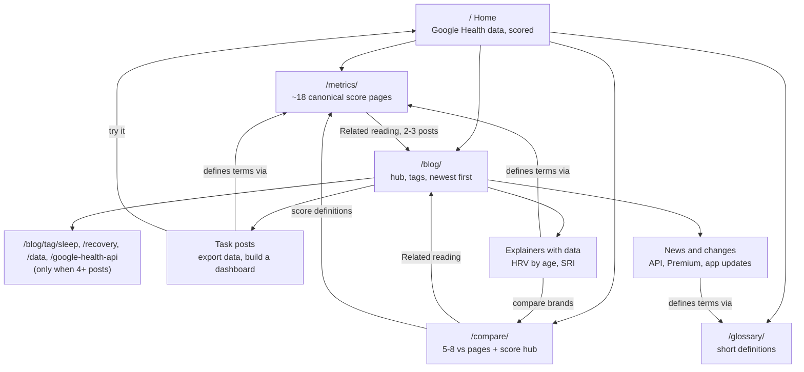

# Blog and comparison SEO strategy

Research date: 2026-10-09. Method: Google autocomplete (240 brand-pair queries and 32 positioning queries, 0.3 s apart), plus Google Search Central pages fetched on the research date. No paid keyword tool, so there are no volume numbers. Reddit was not read.

Labels: **[observed]** = seen directly in autocomplete or a fetched Google page today. **[reported]** = third-party claim, not verified. **[inferred]** = our judgement.

Reads of earlier work: `docs/research/landing-and-seo.md`, `docs/plans/2026-10-03-003-landing-and-programmatic-seo.md`, `site/src/data/compare.ts`, `site/src/pages/index.astro`. The site has `src/lib/schema.ts` with `article()`, `breadcrumbs()`, `collectionPage()` and `faqPage()` helpers already, so Article JSON-LD for a blog is one call [observed].

## Summary

1. A full nC2 grid of brand pairs is the exact pattern Google's scaled-content policy describes. 16 products give 120 pairs. Do not build it [inferred from policy].
2. Autocomplete shows demand for most mainstream pairs, but Pulse cannot out-review magazines on hardware. Build only pair pages where Pulse has data nobody else has: how each brand computes recovery, strain and sleep scores, and what Pulse computes from the same input [inferred].
3. Put the blog at `/blog/` and keep `/metrics/`, `/compare/` and `/glossary/` as they are. Blog posts answer questions and link to the metric page for the definition. They do not restate it.
4. Launch with 6 to 8 posts, then publish 2 to 4 a month.
5. The "Pixel Watch recovery score" and "Pixel Watch strain" queries return **nothing** in autocomplete [observed]. The Fitbit-Air-specific recovery queries do return suggestions (earlier research). So broaden the positioning through "Google Health" and "Pixel Watch readiness/HRV/sleep score", not through "Pixel Watch recovery score".

---

## 1. Comparison pages: demand by brand pair

### How to read this

Autocomplete shows that people type a query. It does not show how many. A pair counts as "demand" when Google completes "A vs B" with real "A vs B ..." suggestions in at least one direction [observed]. Ten of ten suggestions starting with the pair means a mainstream pair. 1 to 3 means a faint pair. Empty means none.

The matrix below counts, per unordered pair, suggestions (out of 20 across both directions) that name both products. Short form: `20` = saturated, `10-19` = strong, `4-9` = moderate, `1-3` = faint, `0` = none.

### Pairs with strong demand (14 to 20 of 20) [observed]

- Fitbit Air vs: WHOOP, Pixel Watch, Oura Ring, Garmin, Amazfit (Helio Strap), Galaxy Watch, Charge 6, Google Health (this one completes as "fitbit air and google health ...": Premium, app, subscription, coach; it is not a true versus query), Apple Watch.
- Pixel Watch vs: WHOOP, Garmin, Amazfit, Oura Ring, Galaxy Watch, Apple Watch, Fitbit Charge 6. Also "pixel watch 4 vs ..." for most of these.
- WHOOP vs: Garmin, Oura Ring, Apple Watch, Galaxy Watch, Amazfit (Helio Strap), WHOOP MG (own-product upgrade question).
- Garmin vs: Oura Ring, Galaxy Watch, Apple Watch, Amazfit.
- Oura Ring vs Samsung Galaxy Ring, Oura Ring vs Galaxy Watch, Oura Ring vs Apple Watch.
- Google Health vs Garmin (completes as "google health vs garmin connect", 18 of 20) and Google Health vs WHOOP (14 of 20: "google health vs whoop", "google health band vs whoop", "google health premium vs whoop", "google health coach vs whoop") [observed].

### Pairs with moderate demand (4 to 13 of 20) [observed]

- Google Health vs Apple Watch (13), Google Health vs Oura (11), Fitbit Air vs Pixel Watch 4 (12).
- Fitbit Premium vs Google Health (9): "fitbit premium vs google health premium", "fitbit premium vs free".
- Fitbit Premium vs Pixel Watch, vs Garmin, vs WHOOP (7 to 9). These complete mostly as "is fitbit premium worth it", not as versus queries.
- Fitbit Air vs WHOOP MG (7), Amazfit Helio Strap vs Fitbit Charge 6 (7), Garmin Index Sleep Monitor vs WHOOP (8) and vs Oura (7).
- Fitbit Air vs Fitbit Premium (5), Google Health vs Amazfit (6).

### Pairs that return nothing or almost nothing [observed]

- **Zero**: Galaxy Ring vs WHOOP MG, Pixel Watch (any) vs Galaxy Ring, Google Health vs WHOOP MG, Garmin Index Sleep Monitor vs Pixel Watch, vs Google Health, vs Galaxy Ring, vs Galaxy Watch, vs WHOOP MG, Fitbit Premium vs WHOOP MG, vs Galaxy Ring, vs Garmin Index, Amazfit Helio Strap vs Galaxy Ring, vs Garmin Index, vs Fitbit Premium, Amazfit vs Garmin Index, Amazfit vs Fitbit Premium, Fitbit Charge 6 vs Garmin Index.
- **Faint (1 to 3)**: Google Health vs Galaxy Ring, Google Health vs Pixel Watch 4, Pixel Watch 4 vs WHOOP MG, Charge 6 vs WHOOP MG, Charge 6 vs Galaxy Ring, Fitbit Air vs Garmin Index, Amazfit Helio Strap vs WHOOP MG, vs Pixel Watch 4, vs Google Health.
- Rule of thumb: anything with Garmin Index Sleep Monitor, Galaxy Ring (except against Oura), WHOOP MG (except against WHOOP, Garmin, Oura or Apple Watch), and Fitbit Premium (except against Google Health) is thin [inferred].

### What this means for Pulse [inferred]

Demand does not equal a page worth writing. Magazines, Tom's Guide, Trusted Reviews and Kygo already own hardware versus queries (see `landing-and-seo.md` section 3). A Pulse page ranks only if it carries something they do not. Pulse's unique inputs are: the published formula for each score, the fields Google Health returns for that device, and a worked number.

**Earn a page (build, in this order):**

| # | Page | Why it earns it | Pulse-only content |
|---|---|---|---|
| 1 | Fitbit Air vs WHOOP: scores, not hardware | Strongest cluster: "vs whoop", "5.0", "reddit", "accuracy", "peak" all complete [observed] | Score-by-score table: Readiness vs Recovery, Cardio Load vs Strain, with Pulse's formulas. Exists in part as `/compare/pulse-vs-subscription-wearables/` [observed in compare.ts]. Extend it rather than add a clone |
| 2 | Pixel Watch vs WHOOP | "pixel watch (3/4) vs whoop (5/mg)" all complete | Same score table for Pixel Watch data via Google Health. Needs a real Pixel Watch capture before publishing |
| 3 | Google Health Premium vs WHOOP vs free | "google health premium vs whoop", "coach vs whoop" complete | Price and feature table with `checked` date. Merge into the existing `/compare/google-health-premium/` page |
| 4 | Fitbit Air vs Garmin (Cirqa) | "fitbit air vs garmin cirqa" is the first suggestion | Garmin Body Battery vs Pulse Energy Bank vs Readiness. "garmin body battery alternative" has demand [observed] |
| 5 | Fitbit Air vs Amazfit Helio Strap | Completes with "which is better", "vs whoop" | Strap-class devices compared by which scores each computes |
| 6 | Fitbit Air vs Oura Ring | Completes (Ring 4, Ring 5, sleep tracking) | Sleep-score and readiness inputs |
| 7 | Google Health app vs Garmin Connect (as dashboards) | "google health vs garmin connect" 9 of 10 | App-level features: what Pulse adds on top of Google Health data |

**One data hub instead of many pair pages:** `/compare/recovery-scores/` (working name). A single table of how each brand builds recovery, strain, sleep and stress scores: inputs, scale, free or paid, source link. Kygo does this with 12 wearables in a tool-style page [observed in `landing-and-seo.md`]. One rich page can answer all the pair queries at once and is the single best defence against the scaled-content label [inferred].

**Would be thin (do not build):**
- Any pair with zero or faint demand above.
- Pure hardware pairs with no score angle: Garmin vs Apple Watch, Galaxy Watch vs Oura, Apple Watch vs Galaxy Watch, Charge 6 vs Galaxy Watch. They do have autocomplete demand, but Pulse has nothing to add and a Pulse page would be a rewrite of existing reviews.
- Both directions of the same pair ("A vs B" and "B vs A"). One URL, with the pair in alphabetical order or by priority.
- Per-model variants (Pixel Watch 3 vs 4 vs 5). Handle as sections.
- Apple Watch and Samsung pages for Pulse's own audience: Pulse reads Google Health data, so Apple Watch is not a source device [inferred]. Mention it only as a "what this does not cover" line.

### Naming competitors: a flagged decision

The 2026-10-03 plan chose no competitor names in titles, headings or slugs, because of trade-dress and trademark risk. Every pair query above contains a brand name, so a page that avoids the brand will not match the query [inferred]. The owner should decide knowingly. If names are used:
- Words only, no logos, no look-alike imagery (nominative fair use, three tests in `landing-and-seo.md` section 6).
- A "not affiliated" line and a dated `checked` field on every page (already in `compare.ts`).
- Facts only from primary pages, cited.
- WHOOP is reported to be suing another app over trade dress and patents [reported in `landing-and-seo.md`]. Titles that say "alternative to" are common and low-risk; claims about WHOOP's accuracy are the risky part. Keep to published facts and Pulse's own formulas.

---

## 2. Google's guidance (2026) and what it means for pages

All quotes fetched 2026-10-09 from Google Search Central.

### Scaled content abuse [observed, [Spam policies](https://developers.google.com/search/docs/essentials/spam-policies), updated 2026-08-28]

- Definition: "Scaled content abuse is when many pages are generated for the primary purpose of manipulating search rankings" (the page then adds "and not helping users").
- Listed example: "Using generative AI tools or other similar tools to generate many pages without adding value for users".
- Also listed: "Creating many pages where the content makes little or no sense to a reader but contains search keywords".
- The test is purpose and value, not the tool. Hand-written or AI-written pages made in bulk to catch query variants fall under it.

### Helpful content and AI [observed, [Creating helpful content](https://developers.google.com/search/docs/fundamentals/creating-helpful-content), updated 2026-10-05]

- "using generative AI to produce large amounts of text without manual oversight or curation represents little to no effort."
- Who, how, why: avoid "deceptive authorship information"; sharing "details about the processes involved" helps readers understand automation's role; the "why" should be "creating content primarily to help people".
- E-E-A-T: "trust is most important". The page says E-E-A-T "isn't a specific ranking factor" but the signals of it are useful.

### Using generative AI [observed, [Generative AI content](https://developers.google.com/search/docs/fundamentals/using-gen-ai-content), updated 2026-10-01]

- AI is "particularly useful when researching a topic, and to add structure to original content".
- Review and fact-check all AI output before publishing. The review "also applies to metadata like title elements, meta description elements, structured data". Our `article()` JSON-LD and meta descriptions need the same check.

### Reviews and comparisons [observed, [Write high quality product reviews](https://developers.google.com/search/docs/specialty/ecommerce/write-high-quality-product-reviews), updated 2025-12-10]

- "Provide evidence such as visuals, audio, or other links of your own experience".
- "Share quantitative measurements about how something measures up in various categories of performance."
- "Explain what sets something apart from its competitors."
- When naming something "best", "include why ... with first-hand supporting evidence".
- Pulse can honestly meet this only for the Fitbit Air (the owner wears one). For other brands, Pulse must say it did not test the hardware and compare what is published. That is a reason to compare scores and formulas, not hardware quality.

### Site reputation policy [observed, same spam-policies page]

Applies to third-party content hosted on a site to borrow its ranking. A first-party blog on the same domain is not in scope. Do not accept guest posts or sponsored "alternative" pages hosted on the site [inferred].

### From earlier research, still current [observed in `landing-and-seo.md`]

- Google's generative-AI optimization guide warns against many pages that target query variations, and says Search does not use llms.txt or special markup. FAQ rich results stopped on 2026-05-07.
- A March 2026 core update is reported to have hit variable-swap templates and spared sites with unique data per page [reported, Digital Applied; not confirmed by Google].

### What ranks and what gets penalised [inferred from the above]

| Ranks | Gets penalised or ignored |
|---|---|
| Each URL has data no other page has (formula, worked numbers, field names, captured screenshot) | Same template, brand names swapped |
| One page answers a cluster of queries in sections | One URL per query variant |
| Named author or "maintained by", `dateModified`, sources with a `checked` date | Anonymous, undated, uncited |
| Says what Pulse cannot do (no RR intervals, Air sampling) | Only praise |
| Human-reviewed, with the process stated | Bulk AI output published unread |
| Links to the primary source (Google, manufacturer) | Scraping or restating competitor pages |

Practical gate before publishing any page: if you removed the brand names, would the page still say something specific and different from its sibling? If not, merge or drop it.

---

## 3. Positioning beyond "Fitbit Air"

### Autocomplete evidence [observed, 2026-10-09]

| Query | Result |
|---|---|
| pixel watch recovery score / pixel watch strain | **Nothing.** Do not lead with these |
| pixel watch readiness | Strong: readiness score, daily readiness score, "no readiness score" (Pixel Watch 2/3/4) |
| pixel watch hrv | Strong: accuracy, app, reddit, "hrv 0" |
| pixel watch sleep score | Strong, including "not showing sleep score", "no sleep score" |
| google health app alternative | Real: "for fitbit air", "for fitbit", "reddit" |
| fitbit app alternative | Real: "android", "for pixel watch", "replacement", "fitbit air app alternative" |
| whoop alternative no subscription | Strong: reddit, india, "without a subscription", "strap alternative" |
| whoop alternative | Strong: "google", "band", "app", "india" |
| open source whoop | Strong: app, alternative, software, github, band, reddit |
| self hosted fitness tracker | Real: reddit, app, "best self hosted fitness tracker", "open source self hosted fitness tracker" |
| self hosted health dashboard | Weak and noisy (completes to unrelated "self hosted recipe/list") |
| google health api | Strong: documentation, pricing, key, fitbit, mcp, v4, docs, scopes, reddit |
| health connect dashboard | Noisy: mostly hospital portal logins ("kaiser", "massachusetts"). Do not target |
| health connect data export | Weak (3 suggestions) |
| fitbit web api shutdown | **Nothing**. "fitbit web api deprecated" gives only "deprecation" and "does fitbit have an api" |
| export fitbit data | Strong: to garmin, apple health, excel, strava, csv, samsung health, google fit |
| fitbit data export | Strong: "fitbit air data export", "stuck", "format", "raw" |
| fitbit takeout / google takeout fitbit data | Real |
| fitbit grafana | Weak but on target: dashboard, github |
| fitbit dashboard | Real: login, website, app, online, desktop |
| fitbit without premium | Strong: non premium features, "fitbit air without premium", "sleep without premium" |
| google health premium alternative | Nothing useful |
| google health coach | Strong: price, subscription, "not available", "is coming soon", "india" |
| garmin body battery alternative | Strong, mostly for Apple Watch |
| oura without subscription | Strong |
| amazfit recovery score | Real: helio strap recovery score, sleep score |

### Read of the evidence [inferred]

- The "any Pixel Watch" angle works through **readiness, HRV and sleep score**, where Pixel Watch owners already search and complain. They do not search "recovery score" or "strain" on that device. Pulse's scores can still be explained to them under the words they use.
- "Open source whoop" and "whoop alternative no subscription" are the biggest on-target clusters. They bring in people on any device. Pulse accepts only Google Health data, so the page must say who it is for in the first line.
- The Fitbit Web API shutdown has no autocomplete demand. Developers search "google health api" instead. Write about the Google Health API, not about the shutdown as a topic.
- "Export Fitbit data" is high demand and Pulse can answer it with a real answer (Takeout, plus Pulse's own export). It is the best top-of-funnel post [inferred].

### Overclaim guard

Pulse is tuned on Fitbit Air data. Pixel Watch and other Fitbit data arrive through the same Google Health API, but that has not been validated per device [inferred from the brief]. Safe wording: "built and tuned on Fitbit Air", "works with data that syncs to Google Health", "other devices: same API, less tested". Never write "supports Pixel Watch" without a tested capture. Also never write "any device": a device must sync to Google Health, and fields differ (the Air has no EDA sensor, for example [reported, Kygo]).

### Five hero or landing lines

1. **Recovery, strain and sleep from the Google Health data you already have.** (Sub: built and tuned on Fitbit Air; other devices that sync to Google Health use the same data.)
2. **The WHOOP-style scores your Google Health app does not show. Open source, on your own server.**
3. **Your watch collects the data. Pulse turns it into Recovery, Strain and Pulse Age. No subscription.**
4. **Google Health data, scored. Self-hosted, open source, yours.**
5. **If it syncs to Google Health, Pulse can score it.** Weakest on honesty: use only with the "tuned on Fitbit Air" sub-line, and only after one non-Air device is tested.

Pick 1 for the H1, 2 for the open-source audience page, 4 for the footer or OG title.

### Title and description pair

- Title (about 58 characters): `Pulse: Recovery and Strain from Google Health Data`
- Description (about 155 characters): `Open-source, self-hosted app that scores your Google Health data: Recovery, Strain, Sleep, Pulse Age and more. Tuned on Fitbit Air. No subscription.`
- Current title is `Pulse: recovery and strain for Fitbit Air, self-hosted` [observed in `index.astro`]. Keep "Fitbit Air" in the page body, in `/compare/` titles and in one landing section, because "fitbit air recovery score" is the best-fit cluster (earlier research). Broaden only the home title and description.
- Keywords to add to the `keywords` array: `pixel watch readiness score`, `google health app alternative`, `open source whoop alternative`, `google health data dashboard`, `whoop alternative no subscription`. Google ignores the meta keywords tag, so treat these as the phrases to put in visible copy [observed: Google does not use it; inferred application].

---

## 4. Blog architecture

### Recommendation

- **Blog at `/blog/`**, a new Astro content collection. Do not fold posts into `/metrics/` or `/compare/`.
- `/metrics/<slug>/` stays the canonical definition page for each score (what it is, formula, source). It is the page that should rank for "what is X".
- `/compare/` stays for versus pages (about 5 to 8, as in section 1) plus the one data hub.
- `/glossary/` stays for short definitions. Do not blog a term that the glossary covers in one line.
- `/blog/` holds time-bound and task-shaped content: how-tos, "what changed", troubleshooting, data guides, research summaries.

Why `/blog/` and not `/guides/`: the owner asked for a blog, and it fits dated news items (API changes). Evergreen how-tos can still sit under it. Splitting into `/guides/` and `/blog/` doubles the hub pages for a site this size [inferred].

### Flowchart



### Content collection

- `site/src/content/blog/*.md` with a Zod schema in `content.config.ts`: `title`, `description`, `pubDate`, `updated`, `author`, `tags[]`, `relatedMetrics[]` (slugs), `sources[]` (label and url), `reviewed` (date a human last checked it), `draft`.
- One route `src/pages/blog/[slug].astro` plus `src/pages/blog/index.astro`. Reuse the existing `Base` layout, `schema.ts` and `markdown.ts`.
- Required frontmatter `relatedMetrics` drives the "Related metrics" box on each post and a reverse "Related reading" list on each metric page. That gives linking in both directions without hand-maintained lists.
- Existing pattern to copy: `index.md.ts` and `llms.txt.ts` already emit Markdown twins. A blog twin is optional [inferred].

### Hub pages and internal linking

- `/blog/` lists all posts by date with the tag as a filter label. No pagination until there are about 30 posts.
- Tag pages only once a tag has 4 or more posts. A tag page with 1 or 2 posts is a thin page.
- Each post: 1 to 2 links to `/metrics/` pages (first mention of a score), 1 link to the relevant `/compare/` page if one exists, 1 to the home page or "get started", and 2 related posts.
- Use plain descriptive anchor text that contains the metric name.

### Article JSON-LD

- Use `article(site, { type: "Article", path, headline, description, modified })` from `src/lib/schema.ts` plus `breadcrumbs()` [observed: helpers exist]. Use `TechArticle` for how-tos about the API or export.
- Add `author` (a named person or the Pulse maintainer), `datePublished`, `dateModified` (only on real edits), and `publisher`. The helper takes only `modified` today, so add a `datePublished` field to it [observed: signature in `schema.ts`].
- Article is listed in Google's structured-data gallery [observed in `landing-and-seo.md`]. FAQPage gives no Google rich result now, so write a visible FAQ only where it helps readers.
- Metadata must be human-reviewed as well (Google generative-AI page, section 2).

### How many posts, and cadence [inferred]

- **Launch with 6 to 8** posts. Fewer reads as a stub blog; more than about 10 at once invites the "many pages at once" read and cannot be properly fact-checked.
- Then **2 to 4 a month**, each one reviewed by a human with a `reviewed` date. Stop if you cannot add data or experience to a post.
- Put the three comparison pages that earn a page (Fitbit Air vs WHOOP, Pixel Watch vs WHOOP, Garmin) in the launch month, not as 120 pages.

### Avoiding cannibalisation of `/metrics/` [inferred]

1. **One canonical owner per query.** "What is HRV" and "HRV formula" belong to `/metrics/hrv/`. A blog post on HRV must target a different intent: "what is a good HRV by age" (data, a range table) or "why is my HRV 0 on Fitbit Air" (troubleshooting).
2. **Different intent test.** For each post, write the target query next to the existing page's target query. If a searcher would be equally happy on either page, do not write the post.
3. **Link, do not restate.** First mention of a score links to its metric page. Do not paste its definition or formula.
4. **Canonical stays on the metric page** for definitional queries. Blog posts are never canonicalised to metric pages, because they have different intent, but they should never re-target the metric page's exact title phrase.
5. **Title patterns.** Metric pages: "What is X". Blog: "How to...", "Why is...", "X by age", "What changed...".
6. Watch Search Console once live: two URLs of ours on the same query is the signal to merge [inferred].

---

## 5. Non-brand post ideas (15)

Each has a different intent from the metric pages. "Needs" lists what makes it more than a rewrite. Demand evidence is from autocomplete today unless stated.

| # | Working title | Target query (autocomplete) | Needs | Links to |
|---|---|---|---|---|
| 1 | How to export your Fitbit data in 2026 (Takeout, Data Export, API) | export fitbit data (strong: csv, excel, strava, garmin, apple health) | Step-by-step with screenshots, format table, what each export contains, and a "load it into Pulse" step | Home, glossary |
| 2 | Google Health API for self-hosters: scopes, the 100-user cap and what it costs | google health api (docs, scopes, pricing, key, v4) | Real scopes list from the app's code, OAuth cap explained with primary link | Home, `/compare/` self-hosting |
| 3 | What is a good HRV by age? A range table and how to read yours | what is a good hrv (for my age, at night, by age) | Table with cited source, Fitbit's daily-summary limit stated | `/metrics/hrv/` |
| 4 | Why does my Fitbit Air or Pixel Watch show HRV 0 or "not tracked"? | pixel watch hrv 0, fitbit air hrv not tracked | Cause list from Google docs, checks to run | HRV metric page |
| 5 | Pixel Watch readiness score missing or stuck: what to check | pixel watch no readiness score, "stuck in calibration" | Calibration facts from Google's help page | Recovery page |
| 6 | Pixel Watch sleep score not showing: causes and fixes | pixel watch not showing sleep score | Source: Google help; cite | Sleep page |
| 7 | Sleep regularity index: what it is and how to improve it | sleep regularity index (formula, calculator) | Worked example computed from sample Pulse data; research cited | the sleep regularity metric page (confirm slug) |
| 8 | Fitbit app and Google Health app features that are free vs Premium | fitbit without premium, fitbit sleep without premium | Table with `checked` date | `/compare/google-health-premium/` |
| 9 | Build a Fitbit or Google Health dashboard on your own server (Grafana vs Pulse) | fitbit grafana, fitbit dashboard desktop | Honest side-by-side: raw charts vs computed scores. Credit fitbit-grafana | Home |
| 10 | Garmin Body Battery vs Energy Bank: how each is calculated | garmin body battery alternative | Published Garmin facts plus Pulse's formula | the Energy Bank metric page (confirm slug) |
| 11 | Recovery score vs readiness score: how brands differ | fitbit recovery score, amazfit recovery score | Feeds the data hub table | Compare hub |
| 12 | How much does a recovery band really cost over 3 years? | whoop alternative no subscription, oura without subscription | Cost table with sources and date | `/compare/recovery-tracking-without-subscription/` |
| 13 | Heart-rate-variability from a wrist band: what daily-summary data can and cannot tell you | pixel watch hrv accuracy | Explains the RR-interval limit; cite Task Force 1996 | HRV page |
| 14 | Open source WHOOP alternatives compared (noop, Hælan, fitbit-grafana, Pulse) | open source whoop (app, github, alternative) | Real repos, licences, stars, what each computes. Pulse treated as one option | Home |
| 15 | Google Health Coach: what it does, what it costs, and not available yet | google health coach (price, "not available", "coming soon") | News-style post with `updated` date; will go stale, so review monthly | `/compare/google-health-premium/` |

Launch set (first 6 to 8): 1, 2, 3, 4, 9, 14, plus 8 and 12 if the Premium page is not enough. These match the highest autocomplete demand and the site's strongest honest angle (data, export, self-hosting).

Posts 5, 6 and 15 are troubleshooting or news. They are useful but fast-ageing. Build them last and review them every month [inferred].

---

## 6. Risks and open decisions

- **Naming competitors** (section 1). Owner decision needed. This conflicts with the 2026-10-03 plan.
- **Pixel Watch claim** needs one real Pixel Watch capture before any page says Pulse supports it.
- **Stale facts.** Prices, Google Health Premium tiers and the Google Health Coach availability changed several times in 2026 [reported]. Every price needs a `checked` date.
- **Scale discipline.** Writing the 120-page grid, or 40 posts in a month, risks a site-wide quality judgement. The plan above has about 8 comparison URLs and about 8 launch posts.
- **Health content.** Add a "not medical advice" line to every health post and cite primary research for numbers, in line with the metric pages.
- Autocomplete is one signal. Confirm with Search Console impressions after launch and prune posts that get none after 3 months [inferred].

---

<details>
<summary>Raw autocomplete harvest, 2026-10-09 (click to expand)</summary>

Format: query, then the suggestions Google returned (client=firefox, up to 10). An empty result is shown as `(none)`.

### Positioning queries

```
pixel watch recovery score
    -> (none)
pixel watch strain
    -> (none)
pixel watch readiness
    -> pixel watch readiness score | pixel watch readiness | pixel watch 4 readiness score | pixel watch daily readiness score | pixel watch 3 readiness score | pixel watch 2 readiness score | pixel watch 4 readiness | pixel watch daily readiness | pixel watch no readiness score | pixel watch 4 daily readiness
pixel watch hrv
    -> pixel watch hrv | pixel watch hrv accuracy | pixel watch hrv app | pixel watch hrv reddit | pixel watch hrv 0 | pixel watch heart rate variability | pixel watch 4 hrv | pixel watch 3 hrv | pixel watch 2 hrv | pixel watch 4 hrv accuracy
google health app alternative
    -> google health app alternative | google health app alternative for fitbit air | google health app alternative for fitbit | google health app alternative reddit | best alternative to google health app | alternative zu google health app | does google have a health app | alternative to huawei health app | is google health accurate
fitbit app alternative
    -> fitbit app alternative | fitbit app alternative android | fitbit app alternative for pixel watch | fitbit app replacement | fitbit app replacement reddit | fitbit air app alternative | best fitbit app alternative | google fitbit app alternative | google fitbit air app alternative | fitbit charge 6 alternative app
whoop alternative no subscription
    -> whoop alternative no subscription | whoop alternative no subscription reddit | whoop alternative no subscription india | whoop alternative without a subscription | best whoop alternative no subscription | whoop band alternative no subscription | whoop strap alternative no subscription | best whoop alternative no subscription reddit | can you use whoop without a subscription | can you use whoop without membership
whoop alternative
    -> whoop alternative | whoop alternative india | whoop alternative band | whoop alternative no subscription | whoop alternative app | whoop alternative without subscription | whoop alternative google | whoop alternative reddit | whoop alternative no subscription reddit | whoop alternative india reddit
open source fitness tracker app
    -> open source fitness tracker app | open source fitness tracking app | open source gym tracker app | open source workout tracker app | open source fitness watch app | open source activity tracker app | open source fitness band app | open source gym log app | open source fitbit alternative
open source whoop
    -> open source whoop app | open source whoop | open source whoop alternative | open source whoop software | open source whoop band | open source whoop github | open source whoop 5.0 | open source whoop reddit | open source whoop 4.0 | whoop open source
self hosted health dashboard
    -> self hosted health dashboard | self hosted recipe | self hosted list | what is a self hosted website
self hosted fitness tracker
    -> self hosted fitness tracker | self hosted fitness tracker reddit | self hosted workout tracker | self hosted gym tracker | self hosted activity tracker | self hosted fitness tracking | self hosted fitness tracking app | self hosted fitness watch | best self hosted fitness tracker | open source self hosted fitness tracker
google health api
    -> google health api | google health api documentation | google health api pricing | google health api key | google health api fitbit | google health api mcp | google health api v4 | google health api docs | google health api reddit | google health api scopes
health connect dashboard
    -> health connect dashboard | health connect dashboard app | connect care dashboard | health connect login | health connect login panel | health connect login kaiser | health connect login massachusetts | google health connect dashboard | android health connect dashboard | link health dashboard
health connect data export
    -> health connect data export | google health connect data export | health connect couldn t export data
fitbit web api shutdown
    -> (none)
fitbit web api deprecated
    -> fitbit web api deprecation | does fitbit have an api
export fitbit data
    -> export fitbit data | export fitbit data to garmin | export fitbit data to apple health | export fitbit data to excel | export fitbit data to strava | export fitbit data to csv | export fitbit data to samsung health | export fitbit data to google fit | export fitbit data to garmin connect | export fitbit data to apple watch
fitbit grafana
    -> fitbit grafana | fitbit grafana dashboard | fitbit grafana github
fitbit data export
    -> fitbit data export | fitbit data export page | fitbit data export to garmin | fitbit data export stuck | fitbit data export format | fitbit data export steps | fitbit export data to excel | fitbit air data export | google fitbit data export | fitbit raw data export
fitbit dashboard
    -> fitbit dashboard | fitbit dashboard login | fitbit dashboard website | fitbit dashboard app | fitbit dashboard online | fitbit dashboard settings | fitbit dashboard login app | fitbit dashboard desktop
google health premium alternative
    -> google health premium alternative | healthy alternative to up and go | alternatives to google one
fitbit without premium
    -> fitbit without premium | fitbit non premium features | fitbit no premium | fitbit air without premium | fitbit app without premium | fitbit sleep without premium | using fitbit without premium | fitbit 6 without premium | is fitbit without premium worth it | fitbit premium not working
fitbit recovery score
    -> fitbit recovery score | fitbit air recovery score | google fitbit air recovery score | does fitbit have recovery score | fitbit health score | does fitbit track recovery
pixel watch sleep score
    -> pixel watch sleep score | pixel watch 4 sleep score | pixel watch no sleep score | pixel watch 3 sleep score | pixel watch not showing sleep score | pixel watch 3 no sleep score | pixel watch not giving sleep score | does apple watch give a sleep score | does garmin give a sleep score | does sleep score work with apple watch
garmin body battery alternative
    -> garmin body battery alternative | garmin body battery alternative apple watch | garmin body battery equivalent for apple watch | garmin body battery equivalent | garmin body battery apple equivalent | how to use garmin body battery | garmin body battery which devices | does garmin body battery work | what is body battery garmin
oura without subscription
    -> oura without subscription | oura without subscription reddit | oura without subscription alternative | oura no subscription | oura no subscription reddit | pura without subscription | aura without subscription | oura ring without subscription | oura ring without subscription reddit | oura ring without subscription apple health
amazfit recovery score
    -> amazfit recovery score | amazfit helio strap recovery score | amazfit sleep score | amazfit sleep score meaning | amazfit gts 2 review
google health coach
    -> google health coach | google health coach india | google health coach price | google health coach subscription | google health coach app | google health coach ai | google health coach review | google health coach not available | google health coach is coming soon | google health coach reddit
what is a good hrv
    -> what is a good hrv | what is a good hrv score | what is a good hrv value | what is a good hrv status | what is a good hrv at night | what is a good hrv for athletes | what is a good hrv on apple watch | what is a good hrv for my age | what is a good hrv reading | what is a good hrv range by age
sleep regularity index
    -> sleep regularity index | sleep regularity index (sri) | sleep regularity index formula | sleep regularity index calculator | sleep regularity index questionnaire | sleep regularity index ggir | sleep regularity index definition | what is sleep regularity | sleep index score | sleep quality index scoring
fitbit takeout
    -> fitbit takeout | fitbit google takeout | google takeout fitbit data | fitbit accessories near me
```

### Brand pair queries (240 ordered pairs)

```
fitbit air vs pixel watch
    -> fitbit air vs pixel watch 4 | fitbit air vs pixel watch 5 | fitbit air vs pixel watch 3 | fitbit air vs pixel watch | fitbit air vs pixel watch 2 | fitbit air vs pixel watch 4 sensors | fitbit air vs pixel watch 1 | fitbit air vs pixel watch 4 sleep tracking | fitbit air vs pixel watch 4 accuracy | fitbit air vs pixel watch reddit
fitbit air vs pixel watch 4
    -> fitbit air vs pixel watch 4 | fitbit air vs pixel watch 4 sensors | fitbit air vs pixel watch 4 sleep tracking | fitbit air vs pixel watch 4 accuracy | fitbit air vs pixel watch 4 reddit | fitbit air or pixel watch 4 | fitbit 4 vs apple watch
fitbit air vs fitbit charge 6
    -> fitbit air vs fitbit charge 6 | fitbit air vs fitbit charge 6 vs inspire 3 | fitbit air vs fitbit charge 6 reddit | fitbit air vs fitbit charge 6 which is better | fitbit air vs fitbit charge 6 weight | fitbit air vs fitbit charge 6 size | fitbit air vs fitbit charge 6 features | fitbit air vs fitbit charge 6 sensors | fitbit air vs fitbit charge 6 specs | fitbit air vs fitbit charge 6 accuracy
fitbit air vs whoop
    -> fitbit air vs whoop | fitbit air vs whoop 5.0 | fitbit air vs whoop reddit | fitbit air vs whoop accuracy | fitbit air vs whoop which is better | fitbit air vs whoop peak | fitbit air vs whoop vs apple watch | fitbit air vs whoop vs noise rep | fitbit air vs whoop vs amazfit | fitbit air vs whoop life
fitbit air vs garmin
    -> fitbit air vs garmin cirqa | fitbit air vs garmin | fitbit air vs garmin cirqa vs whoop | fitbit air vs garmin cirqa reddit | fitbit air vs garmin forerunner 55 | fitbit air vs garmin vivosmart 5 | fitbit air vs garmin vivoactive 5 | fitbit air vs garmin watch | fitbit air vs garmin 165 | fitbit air vs garmin forerunner
fitbit air vs amazfit
    -> fitbit air vs amazfit helio strap | fitbit air vs amazfit helio | fitbit air vs amazfit helio strap reddit | fitbit air vs amazfit | fitbit air vs amazfit helio strap pro | fitbit air vs amazfit helio strap which is better | fitbit air vs amazfit helio strap vs whoop | fitbit air vs amazfit helio vs whoop | fitbit air vs amazfit helio reddit | fitbit air vs amazfit helio vs garmin cirqa
fitbit air vs oura ring
    -> fitbit air vs oura ring | fitbit air vs oura ring 4 | fitbit air vs oura ring 5 | fitbit air vs oura ring reddit | fitbit air vs oura ring sleep tracking | fitbit air vs oura ring vs whoop | fitbit air vs oura ring accuracy | fitbit air vs oura ring 5 for sleep tracking | fitbit air vs oura ring 5 reddit | oura ring 3 vs fitbit air
fitbit air vs samsung galaxy ring
    -> google fitbit air vs samsung galaxy ring | samsung galaxy ring vs fitbit air | is a samsung watch better than a fitbit | which is better fitbit or galaxy watch | difference between galaxy watch and fitbit
fitbit air vs galaxy watch
    -> fitbit air vs galaxy watch 8 | fitbit air vs galaxy watch ultra | fitbit air vs galaxy watch 7 | fitbit air vs galaxy watch | fitbit air vs galaxy watch 6 | fitbit air vs galaxy watch 9 | fitbit air vs galaxy watch ultra 2 | fitbit air vs galaxy watch 4 | fitbit air vs galaxy watch 4 classic | fitbit air vs galaxy watch 5
fitbit air vs apple watch
    -> fitbit air vs apple watch | fitbit air vs apple watch 11 | fitbit air vs apple watch se 3 | fitbit air vs apple watch ultra | fitbit air vs apple watch reddit | fitbit air vs apple watch 10 | fitbit air vs apple watch 12 | fitbit air vs apple watch accuracy | fitbit air vs apple watch se | fitbit air vs apple watch sensors
fitbit air vs google health
    -> fitbit air and google health | fitbit air google health premium | fitbit air google health app | fitbit air google health subscription | fitbit air google health premium price | fitbit air google health coach | fitbit air google health connect | fitbit air google health update | fitbit air google health api | fitbit air google health review
fitbit air vs fitbit premium
    -> fitbit air vs fitbit air premium | fitbit vs fitbit premium | is fitbit premium worth it | fitbit free vs fitbit premium
fitbit air vs whoop mg
    -> fitbit air vs whoop mg | google fitbit air vs whoop mg life | fitbit air vs whoop 5.0 mg | google fitbit air vs whoop 5.0mg | what is more accurate whoop or fitbit | what is better whoop or fitbit | whoop vs fitbit accuracy | what's better whoop or fitbit
fitbit air vs amazfit helio strap
    -> fitbit air vs amazfit helio strap | fitbit air vs amazfit helio strap reddit | fitbit air vs amazfit helio strap pro | fitbit air vs amazfit helio strap which is better | fitbit air vs amazfit helio strap vs whoop | fitbit air vs amazfit helio strap vs garmin cirqa | fitbit air vs amazfit helio strap specs | fitbit air vs amazfit helio strap 2 | fitbit air vs amazfit helio band | google fitbit air vs amazfit helio strap
fitbit air vs garmin index sleep monitor
    -> garmin index sleep monitor vs fitbit air | is garmin more accurate than fitbit | how accurate are garmin watches sleep trackers
pixel watch vs fitbit air
    -> pixel watch vs fitbit air | pixel watch vs fitbit air reddit | pixel watch or fitbit air | pixel watch 4 vs fitbit air | pixel watch 5 vs fitbit air | pixel watch 3 vs fitbit air | pixel watch 2 vs fitbit air | pixel watch 4 vs fitbit air reddit | pixel watch 4 or fitbit air | fitbit air vs pixel watch 4 sensors
pixel watch vs pixel watch 4
    -> pixel watch vs pixel watch 4 | pixel watch 3 vs pixel watch 4 | pixel watch 5 vs pixel watch 4 | pixel watch 2 vs pixel watch 4 | pixel watch 1 vs pixel watch 4 | pixel watch 3 vs pixel watch 4 reddit | pixel watch 3 vs pixel watch 4 battery life | pixel watch 3 45mm vs pixel watch 4 45mm | pixel watch 3 or pixel watch 4 | google pixel watch 2 vs pixel watch 4
pixel watch vs fitbit charge 6
    -> pixel watch vs fitbit charge 6 | pixel watch or fitbit charge 6 | pixel watch 4 vs fitbit charge 6 | pixel watch 3 vs fitbit charge 6 | pixel watch 2 vs fitbit charge 6 | pixel watch 5 vs fitbit charge 6 | pixel watch 1 vs fitbit charge 6 | pixel watch 4 or fitbit charge 6 | pixel watch 3 or fitbit charge 6 | google pixel watch 4 vs fitbit charge 6
pixel watch vs whoop
    -> pixel watch vs whoop | pixel watch vs whoop reddit | pixel watch or whoop | pixel watch 4 vs whoop | pixel watch 4 vs whoop 5 | pixel watch 3 vs whoop | pixel watch 4 vs whoop mg | pixel watch 5 vs whoop | pixel watch 3 vs whoop 4.0 | pixel watch 2 vs whoop
pixel watch vs garmin
    -> pixel watch vs garmin | pixel watch vs garmin forerunner | pixel watch vs garmin venu 4 | pixel watch vs garmin vivoactive | pixel watch vs garmin venu 3 | pixel watch vs garmin venu | pixel watch vs garmin vivoactive 5 | pixel watch vs garmin instinct | pixel watch vs garmin fenix | pixel watch vs garmin reddit
pixel watch vs amazfit
    -> pixel watch vs amazfit | pixel watch vs amazfit active 2 | pixel watch vs amazfit bip 6 | pixel watch vs amazfit balance | pixel watch vs amazfit gtr 4 | pixel watch vs amazfit reddit | pixel watch 4 vs amazfit balance 2 | pixel watch 3 vs amazfit active 2 | pixel watch 4 vs amazfit active 2 | pixel watch 3 vs amazfit balance 2
pixel watch vs oura ring
    -> pixel watch vs oura ring | pixel watch 4 vs oura ring | pixel watch 3 vs oura ring 4 | pixel watch 4 vs oura ring 5 | pixel watch 3 vs oura ring | pixel watch 5 vs oura ring | google pixel watch 4 vs oura ring 4 | oura ring vs pixel watch 2 | oura ring vs pixel watch reddit | oura ring vs pixel watch sleep tracking
pixel watch vs samsung galaxy ring
    -> (none)
pixel watch vs galaxy watch
    -> pixel watch vs galaxy watch | pixel watch vs galaxy watch 8 | pixel watch vs galaxy watch ultra | pixel watch vs galaxy watch 9 | pixel watch vs galaxy watch vs apple watch | pixel watch vs galaxy watch reddit | pixel watch vs galaxy watch 7 | pixel watch vs galaxy watch 4 | pixel watch vs galaxy watch vs garmin | pixel watch vs galaxy watch ultra 2
pixel watch vs apple watch
    -> pixel watch vs apple watch | pixel watch vs apple watch accuracy | pixel watch vs apple watch health features | pixel watch vs apple watch reddit | pixel watch vs apple watch ultra | pixel watch vs apple watch for kids | pixel watch vs apple watch battery life | pixel watch vs apple watch vs garmin | pixel watch vs apple watch for fitness | pixel watch vs apple watch features
pixel watch vs google health
    -> pixel watch google health | google health premium pixel watch | does google pixel have a watch | is there a watch for google pixel | is there a smartwatch for google pixel
pixel watch vs fitbit premium
    -> pixel watch fitbit premium | pixel watch fitbit premium features | pixel watch 3 fitbit premium vs free | is fitbit premium worth it
pixel watch vs whoop mg
    -> pixel watch 4 vs whoop mg | whoop review vs apple watch | is whoop more accurate than apple watch | whoop vs apple watch accuracy | whoop heart rate vs apple watch
pixel watch vs amazfit helio strap
    -> pixel watch 4 vs amazfit helio strap | amazfit helio strap vs pixel watch 3 | is huawei watch fit worth buying
pixel watch vs garmin index sleep monitor
    -> (none)
pixel watch 4 vs fitbit air
    -> pixel watch 4 vs fitbit air | pixel watch 4 vs fitbit air reddit | pixel watch 4 or fitbit air | fitbit air vs pixel watch 4 sensors | fitbit air vs pixel watch 4 accuracy | fitbit air vs pixel watch 4 sleep tracking | fitbit 4 vs apple watch
pixel watch 4 vs pixel watch
    -> pixel watch 4 vs pixel watch 5 | pixel watch 4 vs pixel watch 3 | pixel watch 4 vs pixel watch 2 | pixel watch 4 vs pixel watch 1 | pixel watch 4 vs pixel watch 5 specs | pixel watch 4 vs pixel watch | pixel watch 4 vs pixel watch 3 battery life | pixel watch 4 vs pixel watch 3 reddit | pixel watch 4 or pixel watch 3 | google pixel watch 4 vs pixel watch 3
pixel watch 4 vs fitbit charge 6
    -> pixel watch 4 vs fitbit charge 6 | pixel watch 4 or fitbit charge 6 | google pixel watch 4 vs fitbit charge 6 | fitbit charge 6 vs pixel watch 4 reddit
pixel watch 4 vs whoop
    -> pixel watch 4 vs whoop | pixel watch 4 vs whoop 5 | pixel watch 4 vs whoop mg | pixel watch 4 vs whoop reddit | whoop 5.0 vs pixel watch 4 | whoop band vs pixel watch 4 | whoop review vs apple watch | is apple watch better than whoop | is whoop more accurate than apple watch
pixel watch 4 vs garmin
    -> pixel watch 4 vs garmin | pixel watch 4 vs garmin venu 4 | pixel watch 4 vs garmin vivoactive 6 | pixel watch 4 vs garmin forerunner 265 | pixel watch 4 vs garmin vivoactive 5 | pixel watch 4 vs garmin venu 3 | pixel watch 4 vs garmin instinct 3 | pixel watch 4 vs garmin forerunner | pixel watch 4 vs garmin forerunner 965 | pixel watch 4 vs garmin forerunner 165
pixel watch 4 vs amazfit
    -> pixel watch 4 vs amazfit balance 2 | pixel watch 4 vs amazfit active 2 | pixel watch 4 vs amazfit t rex 3 pro | pixel watch 4 vs amazfit | pixel watch 4 vs amazfit t rex 3 | pixel watch 4 vs amazfit balance | pixel watch 4 vs amazfit active 3 premium | pixel watch 4 vs amazfit bip 6 | pixel watch 4 vs amazfit active max | pixel watch 4 vs amazfit helio strap
pixel watch 4 vs oura ring
    -> pixel watch 4 vs oura ring 5 | pixel watch 4 vs oura ring | pixel watch 3 vs oura ring 4 | is oura ring better than apple watch | difference between oura ring and apple watch | oura ring vs apple watch vs fitbit | does oura ring work with apple watch
pixel watch 4 vs samsung galaxy ring
    -> (none)
pixel watch 4 vs galaxy watch
    -> pixel watch 4 vs galaxy watch 8 | pixel watch 4 vs galaxy watch 9 | pixel watch 4 vs galaxy watch 7 | pixel watch 4 vs galaxy watch ultra | pixel watch 4 vs galaxy watch 8 classic | pixel watch 4 vs galaxy watch ultra 2 | pixel watch 4 vs galaxy watch | pixel watch 4 vs galaxy watch 6 | pixel watch 4 vs galaxy watch 8 reddit | pixel watch 4 vs galaxy watch 8 battery life
pixel watch 4 vs apple watch
    -> pixel watch 4 vs apple watch 11 | pixel watch 4 vs apple watch | pixel watch 4 vs apple watch ultra 3 | pixel watch 4 vs apple watch ultra 2 | pixel watch 4 vs apple watch 10 | pixel watch 4 vs apple watch se 3 | pixel watch 4 vs apple watch 11 reddit | pixel watch 4 vs apple watch 12 | pixel watch 4 vs apple watch ultra | pixel watch 4 vs apple watch series 11
pixel watch 4 vs google health
    -> pixel watch 4 google health
pixel watch 4 vs fitbit premium
    -> pixel watch 4 fitbit premium | pixel watch 4 fitbit premium features | pixel watch 4 without fitbit premium | pixel watch 4 free fitbit premium | pixel watch 4 ohne fitbit premium
pixel watch 4 vs whoop mg
    -> pixel watch 4 vs whoop mg | whoop review vs apple watch | whoop heart rate vs apple watch | is whoop better than apple watch | is whoop more accurate than apple watch
pixel watch 4 vs amazfit helio strap
    -> pixel watch 4 vs amazfit helio strap | is huawei watch fit worth buying
pixel watch 4 vs garmin index sleep monitor
    -> (none)
fitbit charge 6 vs fitbit air
    -> fitbit charge 6 vs fitbit air | fitbit charge 6 vs fitbit air accuracy | fitbit charge 6 vs fitbit air sensors | fitbit charge 6 vs fitbit air reddit | fitbit charge 6 vs fitbit air sleep tracking | fitbit charge 6 vs fitbit air which is better | fitbit charge 6 vs fitbit air weight | fitbit charge 6 vs fitbit air features | fitbit charge 6 versus fitbit air | fitbit charge 6 or fitbit air reddit
fitbit charge 6 vs pixel watch
    -> fitbit charge 6 vs pixel watch 4 | fitbit charge 6 vs pixel watch 3 | fitbit charge 6 vs pixel watch 5 | fitbit charge 6 vs pixel watch 2 | fitbit charge 6 vs pixel watch | fitbit charge 6 vs pixel watch 1 | fitbit charge 6 vs pixel watch 3 reddit | fitbit charge 6 vs pixel watch 4 reddit | fitbit charge 6 or pixel watch 4 | fitbit charge 6 or pixel watch 3
fitbit charge 6 vs pixel watch 4
    -> fitbit charge 6 vs pixel watch 4 | fitbit charge 6 vs pixel watch 4 reddit | fitbit charge 6 or pixel watch 4 | fitbit charge 6 pixel watch 4 比较 | fitbit charge 6 pixel watch 4 比較
fitbit charge 6 vs whoop
    -> fitbit charge 6 vs whoop | fitbit charge 6 vs whoop 5.0 | fitbit charge 6 vs whoop peak | fitbit charge 6 vs whoop 5 | fitbit charge 6 vs whoop mg | fitbit charge 6 vs whoop reddit | fitbit charge 6 vs whoop 4.0 | fitbit charge 6 vs whoop life | fitbit charge 6 vs whoop accuracy | google fitbit charge 6 vs whoop
fitbit charge 6 vs garmin
    -> fitbit charge 6 vs garmin vivosmart 5 | fitbit charge 6 vs garmin vivoactive 5 | fitbit charge 6 vs garmin forerunner 55 | fitbit charge 6 vs garmin forerunner 165 | fitbit charge 6 vs garmin | fitbit charge 6 vs garmin vivoactive 6 | fitbit charge 6 vs garmin cirqa | fitbit charge 6 vs garmin venu 3 | fitbit charge 6 vs garmin lily 2 | fitbit charge 6 vs garmin forerunner 265
fitbit charge 6 vs amazfit
    -> fitbit charge 6 vs amazfit bip 6 | fitbit charge 6 vs amazfit active 2 | fitbit charge 6 vs amazfit helio strap | fitbit charge 6 vs amazfit band 7 | fitbit charge 6 vs amazfit | fitbit charge 6 vs amazfit bip max | fitbit charge 6 vs amazfit helio | fitbit charge 6 vs amazfit active 2 premium | fitbit charge 6 vs amazfit balance | fitbit charge 6 vs amazfit active max
fitbit charge 6 vs oura ring
    -> fitbit charge 6 vs oura ring | fitbit charge 6 vs oura ring 5 | fitbit charge 6 vs oura ring 4 | fitbit charge 6 vs oura ring for sleep tracking | fitbit charge 6 vs oura ring 3 | oura ring vs fitbit charge 6 accuracy | difference between oura ring and fitbit | is oura ring better than fitbit | oura ring vs apple watch vs fitbit
fitbit charge 6 vs samsung galaxy ring
    -> samsung galaxy ring vs fitbit charge 6
fitbit charge 6 vs galaxy watch
    -> fitbit charge 6 vs galaxy watch 8 | fitbit charge 6 vs galaxy watch 7 | fitbit charge 6 vs galaxy watch 9 | fitbit charge 6 vs galaxy watch 6 | fitbit charge 6 vs galaxy watch 4 | fitbit charge 6 vs galaxy watch 5 | fitbit charge 6 vs galaxy watch fe | fitbit charge 6 vs galaxy watch ultra | fitbit charge 6 vs galaxy watch 5 pro | fitbit charge 6 vs galaxy watch 7 reddit
fitbit charge 6 vs apple watch
    -> fitbit charge 6 vs apple watch | fitbit charge 6 vs apple watch 11 | fitbit charge 6 vs apple watch se 3 | fitbit charge 6 vs apple watch se | fitbit charge 6 vs apple watch 10 | fitbit charge 6 vs apple watch 9 | fitbit charge 6 vs apple watch ultra 3 | fitbit charge 6 vs apple watch ultra 2 | fitbit charge 6 vs apple watch heart rate monitor | fitbit charge 6 vs apple watch 12
fitbit charge 6 vs google health
    -> fitbit charge 6 and google health app | fitbit charge 6 and google health | fitbit charge 6 google health premium
fitbit charge 6 vs fitbit premium
    -> fitbit charge 6 fitbit premium | fitbit charge 6 without fitbit premium | is fitbit premium worth it | fitbit vs fitbit premium | fitbit free vs fitbit premium
fitbit charge 6 vs whoop mg
    -> fitbit charge 6 vs whoop mg | how does whoop compare to fitbit | what is better whoop or fitbit | what is more accurate whoop or fitbit
fitbit charge 6 vs amazfit helio strap
    -> fitbit charge 6 vs amazfit helio strap | google fitbit charge 6 vs amazfit helio strap | amazfit helio strap vs fitbit charge 6 reddit | is amazfit better than fitbit
fitbit charge 6 vs garmin index sleep monitor
    -> (none)
whoop vs fitbit air
    -> whoop vs fitbit air | whoop vs fitbit air accuracy | whoop vs fitbit air vs garmin | whoop vs fitbit air reddit | whoop vs fitbit air vs amazfit | whoop vs fitbit air vs noise rep | whoop vs fitbit air vs garmin cirqa | whoop vs fitbit air which is better | whoop vs fitbit air vs apple watch | whoop vs fitbit air features
whoop vs pixel watch
    -> whoop vs pixel watch 3 | whoop vs pixel watch 4 | whoop vs pixel watch | whoop vs pixel watch 5 | whoop vs pixel watch 2 | whoop vs pixel watch reddit | whoop or pixel watch | whoop band vs pixel watch 3 | whoop 5.0 vs pixel watch 4 | whoop band vs pixel watch 4
whoop vs pixel watch 4
    -> whoop vs pixel watch 4 | whoop 5.0 vs pixel watch 4 | whoop band vs pixel watch 4 | whoop mg vs pixel watch 4 | pixel watch 4 vs whoop 5 | pixel watch 4 vs whoop reddit | pixel watch 3 vs whoop 4.0 | whoop review vs apple watch | whoop vs apple watch heart rate | whoop vs apple watch accuracy
whoop vs fitbit charge 6
    -> whoop vs fitbit charge 6 | whoop vs fitbit charge 6 reddit | whoop 5.0 vs fitbit charge 6 | whoop band vs fitbit charge 6 | whoop 5 vs fitbit charge 6 | whoop mg vs fitbit charge 6 | whoop life vs fitbit charge 6 | whoop peak vs fitbit charge 6 | whoop one vs fitbit charge 6 | whoop 4.0 vs fitbit charge 6
whoop vs garmin
    -> whoop vs garmin | whoop vs garmin cirqa | whoop vs garmin vs apple watch | whoop vs garmin watch | whoop vs garmin vs fitbit | whoop vs garmin which is better | whoop vs garmin forerunner | whoop vs garmin reddit | whoop vs garmin forerunner 265 | whoop vs garmin fenix 8
whoop vs amazfit
    -> whoop vs amazfit | whoop vs amazfit helio strap | whoop vs amazfit helio | whoop vs amazfit vs fitbit air | whoop vs amazfit t rex 3 | whoop vs amazfit reddit | whoop vs amazfit vs google fit | whoop vs amazfit helio size | whoop vs amazfit helio strap vs polar loop | whoop vs amazfit helio reddit
whoop vs oura ring
    -> whoop vs oura ring | whoop vs oura ring vs apple watch | whoop vs oura ring 5 | whoop vs oura ring reddit | whoop vs oura ring for sleep tracking | whoop vs oura ring price | whoop vs oura ring vs garmin | whoop vs oura ring vs fitbit | whoop vs oura ring accuracy | whoop vs oura ring vs hume
whoop vs samsung galaxy ring
    -> whoop vs samsung galaxy ring | whoop review vs apple watch | whoop vs apple watch accuracy | whoop vs heart rate monitor | which is more accurate whoop or apple watch
whoop vs galaxy watch
    -> whoop vs galaxy watch 7 | whoop vs galaxy watch | whoop vs galaxy watch 8 | whoop vs galaxy watch 9 | whoop vs galaxy watch ultra | whoop vs galaxy watch ultra 2 | whoop vs galaxy watch 6 | whoop vs galaxy watch reddit | whoop vs galaxy watch 5 pro | whoop vs galaxy watch 8 classic
whoop vs apple watch
    -> whoop vs apple watch | whoop vs apple watch ultra | whoop vs apple watch ultra 3 | whoop vs apple watch accuracy | whoop vs apple watch 11 | whoop vs apple watch vs garmin | whoop vs apple watch reddit | whoop vs apple watch which is better | whoop vs apple watch which is more accurate | whoop vs apple watch ultra 2
whoop vs google health
    -> whoop vs google health | whoop vs google health premium | whoop vs google health app | whoop and google health | whoop vs garmin calories | whoop vs fitbit accuracy | whoop vs heart rate monitor | is whoop more accurate than fitbit
whoop vs fitbit premium
    -> whoop vs fitbit premium | fitbit premium vs whoop reddit | what is better whoop or fitbit | what is more accurate whoop or fitbit | whoop vs fitbit vs garmin
whoop vs whoop mg
    -> whoop vs whoop mg | whoop 5.0 vs whoop mg | whoop 5 vs whoop mg | whoop peak vs whoop mg | whoop life vs whoop mg | whoop peak vs whoop mg life | whoop 4.0 vs whoop mg | whoop 5.0 vs whoop mg life | whoop 4 vs whoop mg | whoop one vs whoop mg
whoop vs amazfit helio strap
    -> whoop vs amazfit helio strap | whoop vs amazfit helio strap vs polar loop | whoop vs amazfit helio strap reddit | whoop vs amazfit helio strap size | whoop or amazfit helio strap | whoop 5.0 vs amazfit helio strap | whoop band vs amazfit helio strap | whoop 5 vs amazfit helio strap | whoop 4.0 vs amazfit helio strap | whoop peak vs amazfit helio strap
whoop vs garmin index sleep monitor
    -> garmin index sleep monitor vs whoop | garmin index sleep monitor vs whoop reddit | whoop vs garmin heart rate | is whoop better than garmin | whoop vs fitbit vs garmin | whoop vs garmin calories
garmin vs fitbit air
    -> garmin vs fitbit air | garmin vs fitbit air vs whoop | garmin vs fitbit air reddit | garmin vs fitbit air sleep tracking | garmin cirqa vs fitbit air | garmin cirqa vs fitbit air reddit | garmin vs google fitbit air | garmin band vs fitbit air | fitbit air vs garmin cirqa | garmin vivosmart vs fitbit air
garmin vs pixel watch
    -> garmin vs pixel watch | garmin vs pixel watch 4 | garmin vs pixel watch 5 | garmin vs pixel watch reddit | garmin vs pixel watch for running | garmin vs pixel watch 3 | garmin vs pixel watch 2 | garmin vs pixel watch 4 reddit | garmin vs pixel watch 3 reddit | garmin vs pixel watch accuracy
garmin vs pixel watch 4
    -> garmin vs pixel watch 4 | garmin vs pixel watch 4 reddit | garmin or pixel watch 4 | garmin vs pixel watch for running | garmin forerunner vs pixel watch 4 | garmin venu vs pixel watch 4 | garmin vivoactive vs pixel watch 4 | pixel watch 4 vs garmin fenix | garmin 265 vs pixel watch 4 | garmin smartwatch vs pixel watch 4
garmin vs fitbit charge 6
    -> garmin vs fitbit charge 6 | garmin or fitbit charge 6 | garmin vivosmart vs fitbit charge 6 | garmin vivoactive vs fitbit charge 6 | garmin forerunner vs fitbit charge 6 | garmin lily vs fitbit charge 6 | garmin watch vs fitbit charge 6 | garmin cirqa vs fitbit charge 6 | garmin 165 vs fitbit charge 6 | garmin venu vs fitbit charge 6
garmin vs whoop
    -> garmin vs whoop | garmin vs whoop accuracy | garmin vs whoop vs fitbit air | garmin vs whoop which is better | garmin vs whoop reddit | garmin vs whoop vs fitbit | garmin vs whoop band | garmin vs whoop vs apple watch | garmin vs whoop sleep tracking | garmin vs whoop vs oura
garmin vs amazfit
    -> garmin vs amazfit | garmin vs amazfit which is better | garmin vs amazfit t rex 3 | garmin vs amazfit reddit | garmin vs amazfit watches | garmin vs amazfit vs coros | garmin vs amazfit vs huawei | garmin vs amazfit accuracy | garmin vs amazfit helio strap | garmin vs amazfit fitness tracking accuracy
garmin vs oura ring
    -> garmin vs oura ring | garmin vs oura ring sleep tracking | garmin vs oura ring reddit | garmin vs oura ring vs whoop | garmin vs oura ring calories burned | garmin vs oura ring 5 | garmin vs oura ring vs apple watch | garmin vs oura ring hrv | garmin vs oura ring accuracy | garmin vs oura ring 4
garmin vs samsung galaxy ring
    -> samsung galaxy ring vs garmin watch | is samsung watch better than garmin | is garmin better than samsung
garmin vs galaxy watch
    -> garmin vs galaxy watch | garmin vs galaxy watch 8 | garmin vs galaxy watch ultra | garmin vs galaxy watch ultra 2 | garmin vs galaxy watch 9 | garmin vs galaxy watch reddit | garmin vs galaxy watch 7 | garmin vs galaxy watch 6 | garmin vs galaxy watch for running | garmin vs galaxy watch 5 pro
garmin vs apple watch
    -> garmin vs apple watch | garmin vs apple watch which is better | garmin vs apple watch ultra | garmin vs apple watch reddit | garmin vs apple watch vs whoop | garmin vs apple watch accuracy | garmin vs apple watch ultra 3 | garmin vs apple watch for running | garmin vs apple watch for fitness | garmin vs apple watch heart rate accuracy
garmin vs google health
    -> garmin vs google health | garmin vs google health app | garmin and google health connect | garmin and google health | garmin and google health app | garmin connect vs google health | sync garmin and google health | garmin connect plus vs google health | garmin watch and google health | which garmin is better
garmin vs fitbit premium
    -> garmin connect vs fitbit premium | garmin connect plus vs fitbit premium | fitbit premium vs garmin | fitbit vs garmin comparison chart | is garmin better than fitbit
garmin vs whoop mg
    -> garmin vs whoop mg | garmin fenix 8 vs whoop mg | garmin venu 3 vs whoop mg | garmin venu 4 vs whoop mg | whoop mg vs garmin fenix | is whoop better than garmin | whoop vs garmin calories | whoop vs garmin heart rate | is whoop compatible with garmin | whoop vs fitbit vs garmin
garmin vs amazfit helio strap
    -> garmin vs amazfit helio strap | garmin cirqa vs amazfit helio strap | garmin cirqa vs amazfit helio strap pro | garmin cirqa vs amazfit helio strap reddit | amazfit helio strap vs garmin cirqa | garmin vivosmart 5 vs amazfit helio strap | garmin forerunner 165 vs amazfit helio strap | garmin vivoactive 6 vs amazfit helio strap | garmin forerunner 55 vs amazfit helio strap | garmin vivoactive 5 vs amazfit helio strap
garmin vs garmin index sleep monitor
    -> garmin cirqa vs garmin index sleep monitor | garmin garmin index sleep monitor | garmin index sleep monitor vs garmin watch | garmin connect vs garmin iq | does garmin track sleep | is garmin sleep accurate
amazfit vs fitbit air
    -> amazfit vs fitbit air | amazfit vs fitbit air reddit | amazfit vs fitbit air vs whoop | amazfit or fitbit air | amazfit helio vs fitbit air | amazfit vs google fitbit air | amazfit helio vs fitbit air reddit | amazfit strap vs fitbit air | amazfit band vs fitbit air | amazfit helio vs fitbit air which is better
amazfit vs pixel watch
    -> amazfit vs pixel watch | amazfit vs pixel watch 4 | amazfit vs pixel watch 3 | amazfit vs pixel watch reddit | pixel watch 2 vs amazfit | amazfit balance vs pixel watch 3 | amazfit balance vs pixel watch 2 | amazfit balance vs pixel watch 4 | amazfit balance 2 vs pixel watch 4 | amazfit active 2 vs pixel watch 3
amazfit vs pixel watch 4
    -> amazfit vs pixel watch 4 | amazfit balance vs pixel watch 4 | amazfit balance 2 vs pixel watch 4 | amazfit active 2 vs pixel watch 4 | amazfit active max vs pixel watch 4 | amazfit bip 6 vs pixel watch 4 | amazfit balance 3 vs pixel watch 4 | amazfit gtr 4 vs pixel watch 4 | amazfit t rex 3 vs pixel watch 4 | amazfit active 3 premium vs pixel watch 4
amazfit vs fitbit charge 6
    -> amazfit vs fitbit charge 6 | amazfit helio vs fitbit charge 6 | fitbit charge 6 vs amazfit 7 | amazfit balance vs fitbit charge 6 | amazfit active vs fitbit charge 6 | amazfit 2 vs fitbit charge 6 | amazfit bip 6 vs fitbit charge 6 | amazfit active 2 vs fitbit charge 6 | amazfit helio strap vs fitbit charge 6 | amazfit band 7 vs fitbit charge 6
amazfit vs whoop
    -> amazfit vs whoop | amazfit vs whoop vs fitbit | amazfit vs whoop vs fitbit air | amazfit vs whoop reddit | amazfit vs whoop vs google fit | amazfit vs whoop vs hume | amazfit vs whoop 5.0 | whoop vs amazfit accuracy | amazfit vs whoop band | amazfit vs whoop review
amazfit vs garmin
    -> amazfit vs garmin | amazfit vs garmin which is better | amazfit vs garmin accuracy | amazfit vs garmin reddit | amazfit vs garmin watch | amazfit vs garmin vs coros | amazfit vs garmin cirqa | amazfit vs garmin forerunner | amazfit vs garmin vs fitbit | amazfit vs garmin forerunner 55
amazfit vs oura ring
    -> amazfit vs oura ring | amazfit vs oura ring reddit | oura ring 4 vs amazfit | amazfit or oura ring | amazfit helio vs oura ring | amazfit helio vs oura ring 4 | amazfit helio strap vs oura ring | amazfit helio strap vs oura ring 4 | amazfit helio ring vs oura ring 3 | amazfit helio band vs oura ring
amazfit vs samsung galaxy ring
    -> amazfit helio ring vs samsung galaxy ring | samsung galaxy ring vs amazfit ring | is amazfit better than fitbit | which is better fitbit or galaxy watch
amazfit vs galaxy watch
    -> amazfit vs galaxy watch | amazfit vs galaxy watch 8 | amazfit vs galaxy watch 7 | amazfit vs galaxy watch 6 | amazfit vs galaxy watch ultra | galaxy watch vs amazfit reddit | amazfit vs galaxy watch 4 | amazfit vs samsung watch | amazfit vs samsung watch reddit | amazfit vs samsung watch which is better
amazfit vs apple watch
    -> amazfit vs apple watch | amazfit vs apple watch reddit | amazfit vs apple watch se | amazfit vs apple watch 11 | amazfit vs apple watch vs garmin | amazfit vs apple watch se 3 | amazfit vs apple watch ultra | amazfit vs apple watch sleep tracking | amazfit vs apple watch ultra 3 | amazfit vs apple watch ultra 2
amazfit vs google health
    -> amazfit vs google health | amazfit and google health | is amazfit better than fitbit | is amazfit any good | is amazfit worth it | is amazfit reliable | is amazfit good brand
amazfit vs fitbit premium
    -> amazfit active 3 premium vs fitbit charge 6 | amazfit active 2 premium vs fitbit versa 4 | amazfit active 2 premium vs fitbit sense 2 | amazfit active. 3 premium vs fitbit sense 2 | is amazfit better than fitbit
amazfit vs whoop mg
    -> amazfit vs whoop mg | amazfit helio vs whoop mg | amazfit helio strap vs whoop mg | is amazfit better than fitbit | what is better whoop or fitbit | is amazfit accurate
amazfit vs amazfit helio strap
    -> amazfit bip 6 vs amazfit helio strap | amazfit active 2 vs amazfit helio strap | amazfit helio strap vs amazfit helio strap pro | amazfit band 7 vs amazfit helio strap | amazfit helio ring vs amazfit helio strap | amazfit helio core vs amazfit helio strap | amazfit balance 2 vs amazfit helio strap | amazfit amazfit helio strap | amazfit vs helio strap | is amazfit better than fitbit
amazfit vs garmin index sleep monitor
    -> (none)
oura ring vs fitbit air
    -> oura ring vs fitbit air | oura ring vs fitbit air accuracy | oura ring vs fitbit air reddit | oura ring vs fitbit air vs whoop | oura ring vs fitbit air sleep tracking | oura ring vs fitbit air for sleep | oura ring or fitbit air reddit | oura ring versus fitbit air | oura ring 5 vs fitbit air | oura ring vs google fitbit air
oura ring vs pixel watch
    -> oura ring vs pixel watch | oura ring vs pixel watch 4 | oura ring vs pixel watch 3 | oura ring vs pixel watch 2 | oura ring vs pixel watch 5 | oura ring vs pixel watch reddit | oura ring vs pixel watch sleep tracking | oura ring and pixel watch | oura ring or pixel watch 4 | oura ring 4 vs pixel watch 3
oura ring vs pixel watch 4
    -> oura ring vs pixel watch 4 | oura ring or pixel watch 4 | oura ring 5 vs pixel watch 4 | oura ring 4 vs pixel watch 3 | oura ring 4 vs pixel watch 2 | oura ring vs apple watch vs fitbit | difference between oura ring and apple watch | is oura ring better than apple watch | oura ring vs other wearables
oura ring vs fitbit charge 6
    -> oura ring vs fitbit charge 6 | oura ring vs fitbit charge 6 sleep tracking | oura ring vs fitbit charge 6 accuracy | oura ring 4 vs fitbit charge 6 | oura ring 5 vs fitbit charge 6 | oura ring 3 vs fitbit charge 6 | oura ring gen 4 vs fitbit charge 6 | difference between oura ring and fitbit | oura ring vs apple watch vs fitbit | is oura ring better than fitbit
oura ring vs whoop
    -> oura ring vs whoop | oura ring vs whoop band | oura ring vs whoop vs apple watch | oura ring vs whoop reddit | oura ring vs whoop vs garmin | oura ring vs whoop vs fitbit air | oura ring vs whoop for sleep tracking | oura ring vs whoop vs fitbit | oura ring vs whoop price | oura ring vs whoop accuracy
oura ring vs garmin
    -> oura ring vs garmin | oura ring vs garmin watch | oura ring vs garmin venu 3 | oura ring vs garmin vivoactive 5 | oura ring vs garmin cirqa | oura ring vs garmin sleep tracking | oura ring vs garmin venu 4 | oura ring vs garmin fenix 8 | oura ring vs garmin reddit | oura ring vs garmin vivoactive 6
oura ring vs amazfit
    -> oura ring vs amazfit | oura ring vs amazfit helio ring | oura ring vs amazfit helio strap | oura ring vs amazfit helio band | oura ring vs amazfit watch | oura ring vs amazfit band | oura ring vs amazfit strap | oura ring or amazfit | oura ring 4 vs amazfit helio | oura ring 4 vs amazfit helio strap
oura ring vs samsung galaxy ring
    -> oura ring vs samsung galaxy ring | oura ring versus samsung galaxy ring | oura ring or samsung galaxy ring | oura ring 4 vs samsung galaxy ring | oura ring 5 vs samsung galaxy ring | oura ring 3 vs samsung galaxy ring | oura ring 4 or samsung galaxy ring | oura ring gen 4 vs samsung galaxy ring | oura ring or galaxy ring | which is better oura ring or samsung galaxy ring
oura ring vs galaxy watch
    -> oura ring vs galaxy watch | oura ring vs galaxy watch 8 | oura ring vs galaxy watch ultra | oura ring vs galaxy watch 7 | oura ring vs galaxy watch 6 | oura ring vs galaxy watch 5 | oura ring vs galaxy watch reddit | oura ring vs galaxy watch 4 | oura ring vs galaxy watch sleep tracking | oura ring versus galaxy watch
oura ring vs apple watch
    -> oura ring vs apple watch | oura ring vs apple watch sleep tracking | oura ring vs apple watch reddit | oura ring vs apple watch for health | oura ring vs apple watch vs whoop | oura ring vs apple watch accuracy | oura ring vs apple watch ultra | oura ring vs apple watch 11 | oura ring vs apple watch for health tracking | oura ring vs apple watch for cycle tracking
oura ring vs google health
    -> oura ring vs google health | oura ring and google health | oura ring google health connect | oura health ring reviews | how accurate is oura ring calories | how accurate is oura ring | is oura ring worth it | is oura ring safe
oura ring vs fitbit premium
    -> oura ring vs fitbit premium | oura ring vs apple watch vs fitbit | is oura ring better than fitbit | difference between oura ring and fitbit
oura ring vs whoop mg
    -> oura ring vs whoop mg | oura ring 5 vs whoop mg | oura ring 4 vs whoop mg | oura ring 4 vs whoop mg life | oura ring 4 vs whoop 5 mg | whoop strap vs oura ring | oura smart ring vs whoop | is whoop or oura more accurate | which is better whoop or oura | whoop vs oura review
oura ring vs amazfit helio strap
    -> oura ring vs amazfit helio strap | oura ring 4 vs amazfit helio strap | oura ring vs apple watch vs fitbit | does oura ring sync with apple watch | is oura ring better than apple watch | is oura ring better than fitbit | oura ring vs other wearables
oura ring vs garmin index sleep monitor
    -> garmin index sleep monitor vs oura ring | does oura ring work with garmin | how accurate is oura ring deep sleep | does oura ring connect to garmin | how accurate is oura ring sleep | does oura ring measure heart rate variability
samsung galaxy ring vs fitbit air
    -> samsung galaxy ring vs fitbit air | samsung galaxy ring vs google fitbit air | difference between fitbit and samsung watch | difference between galaxy watch and fitbit | is a samsung watch better than a fitbit
samsung galaxy ring vs pixel watch
    -> (none)
samsung galaxy ring vs pixel watch 4
    -> (none)
samsung galaxy ring vs fitbit charge 6
    -> samsung galaxy ring vs fitbit charge 6 | how long do ring batteries last | how long do ring sensor batteries last | samsung watch battery life comparison
samsung galaxy ring vs whoop
    -> samsung galaxy ring vs whoop | which is more accurate whoop or apple watch | whoop review vs apple watch | whoop vs apple watch accuracy
samsung galaxy ring vs garmin
    -> samsung galaxy ring vs garmin watch | samsung galaxy ring garmin connect | is samsung watch better than garmin | is garmin better than samsung
samsung galaxy ring vs amazfit
    -> samsung galaxy ring vs amazfit ring | samsung galaxy ring vs amazfit helio ring
samsung galaxy ring vs oura ring
    -> samsung galaxy ring vs oura ring | samsung galaxy ring vs oura ring 5 | samsung galaxy ring vs oura ring 4 | samsung galaxy ring vs oura ring reddit | samsung galaxy ring vs oura ring size | samsung galaxy ring vs oura ring 3 | samsung galaxy ring or oura ring | samsung galaxy ring 2 vs oura ring 4 | is the galaxy ring or oura ring better | samsung galaxy smart ring vs oura ring
samsung galaxy ring vs galaxy watch
    -> samsung galaxy ring vs galaxy watch | samsung galaxy ring vs galaxy watch 8 | samsung galaxy ring vs galaxy watch 7 | samsung galaxy ring vs samsung galaxy watch ultra | galaxy ring and galaxy watch | samsung galaxy ring vs apple watch | samsung galaxy ring and watch together | samsung galaxy ring vs smart watch | samsung galaxy ring and watch | samsung galaxy ring vs garmin watch
samsung galaxy ring vs apple watch
    -> samsung galaxy ring vs apple watch | what is better apple watch or galaxy watch | is samsung galaxy watch better than apple watch | is apple watch better than samsung watch
samsung galaxy ring vs google health
    -> samsung galaxy ring google health | which is better google fit or samsung health | is google phone better than samsung | samsung watch vs google watch | what's better ring doorbell or google nest | is google nest better than ring
samsung galaxy ring vs fitbit premium
    -> (none)
samsung galaxy ring vs whoop mg
    -> (none)
samsung galaxy ring vs amazfit helio strap
    -> (none)
samsung galaxy ring vs garmin index sleep monitor
    -> (none)
galaxy watch vs fitbit air
    -> galaxy watch vs fitbit air | samsung watch vs fitbit air | galaxy watch 8 vs fitbit air | galaxy watch 7 vs fitbit air | galaxy watch 9 vs fitbit air | galaxy watch ultra vs fitbit air | samsung galaxy watch vs fitbit air | galaxy watch 6 vs fitbit air | galaxy watch ultra 2 vs fitbit air | galaxy watch 6 classic vs fitbit air
galaxy watch vs pixel watch
    -> galaxy watch vs pixel watch | galaxy watch vs pixel watch 4 | galaxy watch vs pixel watch reddit | galaxy watch vs pixel watch 5 | galaxy watch vs pixel watch battery life | galaxy watch vs pixel watch 3 | galaxy watch vs pixel watch 2 | galaxy watch vs pixel watch 2025 | galaxy watch versus pixel watch | samsung watch vs pixel watch
galaxy watch vs pixel watch 4
    -> galaxy watch vs pixel watch 4 | samsung watch vs pixel watch 4 | galaxy watch vs pixel watch for kids | galaxy watch 8 vs pixel watch 4 | galaxy watch ultra vs pixel watch 4 | galaxy watch 7 vs pixel watch 4 | galaxy watch 9 vs pixel watch 4 | galaxy watch 6 vs pixel watch 4 | galaxy watch 8 vs pixel watch 4 reddit | galaxy watch 5 vs pixel watch 4
galaxy watch vs fitbit charge 6
    -> galaxy watch vs fitbit charge 6 | samsung watch vs fitbit charge 6 | galaxy watch 8 vs fitbit charge 6 | galaxy watch 7 vs fitbit charge 6 | galaxy watch 4 vs fitbit charge 6 | galaxy watch fe vs fitbit charge 6 | galaxy watch ultra vs fitbit charge 6 | galaxy watch 5 vs fitbit charge 6 | galaxy watch fit 3 vs fitbit charge 6 | samsung watch fe vs fitbit charge 6
galaxy watch vs whoop
    -> galaxy watch vs whoop | galaxy watch vs whoop reddit | samsung watch vs whoop | samsung watch vs whoop reddit | galaxy watch 8 vs whoop | galaxy watch ultra vs whoop | samsung galaxy watch vs whoop | galaxy watch 7 vs whoop | galaxy watch 8 vs whoop 5.0 | galaxy watch 9 vs whoop
galaxy watch vs garmin
    -> galaxy watch vs garmin | galaxy watch vs garmin reddit | galaxy watch vs garmin venu 4 | galaxy watch vs garmin fenix | galaxy watch vs garmin forerunner | galaxy watch vs garmin vivoactive 6 | galaxy watch vs garmin venu | galaxy watch vs garmin venu 3 | galaxy watch vs garmin vivoactive 5 | galaxy watch vs garmin fenix 8
galaxy watch vs amazfit
    -> galaxy watch vs amazfit | galaxy watch vs amazfit active 2 | galaxy watch vs amazfit reddit | galaxy watch vs amazfit balance | galaxy watch vs amazfit bip 6 | samsung watch vs amazfit | galaxy watch or amazfit | galaxy watch 7 vs amazfit active 2 | galaxy watch 8 vs amazfit balance 2 | galaxy watch 7 vs amazfit bip 6
galaxy watch vs oura ring
    -> galaxy watch vs oura ring | samsung watch vs oura ring | samsung watch vs oura ring reddit | samsung galaxy watch vs oura ring | galaxy watch 8 vs oura ring | galaxy watch 8 vs oura ring 4 | oura ring samsung watch | galaxy watch ultra vs oura ring | galaxy watch 7 vs oura ring | galaxy watch 9 vs oura ring 5
galaxy watch vs samsung galaxy ring
    -> samsung galaxy watch vs galaxy ring | galaxy watch or galaxy ring
galaxy watch vs apple watch
    -> galaxy watch vs apple watch | galaxy watch vs apple watch reddit | galaxy watch vs apple watch for kids | galaxy watch vs apple watch vs garmin | galaxy watch vs apple watch ultra | galaxy watch vs apple watch vs pixel watch | galaxy watch vs apple watch which is better | galaxy watch vs apple watch accuracy | galaxy watch vs apple watch health features | galaxy watch vs apple watch battery life
galaxy watch vs google health
    -> galaxy watch and google health | samsung watch and google health | galaxy watch google health app | samsung watch vs google watch
galaxy watch vs fitbit premium
    -> (none)
galaxy watch vs whoop mg
    -> whoop mg vs galaxy watch 8 | whoop review vs apple watch | whoop vs apple watch accuracy | whoop vs apple watch calories | whoop smartwatch review
galaxy watch vs amazfit helio strap
    -> amazfit helio strap vs galaxy watch 7 | amazfit helio strap vs galaxy watch 8 | amazfit helio strap vs galaxy watch | is samsung galaxy watch better than apple watch | which is best galaxy watch
galaxy watch vs garmin index sleep monitor
    -> (none)
apple watch vs fitbit air
    -> apple watch vs fitbit air | apple watch vs fitbit air accuracy | apple watch vs fitbit air reddit | apple watch vs fitbit air sleep tracking | apple watch vs fitbit air vs whoop | apple watch vs fitbit air sensors | apple watch vs fitbit air tracking | fitbit air sleep vs apple watch | apple watch vs google fitbit air | apple watch 11 vs fitbit air
apple watch vs pixel watch
    -> apple watch vs pixel watch | apple watch vs pixel watch 4 | apple watch vs pixel watch 5 | apple watch vs pixel watch reddit | apple watch vs pixel watch for health tracking | apple watch vs pixel watch 3 | apple watch vs pixel watch 4 reddit | apple watch vs pixel watch 2 | apple watch vs pixel watch battery life | apple watch vs pixel watch comparison
apple watch vs pixel watch 4
    -> apple watch vs pixel watch 4 | apple watch vs pixel watch 4 reddit | apple watch vs pixel watch for kids | apple watch vs pixel watch for health tracking | apple watch 11 vs pixel watch 4 | apple watch vs google pixel watch 4 | apple watch ultra vs pixel watch 4 | apple watch 10 vs pixel watch 4 | apple watch 11 vs pixel watch 4 reddit | apple watch se vs pixel watch 4
apple watch vs fitbit charge 6
    -> apple watch vs fitbit charge 6 | apple watch vs fitbit charge 6 sleep tracking | apple watch vs fitbit charge 6 reddit | apple watch or fitbit charge 6 | apple watch se vs fitbit charge 6 | apple watch 11 vs fitbit charge 6 | apple watch se 3 vs fitbit charge 6 | apple watch 10 vs fitbit charge 6 | apple watch 9 vs fitbit charge 6 | apple watch ultra vs fitbit charge 6
apple watch vs whoop
    -> apple watch vs whoop | apple watch vs whoop band | apple watch vs whoop which is better | apple watch vs whoop reddit | apple watch vs whoop accuracy | apple watch vs whoop 5.0 | apple watch vs whoop vs garmin | apple watch vs whoop vs oura | apple watch vs whoop for health tracking | apple watch vs whoop vs oura ring
apple watch vs garmin
    -> apple watch vs garmin | apple watch vs garmin for running | apple watch vs garmin reddit | apple watch vs garmin which is better | apple watch vs garmin vs whoop | apple watch vs garmin forerunner 265 | apple watch vs garmin instinct 3 | apple watch vs garmin for daily use | apple watch vs garmin for fitness | apple watch vs garmin venu 4
apple watch vs amazfit
    -> apple watch vs amazfit | apple watch vs amazfit bip 6 | apple watch vs amazfit helio strap | apple watch vs amazfit balance 2 | apple watch vs amazfit active 3 | apple watch vs amazfit t rex 3 | apple watch vs amazfit active 2 | apple watch vs amazfit helio | apple watch vs amazfit balance | apple watch vs amazfit reddit
apple watch vs oura ring
    -> apple watch vs oura ring | apple watch vs oura ring for sleep tracking | apple watch vs oura ring 5 | apple watch vs oura ring vs whoop | apple watch vs oura ring reddit | apple watch vs oura ring sleep | apple watch vs oura ring for health tracking | apple watch vs oura ring accuracy | apple watch vs oura ring steps | apple watch vs oura ring for fertility tracking
apple watch vs samsung galaxy ring
    -> samsung galaxy ring vs apple watch | what is better apple watch or galaxy watch | is samsung galaxy watch better than apple watch
apple watch vs galaxy watch
    -> apple watch vs galaxy watch | apple watch vs galaxy watch 8 | apple watch vs galaxy watch ultra | apple watch vs galaxy watch for kids | apple watch vs galaxy watch 9 | apple watch vs galaxy watch reddit | apple watch vs galaxy watch battery life | apple watch vs galaxy watch features | apple watch vs galaxy watch vs pixel watch | apple watch vs galaxy watch 7
apple watch vs google health
    -> apple watch vs google health | apple watch google health | apple watch google health app | does apple watch help with health | is apple watch good for health | does apple watch affect health
apple watch vs fitbit premium
    -> fitbit premium vs apple watch | fitbit vs apple watch comparison chart | fitbit vs apple watch price
apple watch vs whoop mg
    -> apple watch vs whoop mg | apple watch or whoop mg | apple watch 11 vs whoop mg | apple watch ultra vs whoop mg | apple watch ecg vs whoop mg | apple watch 10 vs whoop mg | apple watch ultra 3 vs whoop mg | apple watch ultra 2 vs whoop mg | apple watch whoop mg band | apple watch whoop mg band combo
apple watch vs amazfit helio strap
    -> apple watch vs amazfit helio strap | apple watch vs amazfit helio strap reddit | apple watch 11 vs amazfit helio strap | apple watch ultra vs amazfit helio strap | apple watch se vs amazfit helio strap | apple watch se 3 vs amazfit helio strap | apple watch amazfit helio strap | amazfit helio strap vs apple watch ultra 2 | amazfit helio strap vs apple watch 10 | amazfit helio strap vs apple watch ultra 3
apple watch vs garmin index sleep monitor
    -> garmin index sleep monitor vs apple watch | does garmin scale work with apple watch | is apple watch or garmin more accurate
google health vs fitbit air
    -> google health fitbit air | google health fitbit air app | google.health fitbit air alarm | google health fitbit air review | google health fitbit air reddit | google health fitbit air band | google health fitbit air not syncing | google health fitbit air update | google health fitbit air india | google health fitbit air price
google health vs pixel watch
    -> google health pixel watch | google health pixel watch 3 | google health pixel watch 4 | google health pixel watch 1 | google health pixel watch 2 | google health pixel watch 5 | does google pixel have a watch | is there a watch for google pixel | is there a smartwatch for google pixel
google health vs pixel watch 4
    -> google health pixel watch 4 | does google pixel have a watch | is there a watch for google pixel | is there a smartwatch for google pixel | what smart watches work with google pixel
google health vs fitbit charge 6
    -> google health fitbit charge 6 | google health app fitbit charge 6 | google health ecg fitbit charge 6 | is fitbit or apple health more accurate
google health vs whoop
    -> google health vs whoop | google health vs whoop app | google health band vs whoop | google health premium vs whoop | google health fitbit vs whoop | google health coach vs whoop | google health tracker vs whoop | whoop vs apple watch accuracy | whoop vs apple watch calories | whoop vs garmin calories
google health vs garmin
    -> google health vs garmin connect | google health vs garmin | google health or garmin | google health premium vs garmin connect | google health app vs garmin | google health premium vs garmin | garmin connect vs apple health | phone gps vs garmin accuracy | is samsung watch better than garmin
google health vs amazfit
    -> amazfit vs google health | is amazfit better than fitbit | is amazfit accurate | is amazfit any good
google health vs oura ring
    -> oura ring vs google health | google health band vs oura ring | google health oura ring | google health oura ring iphone | google healthcare oura ring | oura health ring reviews | is oura ring worth it | how accurate is oura ring | how accurate is oura ring calories
google health vs samsung galaxy ring
    -> (none)
google health vs galaxy watch
    -> google health galaxy watch | google health galaxy watch 8 | google health galaxy watch 7 | google fit vs samsung health galaxy watch
google health vs apple watch
    -> google health vs apple watch | google health and apple watch | google health fitbit vs apple watch | google health band vs apple watch | google health app and apple watch | google health apple watch complications | what health data apple watch | is apple watch good for health | do doctors recommend apple watch | what is the best apple watch for health
google health vs fitbit premium
    -> google health vs fitbit premium | google health fitbit premium | google health fitbit premium cost | google health fitbit premium vs free | google health fitbit premium features | is fitbit premium worth it
google health vs whoop mg
    -> (none)
google health vs amazfit helio strap
    -> (none)
google health vs garmin index sleep monitor
    -> (none)
fitbit premium vs fitbit air
    -> fitbit air vs fitbit air premium | fitbit vs fitbit premium | fitbit free vs fitbit premium | is fitbit premium worth it
fitbit premium vs pixel watch
    -> fitbit premium vs free pixel watch 3 | fitbit premium pixel watch | fitbit premium pixel watch 4 | fitbit premium pixel watch 3 | is fitbit premium worth it | fitbit vs apple watch comparison chart
fitbit premium vs pixel watch 4
    -> fitbit premium pixel watch 4
fitbit premium vs fitbit charge 6
    -> (none)
fitbit premium vs whoop
    -> fitbit premium vs whoop | fitbit premium vs whoop reddit | fitbit air premium vs whoop | what is better whoop or fitbit | what is more accurate whoop or fitbit
fitbit premium vs garmin
    -> fitbit premium vs garmin connect | fitbit premium vs garmin | fitbit vs garmin comparison chart | is garmin more accurate than fitbit | fitbit vs apple vs garmin
fitbit premium vs amazfit
    -> (none)
fitbit premium vs oura ring
    -> fitbit premium vs oura ring | fitbit sense vs oura ring | is oura ring better than fitbit | difference between oura ring and fitbit | oura ring vs apple watch vs fitbit
fitbit premium vs samsung galaxy ring
    -> (none)
fitbit premium vs galaxy watch
    -> fitbit premium galaxy watch | which is better fitbit or galaxy watch | difference between galaxy watch and fitbit
fitbit premium vs apple watch
    -> fitbit premium vs apple watch | fitbit premium apple watch | fitbit vs apple watch comparison chart | fitbit vs apple watch price | fitbit vs apple watch vs garmin
fitbit premium vs google health
    -> fitbit premium vs google health premium | fitbit premium google health | google health fitbit premium vs free | is fitbit premium worth it | fitbit premium vs regular
fitbit premium vs whoop mg
    -> (none)
fitbit premium vs amazfit helio strap
    -> (none)
fitbit premium vs garmin index sleep monitor
    -> (none)
whoop mg vs fitbit air
    -> whoop mg vs fitbit air | whoop mg vs google fitbit air | whoop mg life vs fitbit air | what is more accurate whoop or fitbit | what is better whoop or fitbit | whoop vs fitbit accuracy
whoop mg vs pixel watch
    -> whoop mg vs pixel watch 4 | whoop review vs apple watch | whoop heart rate vs apple watch | whoop vs apple watch accuracy | which is more accurate whoop or apple watch
whoop mg vs pixel watch 4
    -> whoop mg vs pixel watch 4 | whoop review vs apple watch | whoop heart rate vs apple watch | whoop vs apple watch accuracy
whoop mg vs fitbit charge 6
    -> whoop mg vs fitbit charge 6 | how does whoop compare to fitbit | what is more accurate whoop or fitbit | what is better whoop or fitbit
whoop mg vs whoop
    -> whoop mg vs whoop peak | whoop mg vs whoop 5.0 | whoop mg vs whoop life | whoop mg vs whoop 5 | whoop mg vs whoop 4.0 | whoop mg vs whoop | whoop mg vs whoop 4 | whoop mg vs whoop 5.0 peak | whoop mg vs whoop one | whoop mg or whoop 5.0
whoop mg vs garmin
    -> whoop mg vs garmin cirqa | whoop mg vs garmin | whoop mg vs garmin fenix 8 | whoop mg vs garmin venu 4 | whoop mg vs garmin fenix | whoop mg or garmin | whoop 5.0 mg vs garmin | whoop vs garmin calories | is whoop better than garmin | whoop vs garmin heart rate
whoop mg vs amazfit
    -> whoop mg vs amazfit | amazfit helio vs whoop mg | whoop mg vs amazfit helio strap | how does whoop compare to fitbit | what is more accurate whoop or fitbit | which is better fitbit or whoop
whoop mg vs oura ring
    -> whoop mg vs oura ring 5 | whoop mg vs oura ring | whoop mg vs oura ring 4 | whoop mg or oura ring | whoop 5 mg vs oura ring 4 | whoop 5.0 mg vs oura ring | whoop mg life vs oura ring | whoop 5.0 mg vs oura ring 4 | whoop strap vs oura ring | is whoop or oura more accurate
whoop mg vs samsung galaxy ring
    -> (none)
whoop mg vs galaxy watch
    -> whoop mg vs galaxy watch 8 | whoop vs apple watch accuracy | whoop review vs apple watch | whoop smartwatch review | whoop vs apple watch calories
whoop mg vs apple watch
    -> whoop mg vs apple watch | whoop mg vs apple watch ultra 3 | whoop mg vs apple watch 11 | whoop mg vs apple watch ultra | whoop mg vs apple watch ultra 2 | whoop mg vs apple watch 10 | whoop mg vs apple watch ecg | whoop mg vs apple watch series 11 | whoop mg vs apple watch accuracy | whoop mg and apple watch band
whoop mg vs google health
    -> (none)
whoop mg vs fitbit premium
    -> (none)
whoop mg vs amazfit helio strap
    -> whoop mg vs amazfit helio strap | whoop smartwatch review | whoop review vs apple watch | what is better whoop or fitbit | whoop vs apple watch calories burned | is whoop the best fitness tracker
whoop mg vs garmin index sleep monitor
    -> (none)
amazfit helio strap vs fitbit air
    -> amazfit helio strap vs fitbit air | amazfit helio strap vs fitbit air accuracy | amazfit helio strap vs fitbit air vs whoop | amazfit helio strap vs fitbit air reddit | amazfit helio strap vs fitbit air vs garmin cirqa | amazfit helio strap vs fitbit air size | amazfit helio strap vs fitbit air vs polar loop | amazfit helio strap vs fitbit air which is better | amazfit helio strap vs fitbit air for sleep tracking | amazfit helio strap vs fitbit air comparison
amazfit helio strap vs pixel watch
    -> amazfit helio strap vs pixel watch 3 | pixel watch 4 vs amazfit helio strap | is huawei watch fit worth buying | is huawei watch fit worth it
amazfit helio strap vs pixel watch 4
    -> pixel watch 4 vs amazfit helio strap | is huawei watch fit worth buying
amazfit helio strap vs fitbit charge 6
    -> amazfit helio strap vs fitbit charge 6 | amazfit helio strap vs fitbit charge 6 reddit | amazfit helio band vs fitbit charge 6 | google fitbit charge 6 vs amazfit helio strap | is amazfit better than fitbit
amazfit helio strap vs whoop
    -> amazfit helio strap vs whoop | amazfit helio strap vs whoop band | amazfit helio strap vs whoop 5.0 | amazfit helio strap vs whoop vs fitbit air | amazfit helio strap vs whoop reddit | amazfit helio strap vs whoop 5 | amazfit helio strap vs whoop accuracy | amazfit helio strap vs whoop review | amazfit helio strap vs whoop comparison | amazfit helio strap vs whoop 4.0
amazfit helio strap vs garmin
    -> amazfit helio strap vs garmin cirqa | amazfit helio strap vs garmin | amazfit helio strap vs garmin vivosmart 5 | amazfit helio strap vs garmin cirqa reddit | amazfit helio strap vs garmin forerunner | amazfit helio strap vs garmin fenix | amazfit helio strap vs garmin vivoactive 5 | amazfit helio strap vs garmin forerunner 165 | amazfit helio strap vs garmin vivoactive 6 | amazfit helio strap vs garmin reddit
amazfit helio strap vs amazfit
    -> amazfit helio strap vs amazfit helio strap pro | amazfit helio strap vs amazfit bip 6 | amazfit helio strap vs amazfit band 7 | amazfit helio strap vs amazfit active 2 | amazfit helio strap vs amazfit balance 2 | amazfit helio strap vs amazfit ring | amazfit helio strap vs amazfit core | amazfit helio strap vs amazfit | amazfit helio strap amazfit | is amazfit better than fitbit
amazfit helio strap vs oura ring
    -> amazfit helio strap vs oura ring | amazfit helio strap vs oura ring 4 | amazfit helio band vs oura ring | is oura ring better than apple watch | oura ring vs apple watch vs fitbit | is oura ring better than fitbit | does oura ring sync with apple watch
amazfit helio strap vs samsung galaxy ring
    -> (none)
amazfit helio strap vs galaxy watch
    -> amazfit helio strap vs galaxy watch 7 | amazfit helio strap vs galaxy watch 8 | amazfit helio strap vs galaxy watch | amazfit helio strap vs samsung watch ultra | amazfit helio strap vs samsung watch | is samsung galaxy watch better than apple watch | is apple watch better than samsung watch | which is best galaxy watch | is the galaxy watch better than the apple watch
amazfit helio strap vs apple watch
    -> amazfit helio strap vs apple watch | amazfit helio strap vs apple watch 11 | amazfit helio strap vs apple watch ultra 2 | amazfit helio strap vs apple watch se | amazfit helio strap vs apple watch 10 | amazfit helio strap vs apple watch ultra | amazfit helio strap vs apple watch ultra 3 | apple watch vs amazfit helio strap reddit | amazfit helio strap vs apple watch accuracy | apple watch se 3 vs amazfit helio strap
amazfit helio strap vs google health
    -> amazfit helio strap google health | does amazfit sync with google fit | is amazfit better than fitbit | is huawei watch fit worth buying
amazfit helio strap vs fitbit premium
    -> (none)
amazfit helio strap vs whoop mg
    -> amazfit helio strap vs whoop mg | whoop review vs apple watch | whoop smartwatch review | review of whoop fitness tracker | whoop calories vs apple watch
amazfit helio strap vs garmin index sleep monitor
    -> (none)
garmin index sleep monitor vs fitbit air
    -> garmin index sleep monitor vs fitbit air
garmin index sleep monitor vs pixel watch
    -> (none)
garmin index sleep monitor vs pixel watch 4
    -> (none)
garmin index sleep monitor vs fitbit charge 6
    -> (none)
garmin index sleep monitor vs whoop
    -> garmin index sleep monitor vs whoop | garmin index sleep monitor vs whoop reddit | whoop vs garmin heart rate | is whoop better than garmin | whoop vs garmin calories | whoop vs fitbit vs garmin | how accurate is garmin sleep tracking
garmin index sleep monitor vs garmin
    -> garmin index sleep monitor vs garmin cirqa | garmin index sleep monitor vs garmin watch | garmin index sleep monitor garmin | garmin connect vs garmin iq
garmin index sleep monitor vs amazfit
    -> (none)
garmin index sleep monitor vs oura ring
    -> garmin index sleep monitor vs oura ring | does oura ring work with garmin | how accurate is oura ring deep sleep | does oura ring connect to garmin | does oura ring track sleep apnea | does oura ring track hrv
garmin index sleep monitor vs samsung galaxy ring
    -> (none)
garmin index sleep monitor vs galaxy watch
    -> (none)
garmin index sleep monitor vs apple watch
    -> garmin index sleep monitor vs apple watch | does garmin scale work with apple watch | is apple watch or garmin more accurate | is garmin watch better than apple watch | is apple watch better than garmin
garmin index sleep monitor vs google health
    -> (none)
garmin index sleep monitor vs fitbit premium
    -> (none)
garmin index sleep monitor vs whoop mg
    -> (none)
garmin index sleep monitor vs amazfit helio strap
    -> (none)
```
</details>
