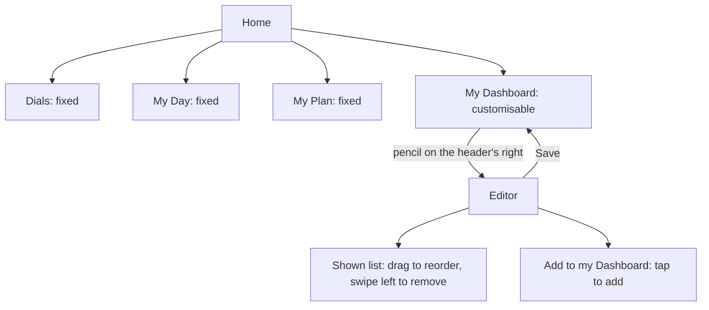
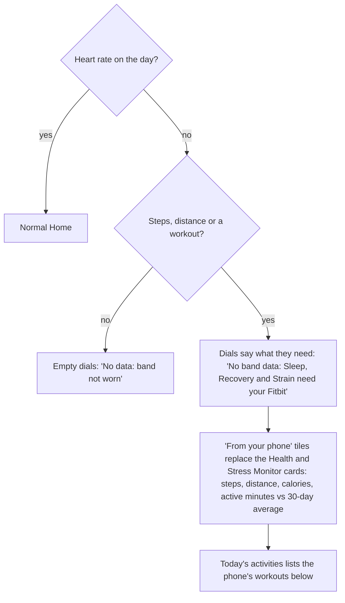

# The reference app's My Dashboard customisation, and what Pulse takes from it

Researched 2026-10-03 for Home's My Dashboard editor (spec §11 CD1, CD2). Sources are the reference app's own pages, its community forum and press, 2024–2026.

**Access note.** the reference app's site (The Locker) and support.the reference app's site refused automated reads (403 / 401). Claims from those pages come from search-engine snippets of them and are marked *[snippet]*. Forum threads and press articles were read in full. No publish date was visible on the Locker or support pages. Forum staff were already explaining the current Home on 2025-05-08, so the redesign shipped around then.

## 1. Where it sits

The reference app's Home is one scrolling page (it used to be swipe tabs), in this order:

1. The three dials (Sleep, Recovery, Strain)
2. **My Day**: activities and last night's sleep
3. **My Plan**: goals, including the Step Goal
4. **My Dashboard**: "the metrics you choose to track, with long-term trends"

Only My Dashboard can be customised. "The dials and the My Day and My Plan sections are fixed" *[snippet]*. A member asked to hide or reorder Home cards on 2026-05-13, so that is still not possible. Health Monitor, Healthspan and Hormonal Insights moved to a separate Health tab.

## 2. The editor

| Aspect | What the reference app does | Confidence |
|---|---|---|
| Entry | A pencil icon on the right of the My Dashboard header. The May 2025 build had a "Customize" text button instead | Confirmed |
| Presentation | Its own screen with a Save button. Whether it is a sheet or a pushed screen, and how it animates, is not documented | Inferred |
| Lists | Two lists: the shown metrics on top, then **"Add to my Dashboard"** with everything else | Confirmed (staff, 2025-05-29) |
| Add | Select a metric in "Add to my Dashboard" | Wording confirmed; the gesture (tap) is inferred |
| Remove | Swipe left on a shown metric to reveal a red trash button; the metric drops to "Add to my Dashboard". A member said there "seems no way" to remove one, and staff passed it to the product team as a discoverability issue | Confirmed |
| Reorder | "Drag and drop to reorder the tiles". Whether a handle or a long-press starts the drag is not documented | Confirmed / handle inferred |
| Save | "Tap Save to confirm your changes". A Cancel button is not documented | Confirmed |
| Categories, search | None documented | Not found |
| Limits | No minimum or maximum documented | Not found |
| Defaults | Not documented. Steps is not always shown: the Steps article says to tap the pencil if it is missing | Partly |
| Earlier version (2023–24) | The Overview's "Key Statistics" editor called its shown list "On Overview" | Confirmed |

## 3. Metrics and tiles

- **Confirmed addable:**
  - Steps
  - VO2 Max (updates weekly; shows "N more recoveries needed" until it has 14 recoveries in 21 days)
  - Hours of Sleep
  - Weight and Lean Body Mass (2024)
- **Likely, from the older Key Statistics:** HRV, resting HR, respiratory rate, sleep performance, calories and stress.
- The reference app calls them **tiles**. Tapping one opens its trend, with Weekly, Monthly and 6-Month views. The Steps tile shows progress toward the step goal.
- Not documented: a 30-day comparison, arrows or colour on each tile. The older Key Statistics and the Health Monitor had a value against a 30-day comparison with arrows.
- Not documented: what a tile shows with no data. Elsewhere the reference app greys Recovery while it calibrates and spells out "N more recoveries needed".

## 4. Phone data and no-wear days

- The reference app does not import phone or Apple Health steps. Steps come only from the strap, and only while it is worn. Members asked for phone steps from 2025-09 to 2026-05 without a staff answer.
- There is no documented "wear your the reference app" Home state. Members describe blank sections and "NO sleep for today" when a sync fails.
- Pulse is different here: Google Health holds phone steps, distance and workouts without a band. Section 6 covers how Pulse uses them.

## 5. Gap list: Pulse's editor before this change

| # | The reference app | Pulse before | Gap → action |
|---|---|---|---|
| G1 | Shown list, then "Add to my Dashboard" | One list of 8 rows, each with a Switch | **Fixed:** two lists, "On Home" and "Add to My Dashboard" |
| G2 | Removing drops a metric into the add list | A switched-off row stayed in place | **Fixed:** Remove moves it to its group in the add list; Add appends it to the shown list |
| G3 | A catalogue of the reference app's metrics | 8 metrics; everything synced since `ea80a41` was missing | **Fixed:** 27 metrics: the 8, Weight, Body fat, and every extra metric in `EXTRA_METRICS`, generated from that list |
| G4 | No categories or search (the catalogue is small) | n/a | **Pulse addition:** with 27 metrics the add list is grouped (Recovery & sleep, Activity, Body, Nutrition, Vitals) and has a search field |
| G5 | Swipe to remove, which members could not find | n/a | **Deviation:** a visible Remove button on each shown row |
| G6 | Drag and drop | Move up / Move down buttons | **Kept:** Pulse has no drag library and the buttons work with a keyboard and a screen reader; each move is announced. A drag handle is a later option |
| G7 | No-data state not documented | Every metric had data | **Pulse addition:** add-list rows with nothing in 30 days say "No data yet", so nobody adds a metric that will only show "--" |
| G8 | Save | Save, Reset to default | Kept. Reset restores the default for this account (G9) |
| G9 | Defaults not documented | The 8 v1 rows | **Pulse addition:** an account that has never synced heart rate defaults to phone metrics (Steps, Distance, Calories, Active minutes, Active calories, Floors) |
| G10 | Tiles open a trend | Rows link to their detail screen | Kept. Extra metrics link to the screen in their `href` (Strain, Journal, Health Monitor) |
| G11 | Only My Dashboard is customisable | Same | Kept |

## 6. Home without a band (Pulse only)

The reference app has nothing to copy here, because it never shows phone data. With no band, Pulse's Home was three empty dials, "No readings" monitor cards and "No data: band not worn", even when the phone counted 9,000 steps. The design (spec §11 CD2):

## Sources

- The Locker, "The all-new the reference app Home screen" *[snippet]*, no date visible: #
- The reference app Support, "Navigating the the reference app Mobile App" *[snippet]*: #
- The reference app Support, "Steps" *[snippet]*: #
- The reference app Community, "Can I customize my home screen?" (staff, 2025-05-08 and 2025-05-29: Customize, swipe to remove, "Add to my Dashboard"): #
- The reference app Community, "Where did my previous home screen metrics go?" (2025-05-08, Health tab): #
- The reference app Community, "Can't customize dashboard and can't set up steps goal" (2026-01-08, pencil icon): #
- The reference app Community, "Customization of application" (2026-05-13): #
- The reference app Community, "I don't have the customize pencil next to my dashboard" (2026-05-15): #
- The reference app Community, "Does the reference app import steps from Apple Health yet?" (2025-09 to 2026-05): #
- The reference app Community, "App not showing data" (2025-11-13): #
- The Locker, VO2 Max ("Customize next to My Dashboard") *[snippet]*: #
- The Locker, body composition and weight trends ("On Overview" list, about 2024-07) *[snippet]*: #
- the5krunner, "the reference app homescreen gets a revamp" (2025-10-15): #
- the5krunner, VO2 Max explainer (2025-03-11): #
- 9to5Google, "the reference app adds step counting" (2024-10-09): #
- YouTube, "FULL the reference app App Walkthrough (2026 Update)" (its page would not load, so it was not used): https://www.youtube.com/watch?v=NrCpf_m75XM
