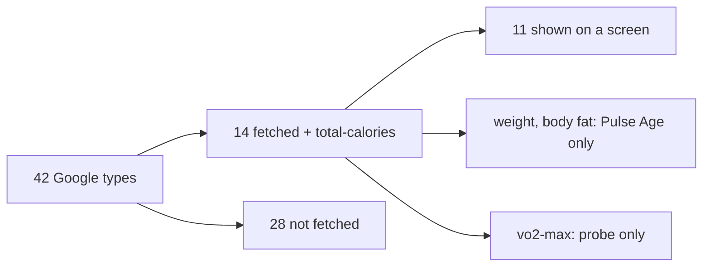
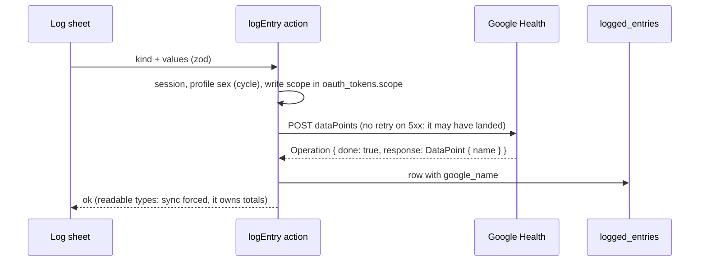

# Google Health API coverage

This compares, one by one, the data types the Google Health API v4 returns ([`users.dataTypes.dataPoints`](https://developers.google.com/health/reference/rest/v4/users.dataTypes.dataPoints)) with what Pulse fetches, stores and shows. Written 2026-10-03, against `src/server/sources/google/catalogue.ts` and `map.ts`.

## Summary

- Google lists **42** data point types.
- Pulse fetches **14** of them, plus `total-calories`, which only answers daily roll-ups and is not in that list.
- **11** reach a screen. **2** (weight, body fat) feed only Pulse Age and are never displayed. **1** (`vo2-max`) is fetched only for the probe.
- **28** are not fetched at all.
- OAuth asks only for the 13 scopes Pulse uses (2026-10-04, trimmed for Google verification): read `activity_and_fitness`, `health_metrics_and_measurements`, `sleep`, `ecg`, `irn`, `nutrition`, `profile` (age at onboarding), `settings` (`users.pairedDevices.list`, the no-device check); write `nutrition`, `health_metrics_and_measurements`, `mindfulness` (moods), `logged_symptoms`, `reproductive_health` (Journal › Log). `location` and the read side of mindfulness, logged symptoms and reproductive health were dropped: Pulse reads nothing there (the types it logs are write-only at Google).

## Type by type

Status: **Shown** means visible on a screen; **Used** means it feeds a score but its own value is not displayed; **Stored** means it is fetched and saved but nothing reads it; **No** means it is not fetched.

| Google type | What it is | Pulse | Where it goes |
|---|---|---|---|
| `steps` | Step counts per interval | **Shown** | Daily total (roll-up) on My Dashboard, Strain, Trends, Pulse Age. Per-minute counts gate stress |
| `heart-rate` | HR samples | **Shown** | Strain, HR charts, zones, stress, Energy Bank. Band only: `HEALTH_CONNECT` points are dropped. Google's daily average shows in Trends (Vitals) |
| `sleep` | Sessions with stages | **Shown** | Sleep, Recovery, Sleep Planner, SRI |
| `daily-resting-heart-rate` | Daily RHR | **Shown** | Recovery, Strain's heart-rate reserve, Health Monitor, My Dashboard, Pulse Age (the sleep-session estimate only on days without it). The calculation method is stored, not shown. Its `dailyRollUp` personal range sets Health Monitor's RHR range (unconfirmed) |
| `daily-heart-rate-variability` | Nightly average RMSSD | **Shown** | Recovery, My Dashboard. The deep-sleep RMSSD is stored, not shown. The non-REM HR is not stored. Its `dailyRollUp` personal range sets Health Monitor's HRV range (unconfirmed) |
| `daily-respiratory-rate` | Nightly breathing rate | **Shown** | Health Monitor, My Dashboard |
| `daily-oxygen-saturation` | Nightly SpO2 | **Shown** | Average only, on Health Monitor and My Dashboard. The lower and upper bounds are not stored |
| `daily-sleep-temperature-derivations` | Nightly skin temperature | **Shown** | Health Monitor, Recovery, My Dashboard: deviation from Google's baseline, Health Monitor's range from its 30-night SD |
| `daily-vo2-max` | Daily cardio fitness | **Shown** | Fitness, Pulse Age (half weight) |
| `run-vo2-max` | VO2max from runs | **Shown** | Fitness, Pulse Age |
| `exercise` | Workouts | **Shown** | Activities: type, name, time, calories, distance (rows and the activity screen) and pace for runs and walks. Splits are not stored |
| `weight` | Weight | **Shown**, **written** | Health Monitor › Measurements (latest, date, vs. the 30 days before); Trends (Body) and the daily export; lean mass (FFMI) in Pulse Age; logged from Journal › Log |
| `body-fat` | Body fat % | **Shown**, **written** | Same; logged from Journal › Log |
| `vo2-max` | Generic VO2max | **Stored** | Probe only |
| `total-calories` (roll-up) | Daily total kcal | **Shown** | My Dashboard, Strain |
| `distance` | Distance per interval | **Shown** | Daily total on Strain and Trends (Activity), export `distance_km` |
| `floors` | Floors climbed | **Shown** | Strain, Trends (Activity) |
| `altitude` | Elevation gain | **Shown** | Trends (Activity) |
| `active-zone-minutes` | Fitbit AZM | **Shown** | Strain, Trends (Activity), beside Pulse's own zone minutes |
| `time-in-heart-rate-zone` | Time per HR zone | **Shown** | Daily roll-up: Pulse Age's zone terms and Strain's two zone rows |
| `daily-heart-rate-zones` | The user's zone bounds | **Shown** | Zone bounds per day (Strain, activities, HR chart); PEAK's max is max HR when Settings has none |
| `active-minutes` | Minutes by activity level | **Shown** | Moderate + vigorous as Active minutes (Strain, Trends); light as Light activity (Trends) |
| `activity-level` | Daily activity level | No | |
| `sedentary-period` | Sedentary intervals | **Shown** | Daily total as Sedentary time (Trends) |
| `active-energy-burned` | Active kcal | **Shown** | Strain, Trends (Activity) |
| `basal-energy-burned` | BMR kcal | No | No daily roll-up (2026-10-03). Strain's Calories burned derives resting as `total-calories` − `active-energy-burned` |
| `heart-rate-variability` | HRV samples | No | Only the nightly average is fetched |
| `oxygen-saturation` | SpO2 samples | No | Only the nightly average is fetched |
| `respiratory-rate-sleep-summary` | Breathing rate per sleep stage | No | |
| `core-body-temperature` | Core temperature | **Shown** | Daily average (`daily_values.core_temp`): Health Monitor › Measurements once ever recorded; Trends (Vitals) |
| `height` | Height | **Used** | Latest reading fills the profile height when the user gave none (Pulse Age lean mass) |
| `swim-lengths-data` | Swim strokes per length | **Shown** | Daily stroke total in Trends (Activity) |
| `electrocardiogram` | ECG readings | **Shown** | Result and average bpm (`health_records`, never the waveform): Health Monitor › Heart rhythm, latest, history and a detail sheet |
| `irregular-rhythm-notification` | AFib alerts | **Shown** | Count and latest date: Health Monitor › Heart rhythm |
| `blood-glucose` | Glucose readings | **Shown** | Daily average (`daily_values.glucose`): Health Monitor › Measurements once ever recorded; Trends (Vitals) |
| `hydration-log` | Water logged | **Shown**, **written** | Daily total in Trends (Nutrition); logged from Journal › Log |
| `nutrition-log` | Meals and nutrients | **Shown**, **written** | Daily kcal, protein, carbohydrates and fat in Trends (Nutrition); logged from Journal › Log as anonymous food |
| `food`, `food-measurement-unit` | Food database entries | No | |
| `menstrual-period` | Cycle tracking | **Written** | Write-only at Google. Journal › Log, female profiles only; mirrored in `logged_entries` |
| `ovulation-test` | Ovulation test results | **Written** | Same |
| `symptoms` | Logged symptoms | **Written** | Write-only at Google. Journal › Log; mirrored in `logged_entries` |
| `moods` | Logged moods | **Written** | Same |

## What the Google Health app shows that Pulse doesn't

These are the gaps a Fitbit Air user would notice, ordered by how often they come up. Items 1 to 4 now show on Strain, Trends and the activity screens, and the hydration and food totals show in Trends (spec §11 EX1-EX4); the type table above has each status.

1. **Distance, floors and active minutes**: the everyday activity numbers next to steps. Each is one roll-up type, and they fit beside Steps on Strain and My Dashboard.
2. **Weight and body fat**: done, Health Monitor › Measurements.
3. **Exercise distance and pace**: distance is already stored per workout; it should show on the activity row.
4. **Active Zone Minutes**: Fitbit's headline goal. Pulse has its own zone minutes; showing Google's AZM beside them would avoid "my numbers don't match Fitbit".
5. **Hydration and food logs**: a Journal-adjacent feature, not a score input.
6. **ECG and irregular rhythm alerts**: done, Health Monitor › Heart rhythm (UI research: `heart-rhythm-ui.md`).
7. **Cycle tracking, symptoms, moods, glucose**: logged data. These are useful as Journal inputs (Behaviour Insights) rather than as screens of their own.

If none of 5–7 are planned, drop their scopes: a consent screen that asks for ECG and reproductive health access, for an app that never reads them, is a fair privacy objection.

## Without a Fitbit device

An account with no band still syncs phone data (steps, calories, workouts from Health Connect). Pulse stores it and shows steps and calories on My Dashboard and Strain. But Home's three rings, Health Monitor and Energy Bank all read "No data: band not worn", so the steps are easy to miss. Heart rate from `HEALTH_CONNECT` is dropped on purpose, so a phone or another watch never feeds Strain.

## Writing (logging from Pulse, 2026-10)

Pulse writes only what the owner logs in Journal › Log (spec §11 LG1). Shapes are from Google's reference and guides
([dataPoints](https://developers.google.com/health/reference/rest/v4/users.dataTypes.dataPoints),
[create](https://developers.google.com/health/reference/rest/v4/users.dataTypes.dataPoints/create),
[Women's Health guide](https://developers.google.com/health/data-types/womens-health),
[Nutrition guide](https://developers.google.com/health/data-types/nutrition)) and the API discovery document.

| Type | Body (`POST users/me/dataTypes/{type}/dataPoints`) | Scope |
|---|---|---|
| `hydration-log` | `{ hydrationLog: { interval, amountConsumed: { milliliters, userProvidedUnit } } }` | `nutrition.writeonly` |
| `nutrition-log` | `{ nutritionLog: { interval, foodDisplayName, mealType, energy: { kcal }, totalCarbohydrate: { grams }, totalFat: { grams }, nutrients: [{ nutrient: "PROTEIN", quantity: { grams } }] } }` | `nutrition.writeonly` |
| `weight` | `{ weight: { sampleTime, weightGrams } }` | `health_metrics_and_measurements.writeonly` |
| `body-fat` | `{ bodyFat: { sampleTime, percentage } }` | same |
| `moods` | `{ moods: { sampleTime, moods: [Mood], valences: [UNPLEASANT \| BASELINE \| PLEASANT] } }` | `mindfulness.writeonly` |
| `symptoms` | `{ symptoms: { sampleTime, symptoms: [SymptomValue] } }` | `logged_symptoms.writeonly` |
| `menstrual-period` | `{ menstrualPeriod: { interval, notes } }` (no flow field: Pulse writes "Flow: medium" into `notes`) | `reproductive_health.writeonly` |
| `ovulation-test` | `{ ovulationTest: { sampleTime, result } }` | same |

`sampleTime` is `{ physicalTime, utcOffset }` and `interval` is `{ startTime, startUtcOffset, endTime, endUtcOffset }`; Pulse
always sends the offset (`"19800s"`), else Google stores `0s` and the civil time is UTC's.

- **Response.** `create` returns an `Operation`. The guides show `{ done: true, response: { "@type": ".../DataPoint", name: "users/{id}/dataTypes/{type}/dataPoints/{id}", ... } }`. There is no `operations.get`, so an unfinished operation cannot be polled; Pulse stores the entry without a name and shows "in Pulse only".
- **Delete.** `POST .../dataPoints:batchDelete` with `{ names }`; the response is an `Operation`. The parent is `users/me`, and names must share it, so Pulse rewrites `users/{id}/` to `users/me/` (the form the Nutrition guide's delete example uses). Unconfirmed until a real delete.
- **Read back.** `dataPoints.get` accepts the write-only scopes, so a single logged mood can be fetched by name; `list` cannot. Pulse does not use `get`.
- **Not confirmed until a real write:** the exact 403 code an older grant gets (`PERMISSION_DENIED` or `ACCESS_TOKEN_SCOPE_INSUFFICIENT`; Pulse keys on the status), whether an anonymous nutrition log needs `foodDisplayName` (Pulse sends "Quick calories" when none is given), and how soon a write shows in `dailyRollUp`.
- **Old grants.** A grant made before 2026-10 has `nutrition.writeonly` only, so water and food write at once; the rest need a reconnect. `/oauth/start` sends such a grant through consent again so a fresh refresh token covers every scope.
