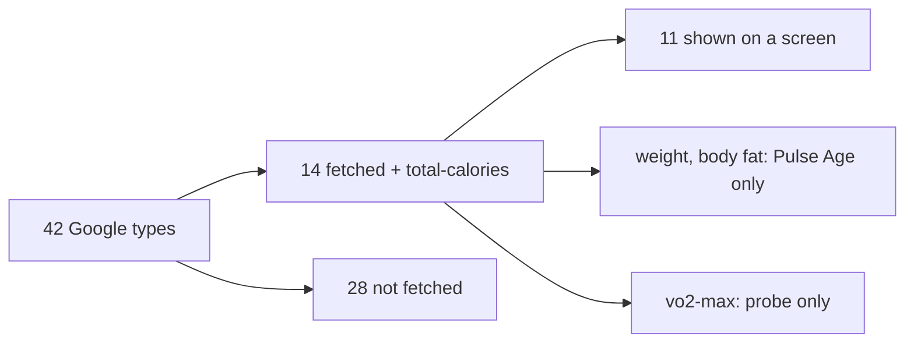

# Google Health API coverage

This compares, one by one, the data types the Google Health API v4 returns ([`users.dataTypes.dataPoints`](https://developers.google.com/health/reference/rest/v4/users.dataTypes.dataPoints)) with what Pulse fetches, stores and shows. Written 2026-10-03, against `src/server/sources/google/catalogue.ts` and `map.ts`.

## Summary

- Google lists **42** data point types.
- Pulse fetches **14** of them, plus `total-calories`, which only answers daily roll-ups and is not in that list.
- **11** reach a screen. **2** (weight, body fat) feed only Pulse Age and are never displayed. **1** (`vo2-max`) is fetched only for the probe.
- **28** are not fetched at all.
- OAuth asks for scopes Pulse never uses: `ecg`, `irn`, `logged_symptoms`, `mindfulness`, `reproductive_health`, `location` and `nutrition.writeonly`. They were added so the probe could see everything; nothing reads them yet.

## Type by type

Status: **Shown** means visible on a screen; **Used** means it feeds a score but its own value is not displayed; **Stored** means it is fetched and saved but nothing reads it; **No** means it is not fetched.

| Google type | What it is | Pulse | Where it goes |
|---|---|---|---|
| `steps` | Step counts per interval | **Shown** | Daily total (roll-up) on My Dashboard, Strain, Trends, Pulse Age. Per-minute counts gate stress |
| `heart-rate` | HR samples | **Shown** | Strain, HR charts, zones, stress, Energy Bank. Band only: `HEALTH_CONNECT` points are dropped |
| `sleep` | Sessions with stages | **Shown** | Sleep, Recovery, Sleep Planner, SRI |
| `daily-resting-heart-rate` | Daily RHR | **Shown** | Recovery, My Dashboard, Pulse Age. The calculation method is stored, not shown |
| `daily-heart-rate-variability` | Nightly average RMSSD | **Shown** | Recovery, My Dashboard. The deep-sleep RMSSD is stored, not shown. The non-REM HR is not stored |
| `daily-respiratory-rate` | Nightly breathing rate | **Shown** | Health Monitor, My Dashboard |
| `daily-oxygen-saturation` | Nightly SpO2 | **Shown** | Average only, on Health Monitor and My Dashboard. The lower and upper bounds are not stored |
| `daily-sleep-temperature-derivations` | Nightly skin temperature | **Shown** | Health Monitor, My Dashboard (deviation from Pulse's own baseline) |
| `daily-vo2-max` | Daily cardio fitness | **Shown** | Fitness, Pulse Age (half weight) |
| `run-vo2-max` | VO2max from runs | **Shown** | Fitness, Pulse Age |
| `exercise` | Workouts | **Shown** | Activities: type, name, time, calories. Distance is stored, not shown. Splits are not stored |
| `weight` | Weight | **Shown** | Health Monitor › Measurements (latest, date, vs. the 30 days before); lean mass (FFMI) in Pulse Age |
| `body-fat` | Body fat % | **Shown** | Same |
| `vo2-max` | Generic VO2max | **Stored** | Probe only |
| `total-calories` (roll-up) | Daily total kcal | **Shown** | My Dashboard, Strain |
| `distance` | Distance per interval | No | |
| `floors` | Floors climbed | No | |
| `altitude` | Elevation gain | No | |
| `active-zone-minutes` | Fitbit AZM | No | Pulse computes its own zone minutes from HR |
| `time-in-heart-rate-zone` | Time per HR zone | No | Same |
| `daily-heart-rate-zones` | The user's zone bounds | No | Pulse uses %HRmax zones |
| `active-minutes` | Minutes by activity level | No | |
| `activity-level` | Daily activity level | No | |
| `sedentary-period` | Sedentary intervals | No | |
| `active-energy-burned` | Active kcal | No | Only the total is fetched |
| `basal-energy-burned` | BMR kcal | No | |
| `heart-rate-variability` | HRV samples | No | Only the nightly average is fetched |
| `oxygen-saturation` | SpO2 samples | No | Only the nightly average is fetched |
| `respiratory-rate-sleep-summary` | Breathing rate per sleep stage | No | |
| `core-body-temperature` | Core temperature | **Shown** | Daily average (`daily_values.core_temp`): Health Monitor › Measurements, once ever recorded |
| `height` | Height | No | Asked in onboarding instead (deferred: read it from Google) |
| `swim-lengths-data` | Swim strokes per length | No | |
| `electrocardiogram` | ECG readings | **Shown** | Result and average bpm (`health_records`, never the waveform): Health Monitor › Heart rhythm, latest, history and a detail sheet |
| `irregular-rhythm-notification` | AFib alerts | **Shown** | Count and latest date: Health Monitor › Heart rhythm |
| `blood-glucose` | Glucose readings | **Shown** | Daily average (`daily_values.glucose`): Health Monitor › Measurements, once ever recorded |
| `hydration-log` | Water logged | No | |
| `nutrition-log` | Meals and nutrients | No | |
| `food`, `food-measurement-unit` | Food database entries | No | |
| `menstrual-period` | Cycle tracking | No | Scope requested |
| `ovulation-test` | Ovulation test results | No | Scope requested |
| `symptoms` | Logged symptoms | No | Scope requested |
| `moods` | Logged moods | No | |

## What the Google Health app shows that Pulse doesn't

These are the gaps a Fitbit Air user would notice, ordered by how often they come up:

1. **Distance, floors and active minutes**: the everyday activity numbers next to steps. Each is one roll-up type, and they fit beside Steps on Strain and My Dashboard.
2. **Weight and body fat**: done, Health Monitor › Measurements.
3. **Exercise distance and pace**: distance is already stored per workout; it should show on the activity row.
4. **Active Zone Minutes**: Fitbit's headline goal. Pulse has its own zone minutes; showing Google's AZM beside them would avoid "my numbers don't match Fitbit".
5. **Hydration and food logs**: a Journal-adjacent feature, not a score input.
6. **ECG and irregular rhythm alerts**: done, Health Monitor › Heart rhythm (UI research: `heart-rhythm-ui.md`).
7. **Cycle tracking, symptoms, moods, glucose**: logged data. These are useful as Journal inputs (Behaviour Insights) rather than as screens of their own.

If none of 5–7 are planned, drop their scopes: a consent screen that asks for ECG and reproductive health access, for an app that never reads them, is a fair privacy objection.

## Without a Fitbit device

An account with no band still syncs phone data (steps, calories, workouts from Health Connect). Pulse stores it and shows steps and calories on My Dashboard and Strain. But Home's three rings, Health Monitor and Energy Bank all read "No data: band not worn", so the steps are easy to miss. Heart rate from `HEALTH_CONNECT` is dropped on purpose, so a phone or another watch never feeds Strain.
