# Landing page and SEO research

Research date: 2026-10-03. Method: WebSearch, WebFetch and Google autocomplete only. We used no paid keyword tools, so we have no search-volume numbers.

Evidence labels used below:
- **[observed]**: seen directly in a fetched page or in autocomplete output on the research date.
- **[reported]**: stated by a third-party article. We did not verify it against a primary source.
- **[inferred]**: our own judgement from the evidence.

Reddit (reddit.com and old.reddit.com) blocks our fetch and search tools. We could not read r/FitbitAir, r/FitbitAir_India or r/selfhosted directly. Reddit sentiment below comes from news coverage that quotes Reddit, and from autocomplete suffixes such as "... reddit". Before writing copy, check the subreddits by hand.

---

## 1. Audience

### 1.1 Fitbit Air owners (primary)

- **Product**: Google Fitbit Air, a screenless band, announced 2026-05-07. It costs $99 ($129 for the Stephen Curry Special Edition) and includes 3 months of Google Health Premium [observed, [Google blog][g-blog]]. Several reviews give a 12 g weight and about 7-day battery life [reported, [Yahoo/Tom's Guide vs the reference app][yahoo-vs]].
- **India**: on sale 2026-10-02 at Rs 13,999 through Google Store and retail partners. Needs Android 11+ or iOS 16.4+, a Google Account and the Google Health app. Includes a 3-month Premium trial [observed, [Google India blog][g-in]]. India launched only one day before this research, so Indian search demand is just starting ("fitbit air india launch date", "fitbit air india flipkart", "fitbit air jiomart") [observed, autocomplete].
- **App**: the Fitbit app became the **Google Health app**. It combines data from wearables, Health Connect, Apple Health and medical records [observed, [Google blog][g-blog]]. Numeric stress scores were replaced by "Resilience" (Optimal/Balanced/Low) on 2026-05-19. The Air has no EDA sensor [reported, [Kygo][kygo-stress]].
- **Free vs paid**:
  - Free: heart rate, HRV, SpO2, skin temperature, sleep stages, Cardio Load, Daily Readiness and smart wake [reported, [Digital Trends][dt-free]; [Kygo][kygo-vs]].
  - Paid: **Google Health Premium** costs $9.99/month or $99.99/year (Fitbit Premium was $79.99/year). It adds the Gemini-based Google Health Coach, adaptive plans and "deeper sleep insights" [observed, [Android Authority][aa-premium]; [Google blog][g-blog]]. Premium is also included with Google AI Pro and Ultra [observed, [Google blog][g-blog]].
  - Conflict: one review says the price after the trial is "$79 per year" [reported, [the5krunner][5kr]]. Treat $99.99 as current, and quote prices with an "as of" date.
- **What owners lack**:
  - The Air has no recovery-app-style 0-21 daily strain or recovery-% model. It has Readiness (out of 100) and a weekly Cardio Load [reported, [Kygo][kygo-vs]].
  - "Recovery scoring is simpler than the reference app's" [reported, [the5krunner][5kr]].
  - The Air does not write to Apple Health. Google Health reads from Apple Health but cannot write back [reported, [the5krunner][5kr]].
  - Export is through Google Takeout or the Fitbit "Data Export" archive [observed, [Google Health Help][gh-export]].
- **Complaints** (from news that quotes Reddit):
  - Sleep detection is inaccurate: one post on r/fitbit called it "100% useless".
  - Step counts are inflated while sitting.
  - Some users reported better heart-rate readings with the band on the ankle [reported, [Android Authority, 2026-06-03][aa-issues]].
  - After Readiness algorithm updates, the score got "stuck in calibration" [reported, [Notebookcheck][nbc]].
  - Autocomplete for the Air shows: "fitbit air hrv not tracked", "fitbit air hrv 0", "fitbit air sleep score not working", "fitbit air data not syncing" [observed].
- **Developer context**:
  - The legacy Fitbit Web API stops being supported on 2026-09-30. It is turned off on 2026-10-30 [reported, [Google Health API newsletter search result][gh-news]; [Validic][validic]].
  - The replacement is the Google Health API. It uses Google OAuth, and old tokens do not carry over [reported, [Terra][terra]; [Open Wearables][ow]].
  - An unverified OAuth app is capped at **100 new users**, and Google gives no personal-use exception [observed, [Google Cloud help][oauth-cap]]. Hælan uses this cap to explain why it is self-hosted [observed, [Hælan site][haelan-site]].
  - Implication: old Fitbit-to-Grafana scripts break this month. Self-hosters who use them need a replacement now [inferred].

### 1.2 the reference app-alternative and "no subscription" searchers

- The reference app requires a membership. Reported tiers are One $199/yr, Peak $239/yr and MG/Life $359/yr [reported, [Kygo][kygo-vs]]. The common pitch is "cancel and the band becomes a paperweight" [reported, [Livity][livity-alt]].
- Autocomplete for "refapp alternative" includes: no subscription, without subscription, app, google, india, reddit, "no subscription reddit" [observed].
- Most reviews frame the Fitbit Air itself as the cheap the reference app alternative [observed: [Tom's Guide review title][tg-review]; [Yahoo][yahoo-vs]]. Pulse's target is the gap these reviews point out: the reference app-like *analytics* on the Air's data.

### 1.3 Self-hosters and quantified-self

- Autocomplete: "self hosted fitness tracker", "self hosted fitness data", "self hosted fitness tracker reddit" [observed].
- **Existing projects**:
  - Hælan (AGPL-3.0, about 39 stars) [observed, [GitHub][haelan-gh]].
  - arpanghosh8453/fitbit-grafana (925 stars, BSD-4-Clause). It now supports Google Cloud credentials [observed, [GitHub][fg]].
  - noop for the reference app straps (about 1.3k stars, PolyForm NC) [observed, [GitHub][noop]].
- Interest in "open source refapp" is real. Autocomplete shows app, alternative, github and reddit variants [observed]. Android Police covered noop on 2026-06-13 [observed, [Android Police][ap-noop]].

---

## 2. Keywords and questions

Sources: Google autocomplete fetched on 2026-10-03 [observed] and ranking pages [observed]. We have no volume data. Our guess at relative size is marked [inferred].

| Cluster | Observed queries (autocomplete unless noted) | Intent | Notes |
|---|---|---|---|
| **A. Fitbit Air recovery and strain** | fitbit air recovery score, fitbit air recovery tracking, fitbit air recovery metrics, google fitbit air recovery score, fitbit air strain score, does fitbit air track strain, does fitbit air have strain and recovery, does fitbit air have a strain score | Informational, with commercial follow-up | **Best fit for Pulse.** The answer is "Readiness yes, a recovery-app-style strain no, but you can compute one". Few pages answer it head-on [inferred]. |
| **B. Fitbit Air subscription** | fitbit air without subscription (+ reddit), fitbit air without premium, fitbit air without google health premium, fitbit air premium vs free, fitbit air premium features, fitbit air no subscription | Commercial investigation | Pulse = "extra analytics, no subscription, self-hosted". |
| **C. Fitbit Air comparisons** | fitbit air vs refapp (+ 5.0, reddit), vs garmin cirqa, vs amazfit helio strap, vs fitbit charge 6, vs inspire 3, vs apple watch | Commercial | Major outlets already own these. Pulse cannot win on hardware reviews [inferred]. Its angle is metric parity: "what the reference app shows that the Air app doesn't, and how to get it". |
| **D. Fitbit Air metric questions** | fitbit air hrv (accuracy, not tracked, 0, low, apple health), fitbit air stress score / tracking / level, fitbit air sleep score (not working, accuracy), fitbit readiness score (always low, stuck at 15, explained, meaning, not showing) | Informational / troubleshooting | Long tail. Glossary and metric pages can answer these and show the Pulse equivalent. |
| **E. Fitbit Air data** | fitbit air data export, fitbit air data api, fitbit air data to apple health, fitbit air data to garmin connect, fitbit air data privacy, fitbit air data not syncing | Informational / navigational | Good fit for "own your data" and "Google Health API" pages. |
| **F. The reference app metric explainers** | how is refapp recovery calculated (the reference app support ranks), refapp recovery score explained, refapp recovery always low, strain score refapp, strain score meaning, refapp strain score meaning, refapp age (calculator, test, test free, meaning), how is refapp age calculated | Informational | The reference app's own pages rank #1 [observed]. Pulse can be a neutral, citable explainer of the published methods (TRIMP, Karvonen, RMSSD baselines) and link to its own open code. |
| **G. Generic physiology** | what is a good hrv (score, for my age, range by age, at night, for athletes), sleep regularity index (formula, SRI, vs sleep duration, "stronger predictor of mortality"), what is biological age, biological age wearable, can you change your biological age | Informational | High volume and very competitive [inferred]. Only worth it if each page carries Pulse-specific detail (formula, code link, worked example). |
| **H. The reference app alternatives** | refapp alternative (no subscription, app, google, reddit), free refapp alternative (search) | Commercial | Many affiliate/app listicles crowd this [observed]. Pulse's niche: "open-source / self-hosted the reference app alternative for Fitbit Air". |
| **I. Open-source / self-hosted** | open source refapp (app, alternative, github, reddit), self hosted fitness tracker (app, data), google health api (docs, v4, scopes, mcp, reddit, pricing), fitbit dashboard (desktop, online) | Navigational / commercial | Low volume, high intent [inferred]. "fitbit dashboard desktop/online" signals demand for a web dashboard now that fitbit.com's dashboard is gone [inferred]. |

**People-Also-Ask-style questions** (adapted from autocomplete stems, [inferred]):
- Does the Fitbit Air have a recovery score?
- Does Fitbit Air track strain?
- Can I use Fitbit Air without a subscription?
- What does Google Health Premium add?
- How is the reference app recovery calculated?
- What is a good HRV for my age?
- What is the sleep regularity index?
- How is biological age calculated from a wearable?
- How do I export Fitbit Air data?
- Can I see Fitbit data on a desktop?

---

## 3. Competing pages

Dates are publication or update dates where the page shows them. Prices are as reported and unverified unless the source is a primary page.

| Page | URL | Type | Covers | Angle a self-hosted OSS project can own |
|---|---|---|---|---|
| Google blog launch | [blog.google][g-blog] (2026-05-07) | Official announcement | Air, Google Health app, Premium pricing | None. Link to it as the primary source. |
| Tom's Guide review | [tomsguide.com][tg-review] | Review | Calls the Air "the best the reference app alternative for the rest of us" (title) | Follow-up: "Fitbit Air + Pulse = the the reference app metrics the review says are missing". |
| the5krunner review | [the5krunner.com][5kr] (2026-05-07) | Long-form review, 31 cons | Recovery "simpler than the reference app's"; logs about every 5 s, not 2 s; no Apple Health write | Be honest about data-resolution limits on metric pages. |
| Android Authority issues | [androidauthority.com][aa-issues] (2026-06-03) | News | Sleep and step accuracy complaints | Data-quality caveats in Pulse docs. |
| Trusted Reviews / Yahoo / Tom's Guide / HealNourishGrow "Fitbit Air vs the reference app" | [trustedreviews][tr-vs], [yahoo][yahoo-vs], [tomsguide][tg-vs], [healnourishgrow][hng-vs] | Versus pages | Hardware, battery, subscription, weight | Pulse cannot out-rank on hardware. It can own "Fitbit Air vs the reference app: *metrics*", a score-by-score table showing what Pulse computes. |
| Kygo "Fitbit Air vs the reference app" | [kygo.app][kygo-vs] (2026-05-08, upd. 2026-09-18) | App-vendor versus page | 3-year cost table, readiness vs recovery, the reference app tiers | Kygo is a commercial aggregator app. Pulse's difference: open source, self-hosted, formulas public. |
| Kygo Recovery Score Explorer | [kygo.app/tools][kygo-explorer] | Tool-style page covering 12 wearables | Comparison of how brands build recovery scores | Good programmatic-SEO pattern to learn from: one data-rich hub, not 12 thin pages. |
| Livity (iOS) | [livity-app.com alternatives][livity-alt] (2026-03-07, upd. 04-22); [Air review][livity-air] | Vendor listicle + review | The reference app alternatives; Livity connects to Google Health and computes readiness, HRV, training load | Direct software competitor for Air owners on iOS. Pulse: any OS (web), self-hosted, no account with a vendor. |
| The reference app-alternative listicles | [healthappinsider][hai], [beglance][beglance], [wearablebeat][wb], [trackervs][tvs], [lifestack][lifestack], [askvora][vora] | Listicles (mostly app vendors) | Hardware (Garmin Cirqa, Helio Strap, rings) and apps (another app, Athlytic, Welltory) | None of the fetched lists include open-source or self-hosted options [inferred from fetched pages]. "Open-source the reference app alternatives" is an open slot. |
| Another app | [help.alt.health][alt] | App (iOS / Apple Health) | Recovery, sleep, strain, stress free; Pro $14.99/mo or $99.99/yr adds AI coach, health records, **Biological Age** [reported, [askvora][alt-price]] | Pulse Age is free. **Note: the reference app is suing another app (2026-03, D. Del. 1:26-cv-00289) over app look-and-feel trade dress, copyright and recovery/strain patents** [reported, [gadgetsandwearables][refapp-alt]; [the5krunner][5kr-alt]]. |
| Athlytic | [App Store][athlytic] | App (Apple Watch only) | Recovery, Exertion, Sleep | Prices conflict ($24.99/yr vs $29.99/yr), so don't quote them. Apple-only, so not a direct competitor. |
| Gentler Streak | [App Store][gentler] | App (Apple only) | "Push or recover" guidance | Apple-only, so out of scope for Air owners [reported, [habitbox via search][gentler-src]]. |
| Welltory | [welltory.com/devices/fitbit-hrv-app][welltory] | App + device landing page | Stress/energy from HRV; Fitbit gives only daily HRV summaries, not RR intervals | Same limit applies to Pulse. Say so plainly. Welltory's per-device landing page is a pattern to copy. |
| Oura comparisons | [trustedreviews][tr-oura], [tomsguide][tg-oura] | Versus | Ring vs band, $349 vs $99, sleep scores | Low priority. |
| noop | [github.com/ryanbr/noop][noop] | GitHub README only, no site | Offline the reference app companion; recovery 0-100, strain 0-21, documented methods; PolyForm NC | Credit as upstream. Pulse = "noop's math for Fitbit Air via Google Health". |
| Hælan | [github][haelan-gh], [site][haelan-site] | GitHub + GitHub Pages landing | Self-hosted Google Health mirror + dashboard; AGPL-3.0; MCP server; explains the 100-user OAuth cap | Peer, credited. Pulse's difference: recovery-app-style *scores* (recovery, strain, Pulse Age, Energy Bank, planner), not a mirror. |
| fitbit-grafana | [github][fg] | GitHub README | InfluxDB + Grafana raw metrics, migrating to Google Health | Pulse: computed scores, not raw charts. "Fitbit Grafana alternative" page. |
| Open Wearables | [openwearables.io][ow] | MIT OSS platform for developers | Multi-provider wearable API | B2B, not a competitor. |
| The reference app support / The Locker | [How is Recovery calculated][refapp-rec], [How does strain work][refapp-strain], [Pulse Age guide][refapp-age] | Official docs | Rank #1 for the reference app-metric queries | Link out to them. Write neutral explainers that cite them. Do not copy. |

---

## 4. Landing page patterns from open-source / self-hosted projects

| Project | Hero (quoted) | Notable patterns |
|---|---|---|
| Plausible [home][plausible], [self-host page][plausible-sh] | "Easy to use and privacy-friendly Google Analytics alternative" | Names the incumbent in the H1. "View live demo" next to the main CTA. Hard numbers (paying subscribers, pageviews, uptime). Separate **self-hosted page** with a cloud-vs-CE table and honest "you handle installation, maintenance, upgrades, backup, security" copy. AGPL named. "vs Google Analytics" pages linked in the footer. |
| Actual Budget [home][actual] | "Your Finances — made simple" | Main CTA is one-click hosted setup ("Set up on PikaPods in 2 minutes"), then "Set up manually" and "Try the demo". Light and dark screenshots. "Unabashedly local-first software" section. A 12-card feature grid. |
| Home Assistant [home][ha] | "Awaken your home" / "Open source home automation that puts local control and privacy first." | Three CTAs: Get started, View live demos, Browse integrations. Trust from press logos, a "2.7M households" stat, and nonprofit foundation status. |
| Ghost [home][ghost] | "Turn your audience into a business." | Open-source and nonprofit badges. A set of **"Ghost vs Substack / BeeHiiv / WordPress / Medium / Patreon"** pages plus an "alternatives" directory. |
| Cal.com [home][cal] | "The better way to schedule your meetings" | A "Self-hosted" solution page linking to GitHub and Docker docs. FAQ block. "Cal.com vs Calendly" in Resources. |
| Supabase [home][supabase] | "Build in a weekend. Scale to millions." | States "all core tools are open source and self-hostable". Goal-based "what do you want to do?" table pointing into docs. CLI snippet up front. |
| Mealie [home][mealie] | "Self-hosted recipe management and meal planning" | Self-hosted is in the tagline. CTAs: "Read the introduction", "View demo". Three task screenshots. Install options (SQLite vs Postgres). Import compatibility list. |
| Immich [GitHub][immich] | "High performance self-hosted photo and video management solution" | Public demo with credentials in the README. A prominent safety warning (3-2-1 backups). Large star count (about 115k). The site itself was JS-rendered and did not fetch. |
| Hælan [site][haelan-site] | "Your health data, kept where you can reach it" | Closest analogue to Pulse. Sections: Mirror / Dashboard / Tools (MCP) / **Why it is self-hosted** (explains the OAuth cap). CTAs "Open the demo", "Read the source". Five screenshots. Inline Docker Compose. License, no-telemetry and version shown. |

Umami's homepage and Excalidraw did not render through WebFetch, so they are not analysed.

**Common pattern** [inferred from the table]:
1. H1 names the outcome or the incumbent.
2. Primary CTA plus a **live demo**.
3. A real screenshot above the fold.
4. A feature grid.
5. A "why self-hosted / local-first" section.
6. An install snippet (Docker Compose).
7. Trust: license, GitHub link or stars, "no telemetry", version and changelog.
8. Comparison pages linked from the footer.
9. FAQ.
10. Docs links.

The strongest self-host pages say **plainly what self-hosting costs you** (Plausible, Hælan).

---

## 5. Programmatic SEO for a small site in 2026

**Policy (primary sources)**
- **Scaled content abuse** = "many pages are generated for the primary purpose of manipulating search rankings and not helping users". It explicitly covers genAI pages "without adding value" and "stitching or combining content from different web pages" [observed, [Google spam policies, updated 2026-08-28][spam]].
- Google's helpful-content guidance warns against "producing lots of content on many different topics in hopes that some of it might perform well". It asks that automation be "self-evident to visitors" (who, how, why) [observed, [Creating helpful content, updated 2026-10-01][helpful]].
- Google's generative-AI optimization guide (published 2026-05-15, updated 2026-07-10) has three relevant points [observed, [AI optimization guide][ai-guide]]:
  - "non-commodity" content and first-hand experience
  - **not** creating many pages that target query variations
  - "You don't need to create new machine readable files, AI text files, markup, or Markdown to appear in Google Search ... as Google Search itself doesn't use them". This covers llms.txt.
- Third parties report a **March 2026 core update** that hit template-with-variable-swap sites hard. The survivors had unique data per page [reported, [Digital Applied, 2026-03-18][da-pseo]]. This is not confirmed by Google in what we read.

**Practical rules for Pulse** [inferred from the above]:
- Generate only pages where each URL has **unique substance**:
  - each metric's formula and inputs
  - the Fitbit Air signals it uses and the Google Health API data type
  - known limits, for example no RR intervals, and Air sampling
  - a worked example with numbers
  - a link to the exact source file
  - a screenshot of that card
  Aim for roughly 10-25 strong pages, not hundreds.
- Merge near-duplicates. For example, one "HRV" page answers "good HRV / by age / at night / for athletes" in sections. Do not make four URLs.
- Add a byline or "maintained by" and a "last reviewed" date. Say that the formulas are ported from noop and link to the commit.
- Health/YMYL: add a "not medical advice" note on every metric page. Cite primary research (Task Force 1996 HRV, Banister TRIMP, SRI papers).

**Structured data** (Google search gallery, updated 2026-06-15) [observed, [search gallery][gallery]]
- **FAQ rich results are gone.** They were limited to gov/health sites in Aug 2023 and **stopped appearing on 2026-05-07**. The docs were removed 2026-06-15 [observed, [FAQPage doc][faq]; [reported][faq-news]]. FAQPage markup is harmless and other engines may read it, but expect no Google rich result. Keep visible FAQs for users and AI answers.
- **Still listed**: Article, Breadcrumb, Organization, Profile page, Q&A, Review snippet, **Software app**, Video, Image metadata, Dataset.
- **SoftwareApplication** requires `name`, `offers.price` (0 is allowed) **and** `aggregateRating` or `review` to be eligible [observed, [Software app doc][softapp]]. Pulse has no real ratings, so do not invent any. Use SoftwareApplication for entity clarity only and expect no rich result.
- Use **BreadcrumbList** on all non-home pages, **Article/TechArticle** (author, dateModified) on metric, glossary and comparison pages, and **Organization** (or a person profile) plus `sameAs` the GitHub repo on the homepage.

**Technical**
- Sitemap: absolute canonical URLs only. Keep `lastmod` accurate (significant changes only). Google ignores `priority` and `changefreq` [observed, [sitemap doc][sitemap]]. Add a `Sitemap:` line to robots.txt.
- Give every page a self-referencing canonical. Use one host (www or apex) and trailing-slash rules that match the canonicals.
- OG/Twitter images: one per page type (metric, comparison, glossary), generated at build time with the metric name and a real screenshot crop [inferred best practice].
- **AI search / GEO**:
  - ChatGPT search uses OAI-SearchBot, which is separate from GPTBot, so the site can allow search and block training [observed, [OpenAI bots][openai-bots]].
  - Third-party reports say ChatGPT citations track Bing results, so submitting to Bing Webmaster Tools and IndexNow is cheap [reported, [up-review][upr]].
  - llms.txt: Google says it does not use it. Third parties report low adoption and that crawlers rarely fetch it [reported, [Passionfruit][pf-llms]]. Optional and cheap. Its only real use is for coding agents reading docs.
  - Write answer-first paragraphs. Example: "Does Fitbit Air track strain? Not as a 0-21 daily score; it reports weekly Cardio Load. Pulse computes ...".

---

## 6. Trademark and comparison-page etiquette

**Law** (not legal advice)
- US nominative fair use, New Kids on the Block test [observed, [Wikipedia][nom]]:
  1. The product can't be readily identified without the mark.
  2. Use only as much of the mark as necessary: words, not logos or stylised fonts.
  3. Nothing suggests sponsorship or endorsement.
- Comparative ads must be accurate, not misleading, and not imply affiliation. Disclaimers of non-affiliation help: the Keurig/"no affiliation" example [reported, [search summary of Dykema/DG Law primers][tm-primers]].
- EU Directive 2006/114/EC allows comparisons that "objectively compare ... material, relevant, verifiable and representative features" and do not denigrate the competitor's marks [observed, [EUR-Lex][eu-dir]].

**Brand rules**
- Google Health developer branding [observed, [Promote Google Health][gh-promote]]:
  - Use the exact names "Google Health", "Google Health app", "Google Health Premium" and "Google Health Coach".
  - Do not alter logos.
  - Do not use legacy Fitbit or Google Fit logos or naming for Google Health API integrations unless relevant to migration.
- "Fitbit Air" is the device's product name. Using it in words to describe compatibility is nominative use. Do not use Fitbit logos, and do not put "Fitbit" in the product or domain name [reported, [Spike API branding summary][spike]].
- The reference app's API terms forbid using the reference app brand elements without written permission. Pulse doesn't use the the reference app API, but the terms show the company's stance [observed, [The reference app API terms][refapp-api]].

**The reference app enforces its IP actively**
- Preliminary injunction against Lexqi over hardware trade dress (2026) [reported, [Wareable][lexqi]].
- **Lawsuit against another app** (filed 2026-03, D. Del.). It covers app look-and-feel trade dress, copyright, and patents on recovery and intensity scores. No ruling as of the reports [reported, [gadgetsandwearables][refapp-alt], [the5krunner][5kr-alt]].
- Implications for Pulse copy and design [inferred]:
  - In headlines, prefer "recovery, strain and sleep scores for Fitbit Air" over "the reference app for Fitbit Air". Use "the reference app" in body copy only for factual comparison.
  - Don't copy the reference app's visual identity (colour-coded recovery dial palette, typography, screen layout) in marketing screenshots.
  - Don't call metrics "the reference app Recovery" or "Pulse Age". Use Pulse's own names (Recovery, Strain, Pulse Age, Energy Bank).
  - Make no accuracy claims about matching the reference app numbers.

**Page checklist for "X vs Pulse" / "Pulse vs the reference app"**:
- Plain-text marks only.
- A dated comparison table of verifiable facts, each with a source link.
- Say where the other product is better (sensors, 1 s sampling, bicep wear, support).
- Footer disclaimer, for example: "the reference app is a trademark of the reference app, Inc. Fitbit and Google Health are trademarks of Google LLC. Pulse is an independent open-source project, not affiliated with or endorsed by either."
- No "official", "approved" or "certified" wording.
- Re-check prices on each release.

---

## Implications for Pulse

### Page list and keyword mapping

```mermaid
flowchart TD
  H[Home /] --> M["/metrics/ hub"]
  H --> C["/compare/ hub"]
  H --> G["/glossary/"]
  H --> S["/self-host/"]
  H --> F["/fitbit-air/ hub"]
  M --> M1["/metrics/recovery"]
  M --> M2["/metrics/strain"]
  M --> M3["/metrics/sleep-performance"]
  M --> M4["/metrics/pulse-age"]
  M --> M5["/metrics/stress"]
  M --> M6["/metrics/energy-bank"]
  M --> M7["/metrics/sleep-planner"]
  M --> M8["/metrics/hrv"]
  C --> C1["/compare/fitbit-air-vs-refapp-metrics"]
  C --> C2["/compare/refapp-alternatives-open-source"]
  C --> C3["/compare/google-health-premium"]
  C --> C4["/compare/haelan"]
  C --> C5["/compare/fitbit-grafana"]
  F --> F1["/fitbit-air/strain-and-recovery"]
  F --> F2["/fitbit-air/without-subscription"]
  F --> F3["/fitbit-air/export-data"]
```

| Page | Primary keyword / cluster | Title pattern (≤60 chars) | H1 pattern |
|---|---|---|---|
| `/` | open source recovery score fitbit air (A, I) | Pulse: Recovery & Strain for Fitbit Air, Self-Hosted | Recovery, strain and sleep scores for your Fitbit Air |
| `/fitbit-air/strain-and-recovery` | does fitbit air track strain / have recovery score (A) | Does Fitbit Air Track Strain and Recovery? | Does the Fitbit Air have strain and recovery scores? |
| `/fitbit-air/without-subscription` | fitbit air without subscription / premium (B) | Fitbit Air Without a Subscription: What You Get | Using the Fitbit Air without Google Health Premium |
| `/fitbit-air/export-data` | fitbit air data export / api (E) | Export Fitbit Air Data: Takeout and Google Health API | How to get your Fitbit Air data out |
| `/metrics/recovery` | how is refapp recovery calculated, fitbit readiness score explained (F, D) | Recovery Score: How Pulse Calculates It | How Pulse's recovery score is calculated |
| `/metrics/strain` | strain score meaning, refapp strain explained (F) | Strain Score (0–21) Explained, With the Formula | Strain score explained |
| `/metrics/hrv` | what is a good hrv (by age, at night), fitbit air hrv (G, D) | What Is a Good HRV? Ranges, Baselines, Fitbit Air | What is a good HRV, and how Pulse uses yours |
| `/metrics/pulse-age` | biological age wearable, how is refapp age calculated (G, F) | Pulse Age: Biological Age From Your Wearable | Pulse Age: a biological-age estimate from your data |
| `/metrics/sleep-performance` + glossary `sleep-regularity-index` | sleep regularity index (formula), fitbit air sleep score (G, D) | Sleep Regularity Index: Formula and Meaning | Sleep regularity index (SRI) |
| `/metrics/stress` | fitbit air stress score (D) | Fitbit Air Stress Score: What Pulse Adds | Stress tracking on the Fitbit Air |
| `/metrics/energy-bank`, `/metrics/sleep-planner` | brand terms + "body battery fitbit" [inferred] | Energy Bank: Daily Energy From HRV and Load | Energy Bank |
| `/compare/fitbit-air-vs-refapp-metrics` | fitbit air vs refapp (C) | Fitbit Air vs the reference app: Metric-by-Metric | Fitbit Air vs the reference app, compared score by score |
| `/compare/refapp-alternatives-open-source` | open source refapp alternative, refapp alternative no subscription (H, I) | Open-Source the reference app Alternatives (Self-Hosted) | Open-source alternatives to a the reference app membership |
| `/compare/google-health-premium` | fitbit air premium vs free (B) | Google Health Premium vs Free vs Pulse | What Google Health Premium adds, and what Pulse adds |
| `/compare/haelan`, `/compare/fitbit-grafana` | fitbit dashboard, fitbit grafana, self hosted fitness data (I) | Pulse vs Hælan / Fitbit-Grafana | Pulse and Hælan: which self-hosted dashboard fits you |
| `/self-host` | self hosted fitness tracker, google health api (I) | Self-Host Pulse With Docker in 10 Minutes | Run Pulse on your own server |
| `/glossary/*` | RMSSD, RHR, TRIMP, Karvonen, SRI, Cardio Load, Readiness, HRR (G) | {Term}: Definition and How Pulse Uses It | {Term} |

### Top recommendations
1. **Own cluster A/B first.** "does fitbit air track strain / recovery", "fitbit air without subscription/premium" and "fitbit air stress score" are observed, specific queries. The incumbents are hardware reviews, which do not answer them directly. Each page should give an answer in the first 50 words, a screenshot of the Pulse card, the data source, and the limits.
2. **Landing page structure** (from Plausible, Actual and Hælan):
   - H1 states the outcome for Fitbit Air owners.
   - Primary CTA "Self-host with Docker", plus a secondary CTA "Live demo" (seeded data).
   - A real dashboard screenshot.
   - A metric grid linking to the `/metrics/*` pages.
   - A "Why self-hosted" section, honest about Google OAuth setup and the 100-user cap.
   - An inline `docker compose` snippet.
   - Trust strip: PolyForm Noncommercial 1.0.0 (state the noncommercial limit clearly), GitHub link and stars, no telemetry, version/changelog, credits to noop and Hælan.
   - A FAQ.
3. **Few, deep pages.** Make about 8 metric pages, 5 compare pages and about 12 glossary terms. Each gets its formula, a source-code link, a worked example, limits, citations and a "last reviewed" date. Merge variants into sections. Skip per-country or per-device page swaps. Google's 2026 guidance and the scaled-content policy reward exactly this.
4. **Schema.** Use BreadcrumbList everywhere, TechArticle on metric, glossary and compare pages, and SoftwareApplication plus Organization on the homepage, with **no invented ratings**. Keep visible FAQs but expect no FAQ rich result, since they were retired 2026-05-07. Accurate sitemap `lastmod`, canonicals, per-template OG images, Bing Webmaster and IndexNow. Allow OAI-SearchBot, PerplexityBot and Claude-SearchBot. llms.txt is optional.
5. **Trademark caution, given the reference app v. Another app.**
   - Headlines say "recovery & strain for Fitbit Air", not "the reference app for Fitbit Air". Use "recovery-app-style" only descriptively in body text, or not at all.
   - Use Pulse's own metric names and visual identity.
   - Comparison tables should be dated and sourced, and include a non-affiliation footer.
   - Follow Google Health naming rules ("Google Health app", "Google Health Premium").
   - Never use Fitbit or the reference app logos.

### Angles that only Pulse can own [inferred]
- "The formulas are public": link every score to its source file and to noop's cited methods (Banister TRIMP, Karvonen, Task Force 1996 HRV).
- "Your data stays on your server": no vendor account, no subscription, and it works on any OS through the browser. Livity is iOS-only and another app and Athlytic are Apple-only.
- "Built for the Google Health API era": timely because the legacy Fitbit Web API turns off on 2026-10-30.
- India timing: Indian sales started 2026-10-02. Rs 13,999 hardware with no subscription lines up with the observed "refapp alternative india" autocomplete query.

---

## Sources

[g-blog]: https://blog.google/products-and-platforms/products/google-health/google-health-fitbit/
[g-in]: https://blog.google/intl/en-in/products/hardware/the-all-new-fitbit-air-comes-to-india/
[aa-premium]: https://www.androidauthority.com/google-health-premium-price-inclusions-features-3664507/
[aa-issues]: https://www.androidauthority.com/google-fitbit-air-tracking-issues-3673689/
[aa-alt]: https://www.androidauthority.com/google-fitbit-air-alternatives-3663875/
[5kr]: https://the5krunner.com/2026/05/07/fitbit-air-opinion-review-buyers-guide/
[5kr-alt]: #
[tg-review]: https://www.tomsguide.com/wellness/fitness-trackers/fitbit-air-review
[tg-vs]: #
[tg-oura]: https://www.tomsguide.com/wellness/fitness-trackers/ive-worn-the-usd99-fitbit-air-and-usd349-oura-ring-4-to-track-my-sleep-for-a-week-and-the-results-are-closer-than-you-might-imagine
[yahoo-vs]: #
[tr-vs]: #
[tr-oura]: https://www.trustedreviews.com/versus/fitbit-air-vs-oura-ring-4
[hng-vs]: #
[dt-free]: #
[kygo-vs]: #
[kygo-stress]: https://www.kygo.app/post/fitbit-air-stress-tracking
[kygo-explorer]: https://www.kygo.app/tools/recovery-score-explorer
[nbc]: https://www.notebookcheck.net/Fitbit-users-flag-issues-after-changes-made-to-popular-feature.892582.0.html
[gh-export]: https://support.google.com/googlehealth/answer/14236615?hl=en
[gh-news]: https://developers.google.com/health/newsletters
[gh-promote]: https://developers.google.com/health/promote
[validic]: https://help.validic.com/space/VCS/5513478151/Fitbit+to+Google+Health+API+Developer+Transition+Guide
[terra]: https://tryterra.co/blog/everything-you-need-to-know-about-google-health-new-api
[ow]: https://openwearables.io/blog/fitbit-web-api-shutdown-2026-migration-guide
[oauth-cap]: https://support.google.com/cloud/answer/7454865?hl=en
[noop]: https://github.com/ryanbr/noop
[ap-noop]: #
[haelan-gh]: https://github.com/bardesss/haelan
[haelan-site]: https://bardesss.github.io/haelan/
[fg]: https://github.com/arpanghosh8453/fitbit-grafana
[livity-alt]: #
[livity-air]: https://livity-app.com/en/blog/fitbit-air-review-apple-watch
[hai]: #
[beglance]: #
[wb]: #
[tvs]: #
[lifestack]: #
[vora]: #
[alt]: #
[alt-price]: #
[athlytic]: https://apps.apple.com/us/app/athlytic-fitness-recovery/id1543571755
[gentler]: https://apps.apple.com/us/app/gentler-streak-workout-tracker/id1576857102
[gentler-src]: https://habitbox.app/blog/fitness-tracker-app
[welltory]: https://welltory.com/devices/fitbit-hrv-app/
[refapp-rec]: #
[refapp-strain]: #
[refapp-age]: #
[refapp-api]: #
[refapp-alt]: #
[lexqi]: #
[plausible]: https://plausible.io/
[plausible-sh]: https://plausible.io/self-hosted-web-analytics
[actual]: https://actualbudget.org/
[ha]: https://www.home-assistant.io/
[ghost]: https://ghost.org/
[cal]: https://cal.com/
[supabase]: https://supabase.com/
[mealie]: https://mealie.io/
[immich]: https://github.com/immich-app/immich
[spam]: https://developers.google.com/search/docs/essentials/spam-policies
[helpful]: https://developers.google.com/search/docs/fundamentals/creating-helpful-content
[ai-guide]: https://developers.google.com/search/docs/fundamentals/ai-optimization-guide
[ai-features]: https://developers.google.com/search/docs/appearance/ai-features
[gallery]: https://developers.google.com/search/docs/appearance/structured-data/search-gallery
[faq]: https://developers.google.com/search/docs/appearance/structured-data/faqpage
[faq-news]: https://www.getpassionfruit.com/blog/what-changed-with-google-drops-faq-rich-results-and-what-to-do-now
[softapp]: https://developers.google.com/search/docs/appearance/structured-data/software-app
[sitemap]: https://developers.google.com/search/docs/crawling-indexing/sitemaps/build-sitemap
[openai-bots]: https://developers.openai.com/api/docs/bots
[upr]: https://up-review.co/en/articles/seo-for-chatgpt-2026-strategy
[pf-llms]: https://www.getpassionfruit.com/blog/should-i-create-an-llms.txt-file-google-s-2026-guidance-explained
[da-pseo]: https://www.digitalapplied.com/blog/programmatic-seo-after-march-2026-surviving-scaled-content-ban
[nom]: https://en.wikipedia.org/wiki/Nominative_use
[tm-primers]: https://www.dykema.com/a/web/nzmvwJUKdkU9WpD6NEMbNs/8zzsZa/dykema-primercomparative-advertising-and-nominative-fair-use.pdf
[eu-dir]: https://eur-lex.europa.eu/legal-content/EN/TXT/PDF/?uri=CELEX:32006L0114
[spike]: https://www.spikeapi.com/blog/provider-integration-branding-2025

Full list (same URLs as the reference links above):

- Fitbit Air and Google Health:
  - https://blog.google/products-and-platforms/products/google-health/google-health-fitbit/
  - https://blog.google/intl/en-in/products/hardware/the-all-new-fitbit-air-comes-to-india/
  - https://www.androidauthority.com/google-health-premium-price-inclusions-features-3664507/
  - https://www.androidauthority.com/google-fitbit-air-tracking-issues-3673689/
  - https://www.androidauthority.com/google-fitbit-air-alternatives-3663875/
  - https://the5krunner.com/2026/05/07/fitbit-air-opinion-review-buyers-guide/
  - https://www.tomsguide.com/wellness/fitness-trackers/fitbit-air-review
  - #
  - https://www.kygo.app/post/fitbit-air-stress-tracking
  - https://www.notebookcheck.net/Fitbit-users-flag-issues-after-changes-made-to-popular-feature.892582.0.html
  - https://support.google.com/googlehealth/answer/14236615?hl=en
- Comparisons:
  - #
  - #
  - #
  - #
  - #
  - https://www.kygo.app/tools/recovery-score-explorer
  - https://www.trustedreviews.com/versus/fitbit-air-vs-oura-ring-4
  - https://www.tomsguide.com/wellness/fitness-trackers/ive-worn-the-usd99-fitbit-air-and-usd349-oura-ring-4-to-track-my-sleep-for-a-week-and-the-results-are-closer-than-you-might-imagine
- API and migration:
  - https://developers.google.com/health/newsletters
  - https://developers.google.com/health/promote
  - https://help.validic.com/space/VCS/5513478151/Fitbit+to+Google+Health+API+Developer+Transition+Guide
  - https://tryterra.co/blog/everything-you-need-to-know-about-google-health-new-api
  - https://openwearables.io/blog/fitbit-web-api-shutdown-2026-migration-guide
  - https://support.google.com/cloud/answer/7454865?hl=en
- Open-source peers:
  - https://github.com/ryanbr/noop
  - #
  - https://github.com/bardesss/haelan
  - https://bardesss.github.io/haelan/
  - https://github.com/arpanghosh8453/fitbit-grafana
- Apps and listicles:
  - #
  - https://livity-app.com/en/blog/fitbit-air-review-apple-watch
  - #
  - #
  - #
  - #
  - #
  - #
  - #
  - #
  - https://apps.apple.com/us/app/athlytic-fitness-recovery/id1543571755
  - https://apps.apple.com/us/app/gentler-streak-workout-tracker/id1576857102
  - https://habitbox.app/blog/fitness-tracker-app
  - https://welltory.com/devices/fitbit-hrv-app/
- The reference app:
  - #
  - #
  - #
  - #
  - #
  - #
  - #
- Landing pages:
  - https://plausible.io/
  - https://plausible.io/self-hosted-web-analytics
  - https://actualbudget.org/
  - https://www.home-assistant.io/
  - https://ghost.org/
  - https://cal.com/
  - https://supabase.com/
  - https://mealie.io/
  - https://github.com/immich-app/immich
- SEO:
  - https://developers.google.com/search/docs/essentials/spam-policies
  - https://developers.google.com/search/docs/fundamentals/creating-helpful-content
  - https://developers.google.com/search/docs/fundamentals/ai-optimization-guide
  - https://developers.google.com/search/docs/appearance/ai-features
  - https://developers.google.com/search/docs/appearance/structured-data/search-gallery
  - https://developers.google.com/search/docs/appearance/structured-data/faqpage
  - https://www.getpassionfruit.com/blog/what-changed-with-google-drops-faq-rich-results-and-what-to-do-now
  - https://developers.google.com/search/docs/appearance/structured-data/software-app
  - https://developers.google.com/search/docs/crawling-indexing/sitemaps/build-sitemap
  - https://developers.openai.com/api/docs/bots
  - https://up-review.co/en/articles/seo-for-chatgpt-2026-strategy
  - https://www.getpassionfruit.com/blog/should-i-create-an-llms.txt-file-google-s-2026-guidance-explained
  - https://www.digitalapplied.com/blog/programmatic-seo-after-march-2026-surviving-scaled-content-ban
- Trademark:
  - https://en.wikipedia.org/wiki/Nominative_use
  - https://www.dykema.com/a/web/nzmvwJUKdkU9WpD6NEMbNs/8zzsZa/dykema-primercomparative-advertising-and-nominative-fair-use.pdf
  - https://eur-lex.europa.eu/legal-content/EN/TXT/PDF/?uri=CELEX:32006L0114
  - https://www.spikeapi.com/blog/provider-integration-branding-2025
- Autocomplete: `https://suggestqueries.google.com/complete/search?client=firefox&q=<seed>`. Seeds: fitbit air, fitbit air vs, fitbit air recovery, fitbit air strain, fitbit air without, fitbit air hrv, fitbit air data, fitbit air app, fitbit air stress, fitbit air sleep, fitbit air premium, fitbit air india, fitbit readiness score, fitbit dashboard, refapp alternative, refapp recovery, refapp age, how is refapp, open source refapp, strain score, what is a good hrv, biological age wearable, sleep regularity, self hosted fitness, google health api. All fetched 2026-10-03.
