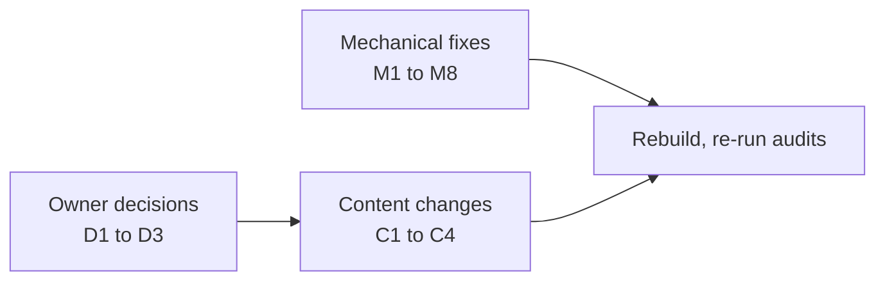

# SEO audit of the marketing site, 2026-10-09

Scope: every page of the local build of `landing-page-updates` (77 indexable pages: landing, 17 metrics, 10 comparisons, 43 blog posts, hubs, glossary, legal), plus `sitemap.xml`, `robots.txt`, `llms.txt` and the Markdown alternates. Three audits ran in parallel; their full reports:

| Report | Covers |
|---|---|
| [crawl-and-index.md](crawl-and-index.md) | Sitemap, robots, llms.txt, Markdown alternates, headers, titles, canonicals, internal links |
| [structured-data.md](structured-data.md) | JSON-LD on every page |
| [programmatic-content.md](programmatic-content.md) | Template uniqueness, thin pages, cannibalisation, internal linking, scaled-content risk |

No search data was available (no Search Console, no SERP rankings): query targeting is read from titles, H1s and meta keywords. Production headers could not be observed, because `astro preview` does not apply `public/_headers`.

## What is already sound

- All 77 pages are in the sitemap exactly once; nothing noindex or non-canonical is listed; no internal link 404s or redirects; no page is unreachable.
- Every page has one H1, a self-referencing absolute canonical with a trailing slash, matching `og:url`, and no duplicate titles or descriptions.
- JSON-LD parses on every page; blog `datePublished` and `dateModified` match the frontmatter on all 43 posts.
- Metric and comparison pages read as helpful first-party content to Google's 2026 policies.

## Findings, ranked

### Owner decisions (block some content work)

| # | Finding | Options |
|---|---|---|
| D1 | **Scaled-content risk on the blog.** 43 posts appear at once, dated across 131 days, under an organisation byline ("Pulse contributors") while several posts speak in the first person ("I wrote Pulse"). The strategy research recommended launching 6 to 8. | Keep all 43 live; or publish a launch set and release the rest over the coming weeks (the build already hides future-dated posts); and in either case name a real author (see D2). |
| D2 | **Authorship.** Articles credit an Organization whose URL is the GitHub repo; the footer says one developer makes Pulse. Google's guidance favours a named author with an author page. | Add a Person (name, short bio, an `/about/` page) and use it as `author` on every article; or keep the organisation and drop first-person phrasing from posts. |
| D3 | **Overlapping pages.** Three pairs answer the same query: `/metrics/sleep-consistency/` vs `/blog/sleep-regularity-index/`; `/compare/google-health-premium/` vs `/blog/google-health-premium-vs-free/`; `/compare/recovery-scores/` vs `/blog/whoop-recovery-vs-body-battery-vs-oura-readiness/`. Separately `/compare/pulse-vs-subscription-wearables/` and `/compare/recovery-tracking-without-subscription/` answer one question in two places. | For each pair, keep one page as the owner of the query and retarget the other's title and keywords to a different intent, or merge and redirect. The programmatic report has the table of 15 shared keyword strings with a suggested owner for each. |

### Content changes

| # | Finding | Fix |
|---|---|---|
| C1 | No metric page links to any blog post; comparisons link to the blog twice. The blog only receives links from itself. | A "Further reading" list on metric and comparison pages, from posts that link to that metric (derivable at build time from post bodies). |
| C2 | Three posts are reachable only from `/blog/` (`fitbit-resilience-stress-score`, `garmin-sleep-score-explained`, `whoop-sleep-need-explained`); seven more have one inbound link. | Fixed by C1, plus a link from each related post. |
| C3 | Nine metric pages are thin for their intent (median 403 words, thinnest 259). Six share 41 to 52 % of their phrasing with sibling metric pages (template text). | Add a worked example and real FAQ to the thinnest; trim the repeated template sentences. |
| C4 | Freshness signals disagree: 29 posts show "facts checked 9 October" under June to September dates, while `dateModified` and sitemap `lastmod` carry the old date. Metric pages show no date and their `lastmod` is fixed at 2026-10-03. | Use `checked` as the modified date where it is newer (or show only one date); give metric and comparison pages real published and modified dates. |

### Mechanical fixes (no decision needed)

| # | Finding | Fix |
|---|---|---|
| M1 | 70 article pages reference `about: {"@id": "/#app"}`, which exists only on `/`. | Drop `about` from `article()`, or move `SoftwareApplication` into `siteGraph()`. |
| M2 | Blog posts have no `/index.md` alternate (the other 29 page types do), so `llms.txt` links blog posts as HTML. | Add `blog/[slug]/index.md.ts`, extend `hasMarkdown` in `Base.astro`, point `llms.txt` at the `.md` files. |
| M3 | `public/_headers` sends `X-Robots-Tag: index` for `/metrics/*` and `/compare/*`, which also matches their `index.md`, colliding with the `/*.md` noindex rule: the Markdown copies can be indexed as duplicates. The `Link: rel=canonical` header on `.md` files is set in code that static hosting does not run. | Remove the redundant `index` rules; set the canonical `Link` header for `.md` files in `_headers`. |
| M4 | Metric and comparison Articles have no `datePublished`. | Make `published` required in `article()`; add dates to the data. |
| M5 | Organization has no `logo`. | Add a PNG logo `ImageObject` in `siteGraph()`. |
| M6 | 13 meta descriptions over 160 characters (worst 176); one title at 63; the `\| Pulse` suffix applies inconsistently. | Shorten; decide the suffix rule once in `Base.astro`. |
| M7 | `llms.txt`: blank lines between list items, comparisons described only as "Facts checked ...", hub pages not linked. `llms-full.txt` does not exist. | Tighten `llms.txt`; optionally generate `llms-full.txt` from the existing `markdown.ts` functions (Google does not use either file; other AI crawlers may). |
| M8 | `/404.html` declares a canonical of `/404/`, a URL that does not exist (harmless: the page is noindex). | Omit canonical and `og:url` on the 404 page. |

Info only: FAQPage markup stays on 12 pages by the earlier decision (no Google rich result since 2026-05-07); `robots.txt` allows all crawlers, as intended.

## How to know the fixes worked

- Re-run the three audits against a fresh build: zero High findings, no shared keyword strings between pages, every post with at least two inbound links.
- After deploy, in Search Console: all 77 URLs indexed, no "Duplicate without user-selected canonical" for `.md` files, and impressions for the queries each owner page targets.

## Resolution (2026-10-09)

Owner decisions: keep all 43 posts live with their past dates (D1); stay anonymous, so first-person author voice was rewritten to neutral in 39 posts (D2); retarget overlapping pages rather than merge (D3).

| Item | Done |
|---|---|
| D2 | First-person author sentences rewritten in 39 posts; reader questions ("why is my HRV low?") left as they are |
| D3 | Retitled and re-keyworded `/blog/sleep-regularity-index/` ("How to improve your sleep regularity"), `/blog/google-health-premium-vs-free/` ("Is Google Health Premium worth it?") and `/blog/whoop-recovery-vs-body-battery-vs-oura-readiness/` ("Why WHOOP, Garmin and Oura scores disagree"); each links to the owner page. Brand keywords moved off metric pages, the home page and comparison pages to the page that owns each query (table rows 4 to 15) |
| C1, C2 | `FurtherReading.astro` lists the posts that cite a page, on 22 of 27 metric and comparison pages; three posts gained a link from a sibling post. Every post now has at least two inbound links besides `/blog/` |
| C4 | One modified date per post (`postModified`: the latest of published, updated, checked) used by the page, its schema and the sitemap; metric and comparison pages have `datePublished` |
| M1 to M8 | `about` dropped from articles; blog `.md` alternates; `_headers` index rules removed and canonical `Link` headers added for every `.md`; Organization `logo` (`public/logo.png`); all descriptions at or under 160 characters and titles at or under 60; `llms.txt` reformatted with hub links and `.md` targets; `llms-full.txt` added; no canonical on the 404 page |
| C3 | The 9 thin metric pages (259 to 403 words) now have a worked example in the app's explainer (`content.ts`, so the app's How Pulse works shows it too), each run through Pulse's own scoring functions, and 4 FAQ answers in `site/src/data/metrics.ts`, including how the score differs from the device's own: 750 to 990 words each |
